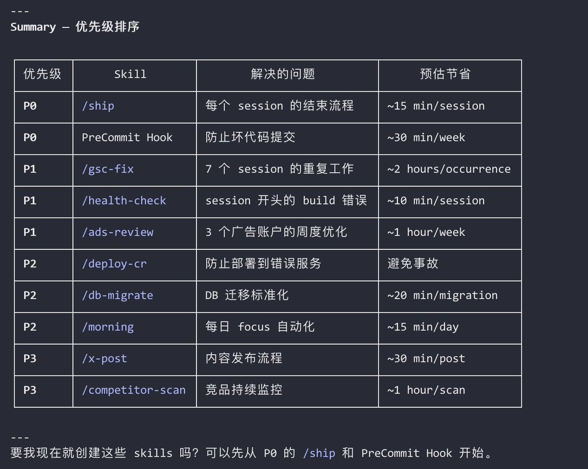

# 使用 Claude Code Insights 自動生成 Skills 和自動化流程

> **來源**: [@JamesAI](https://x.com/JamesAI/status/2028269700376097108)
>
> **日期**: Mon Mar 02 00:42:34 +0000 2026
>
> **標籤**: `Claude Code` `自動化` `效率提升`

---

三行命令，每天起碼節省你 2 小時。

## 三步驟工作流程

打開 Claude Code，或者任何一個類似的 AI：

1. `/insights`
2. 根據我們過去 3 個月的所有的資料夾的所有的對話歷史記錄，結合 insights 報告，建議我需要生成哪些 skills 和自動化流程
3. 好的，請執行

大家生成了什麼可以留言回覆一下。
