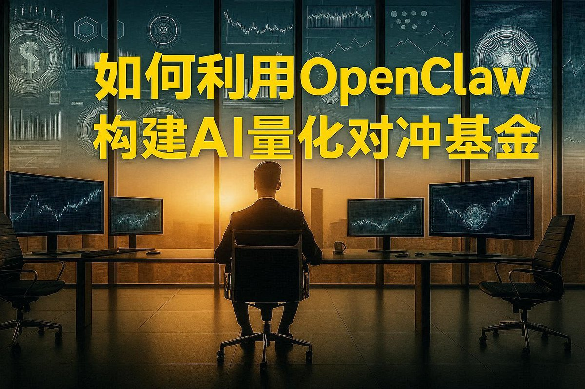

# 用 OpenClaw 搭建 AI 量化對沖基金：Subagent 職責設計

> **來源**: [@sunlc_crypto](https://x.com/sunlc_crypto/status/2028020210209591306)
>
> **日期**: Sun Mar 01 08:11:11 +0000 2026
>
> **標籤**: `OpenClaw` `Subagent架構` `量化基金`

---

## DAY 2：搭建 AI 量化對沖基金的崗位體系與 Subagent 職責劃分

今天來開始聊一聊：怎麼搭建一個 AI 量化對沖基金公司裡的崗位體系和 Subagent 的職責劃分。

在聊這個話題之前，我首先想說明的是：不管你想要讓 OpenClaw 去做什麼事情，你自己首先對這個業務需要有一個比較清晰的思路。

## 使用 AI 的兩個核心能力

我覺得一個人能不能把 AI 用好，取決於兩方面的能力：

1. 自己對這個業務本身有沒有一個清晰的了解和清楚的思路？
2. 有沒有比較好的一個表達能力

## 程序員轉型量化交易的誤區

舉個簡單的例子來說，之前我在量化圈裡碰到很多程序員朋友說想轉型做量化，但最終的結果無一例外都是很失敗的。

他們認為做量化交易只要會寫程序就行了，其實這是一個嚴重的誤解。他們甚至於沒有搞清楚量化交易和程序化交易的區別。量化交易首先你腦子裡必須有一套非常成熟、能夠穩定盈利的交易體系，然後再用程序的方式把它實現出來。而大部分程序員根本不懂得如何做交易，只是會寫程序而已，這是本末倒置，怎麼可能賺到錢呢？

## AI 領域的相同道理

同樣的道理，在 AI 領域也是一樣的。如果你只是一個技術大牛，卻不懂得如何通過某個具體業務或者思路去賺錢的話，那麼 AI 能給到你的幫助其實也非常有限。

## 給讀者的建議

所以看到這裡，如果你現在自己並沒有一個很成熟的思路的話，可能短時間內還沒有辦法把 OpenClaw 轉換成生產力，我建議你後面的文章先不要看下去，而是自己思考一下，或者和 AI 進行一場頭腦風暴。等理清楚思路以後，再繼續閱讀。
