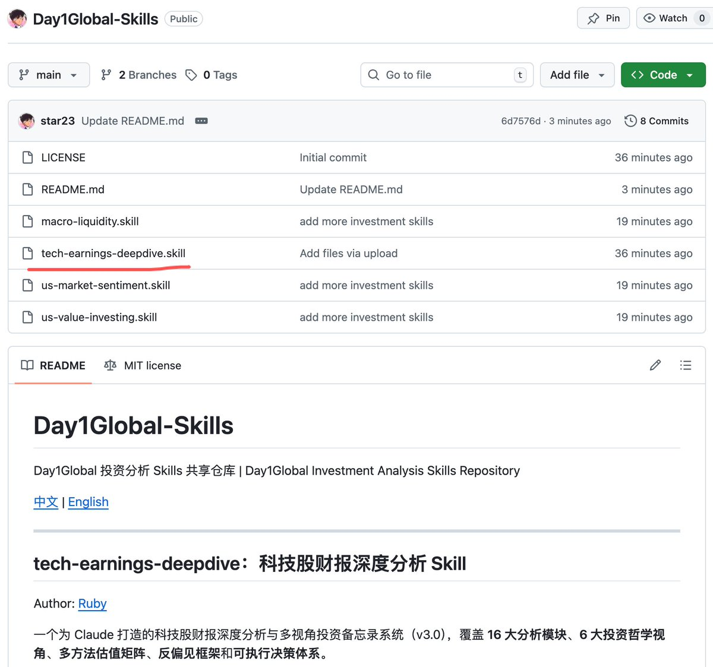
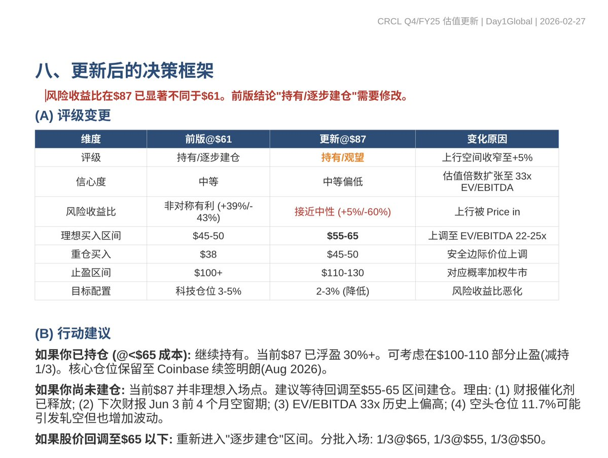

# Claude Skills 美股財報深度分析工具

> **來源**: [@starzq](https://x.com/starzq/status/2027610223310209325) | [原文連結](https://twitter.com/starzq/status/2027610223310209325/photo/1)
>
> **日期**: Sat Feb 28 05:02:03 +0000 2026
>
> **標籤**: `Claude Skills` `美股財報` `開源工具`

---

> **來源**: [@starzq (Star@Day1Global Podcast)](https://x.com/starzq)
> **日期**: 2026-03-05
> **標籤**: `claude-skills` `美股財報` `ai-tools`

---

## 工具介紹

美股財報深度分析 Skill 已發布，可於 GitHub 倉庫取得。

## 使用方式

1. 訪問 GitHub 倉庫：`github.com/star23/Day1Global-Skills`
2. 下載 `tech-earnings-deepdive.skill` 檔案
3. 將檔案提供給 Claude 或 OpenClaw 使用

## 額外資源

倉庫中另附贈 3 個 skills，可搭配使用。

直達連結已放在原推文評論區。
