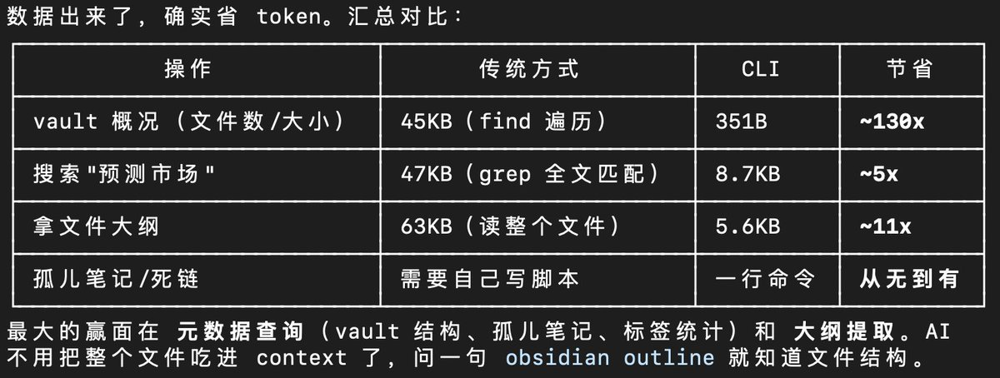

# 用 Obsidian CLI 打造 AI 長期記憶

> **來源**: [@runes_leo](https://x.com/runes_leo/status/2027429571054944298)
>
> **日期**: Fri Feb 27 17:04:12 +0000 2026
>
> **標籤**: `Obsidian` `Claude Code` `知識管理`

---

> **來源**: [@runes_leo (Leo)](https://twitter.com/runes_leo)
> **日期**: 2026-03-05
> **標籤**: `Obsidian` `AI` `Claude Code` `命令行工具` `知識管理`

---

## Obsidian CLI 的重要性

Obsidian 1.12 加了命令行工具，對用 AI 的人來說是大升級。

現在很多人把 Obsidian 當 AI 的外部記憶層——筆記、決策記錄、踩坑經驗都沉澱在 vault 裡，AI 需要時直接讀取。我自己就是這麼用的：Claude Code 讀寫 vault，等於跨會話的長期記憶。

## 升級方法

更新到 1.12 → 設置 → 通用 → 打開命令行工具。

## 兩個直觀感受

### 一、省 Token

以前 AI 要了解筆記庫概況，得遍歷所有文件（45KB）；現在一行命令，351 字節。看一篇筆記結構，以前讀整個文件（63KB），現在只返回標題大綱（5KB）。查孤儿筆記、死鏈，以前得自己寫腳本，現在一行命令秒出。

### 二、多了一層圖譜檢索

向量搜索找的是「內容相似」的筆記，命令行的反向鏈接找的是「你當初主動建立的知識連接」——這兩種「相關」不一樣。AI 搜到一篇筆記後，順著反向鏈接拉出關聯知識，這是傳統搜索做不到的。

## 結論

Obsidian 管存儲，AI 管智能，命令行把兩邊接上了。

---

**Obsidian 1.12 新功能**：
- Obsidian CLI
- Bases search
- 圖片調整大小
- 自動清理未使用的圖片
- 更好的複製/貼上到 Google Docs 等富文本應用
- 原生 iOS 分享面板
