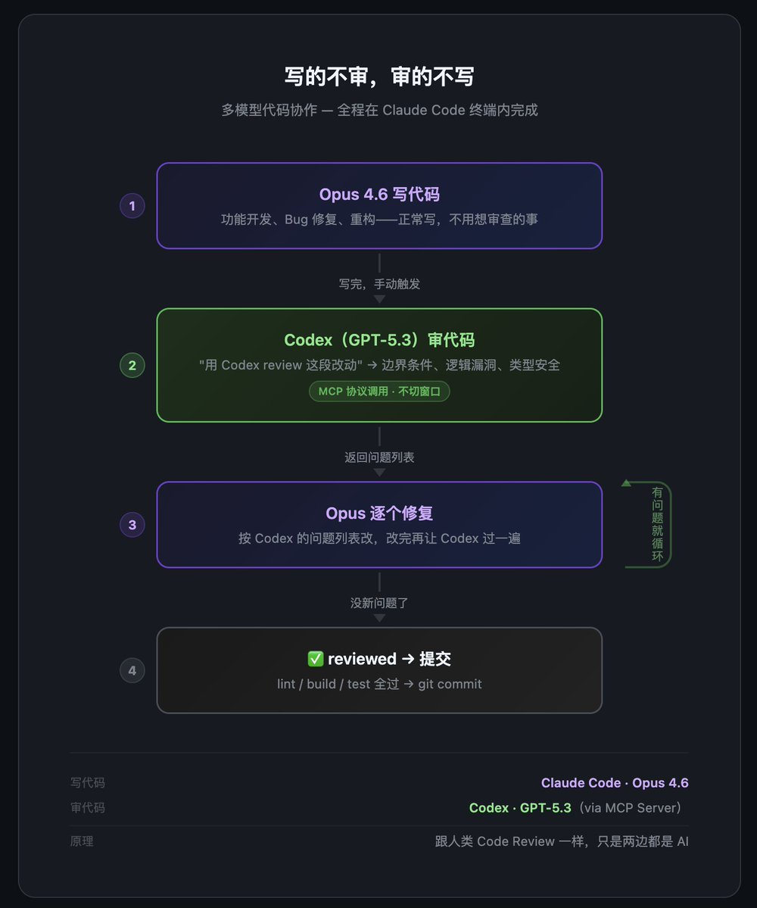

# Claude Code 多模型代碼審查工作流

> **來源**: [@runes_leo](https://x.com/runes_leo/status/2027269214524903892)
>
> **日期**: Fri Feb 27 06:27:00 +0000 2026
>
> **標籤**: `Claude Code` `代碼審查` `AI 協作`

---

## 核心理念

寫程式碼的模型永遠不負責審查自己的程式碼。

日常開發全在 Claude Code 裡跑 Opus 4.6。寫完一個功能或改完一個 bug，不急著提交，先讓 Codex 審一遍。

## 實作方式

Claude Code 支援 MCP 協定，可以在同一個終端裡呼叫外部模型。接了一個 Codex MCP Server。寫完程式碼說一句「Codex review」，它就去審了，不用切視窗。

審完列出問題，回到 Opus 逐個修改，改完再過一遍，循環到沒新問題為止。

## 原理與效果

跟人類團隊 Code Review 一個道理——自己寫的東西自己審，永遠有盲區。區別是現在審查的那個人也是 AI，換一個不同思路的 AI 來審查你的 AI。

實測基本每次 review 都能撈出點東西，邊界條件沒覆蓋、錯誤處理遺漏這種最常見。偶爾還能抓到邏輯 bug。

成本多一輪對話的錢，但省掉的返工時間遠超這個。

## 應用場景

引用 @0xAA_Science 的觀點：opus 4.6 寫專案很厲害，但遇到難改的 bug 就懵了，空轉半小時，浪費一堆 token，最後還改不好。這時候換 chatgpt 5.3 codex 有奇效。

## 使用方法

想試的話：Claude Code 裝個 Codex MCP Server 就行。
