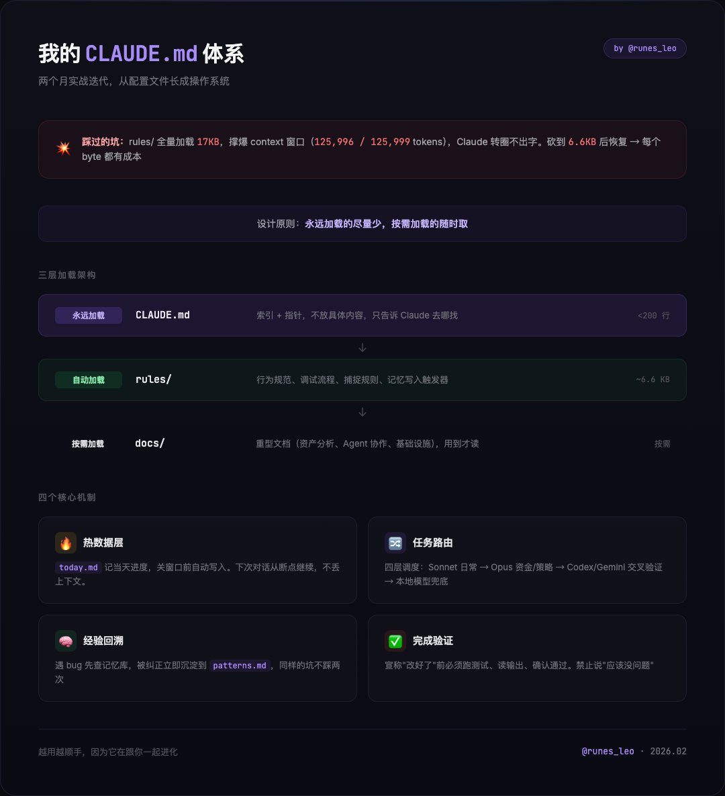

# 從配置到系統：Claude Code 兩個月的演化之旅

> **來源**: [@runes_leo](https://x.com/runes_leo/status/2027030391643570258) | [原文連結](https://code.claude.com/docs)
>
> **日期**: 
>
> **標籤**: `Claude Code` `系統設計` `工作流程`

---



> **來源**: [@runes_leo (Leo)](https://twitter.com/runes_leo)
> **日期**: 2026-03-05
> **標籤**: `claude-code` `配置管理` `工作流程` `最佳實踐`

---

## 從配置到系統的演化

用 Claude Code 兩個多月，CLAUDE.md 從一個配置文件長成了一套操作系統。

## 踩過的坑：Context 爆炸

最痛的坑：rules/ 目錄下的文件每次對話全量加載。我往裡塞了 17KB 的規則，直接撐爆 context 窗口——125,996 / 125,999 tokens，Claude 轉圈不出字。砍到 6.6KB 才恢復正常。

這件事教會我一個設計原則：**每個 byte 都有成本，按需加載才是正解**。

## 三層架構設計

現在我的結構是三層：

- **CLAUDE.md**（永遠加載，<200 行，只放指針）
- **rules/**（自動加載，行為規範、調試流程、捕捉規則）
- **docs/**（按需加載，重型文檔，用到才讀）

## 四個核心機制

### 1. 熱數據層

記當天進度，關窗口前自動寫入，不等你說「保存」。下次開對話，Claude 能從斷點繼續。

### 2. 任務路由

Sonnet 處理日常，涉及資金/策略自動升級到 Opus，需要交叉驗證就外包 Codex 或 Gemini。四層調度，每層有明確的觸發條件。

### 3. 經驗回溯

遇到 bug 第一步查記憶庫，不查就調試算流程違規。被糾正的錯誤立即寫入記憶庫，同樣的坑不踩兩次。

### 4. 完成驗證

宣稱「改好了」之前必須跑測試、讀輸出、確認通過。禁止說「應該沒問題」。

## 最大體感

跑了兩個月，最大的體感：CLAUDE.md 不是寫一次就完的配置文件，是一個活的系統。你糾正它，它記住；你踩坑，它沉澱；你關窗口，它自己保存。越用越順手，因為它在跟你一起進化。

---

## Claude Code 功能概覽

### 安裝方式

**終端機 CLI（推薦）**

macOS、Linux、WSL：
```bash
curl -fsSL https://claude.ai/install.sh | bash
```

Windows PowerShell：
```powershell
irm https://claude.ai/install.ps1 | iex
```

啟動方式：
```bash
cd your-project
claude
```

**其他平台**
- VS Code 擴充套件：搜尋「Claude Code」
- Desktop 應用程式：下載 macOS/Windows 版本
- 瀏覽器版本：造訪 claude.ai/code
- JetBrains 外掛：從 Marketplace 安裝

### 核心功能

#### 1. 自動化繁瑣任務

處理那些一直拖延的工作：為未測試的程式碼撰寫測試、修復專案中的 lint 錯誤、解決合併衝突、更新依賴套件、撰寫發布說明。

```bash
claude "write tests for the auth module, run them, and fix any failures"
```

#### 2. 建立功能與修復 bug

用自然語言描述需求，Claude Code 會規劃方法、跨多個檔案撰寫程式碼、驗證是否正常運作。對於 bug，貼上錯誤訊息或描述症狀，Claude Code 會追蹤問題、找出根本原因、實作修復。

#### 3. 建立 commit 與 pull request

直接與 git 整合，暫存變更、撰寫 commit 訊息、建立分支、開啟 pull request。

```bash
claude "commit my changes with a descriptive message"
```

在 CI 中，可透過 GitHub Actions 或 GitLab CI/CD 自動化程式碼審查和 issue 分類。

#### 4. 透過 MCP 連接工具

Model Context Protocol (MCP) 是連接 AI 工具與外部資料來源的開放標準。透過 MCP，Claude Code 可以讀取 Google Drive 中的設計文件、更新 Jira 工單、從 Slack 提取資料，或使用你自訂的工具。

#### 5. 自訂指令、技能與 Hooks

**CLAUDE.md**：放在專案根目錄的 markdown 檔案，Claude Code 每次啟動都會讀取。用來設定編碼標準、架構決策、偏好的函式庫、審查檢查清單。

**Auto memory**：Claude 在工作時自動建立記憶，儲存建置指令和除錯見解等學習內容，跨對話保留。

**自訂指令**：打包可重複的工作流程供團隊分享，例如 `/review-pr` 或 `/deploy-staging`。

**Hooks**：在 Claude Code 動作前後執行 shell 指令，例如每次檔案編輯後自動格式化，或 commit 前執行 lint。

#### 6. 執行 Agent 團隊與建立自訂 Agent

生成多個 Claude Code agent 同時處理任務的不同部分。主 agent 協調工作、分配子任務、合併結果。

對於完全自訂的工作流程，Agent SDK 讓你建立由 Claude Code 工具和能力驅動的自訂 agent，完全控制編排、工具存取和權限。

#### 7. 透過 CLI 管道化、腳本化、自動化

Claude Code 可組合，遵循 Unix 哲學。將日誌導入、在 CI 中執行，或與其他工具串連：

```bash
# 監控日誌並獲得警報
tail -f app.log | claude -p "Slack me if you see any anomalies"

# 在 CI 中自動化翻譯
claude -p "translate new strings into French and raise a PR for review"

# 跨檔案批次操作
git diff main --name-only | claude -p "review these changed files for security issues"
```

### 跨平台工作

對話不綁定單一介面。隨著情境變化在不同環境間移動工作：

- 離開辦公桌時，用手機或任何瀏覽器透過 Remote Control 繼續工作
- 在 Web 或 iOS app 啟動長時間執行的任務，稍後在終端機用 `/teleport` 拉回
- 在終端機對話完成後，用 `/desktop` 交給 Desktop app 進行視覺化 diff 審查
- 從團隊聊天路由任務：在 Slack 中提及 @Claude 並附上 bug 報告，取得 pull request 回覆
