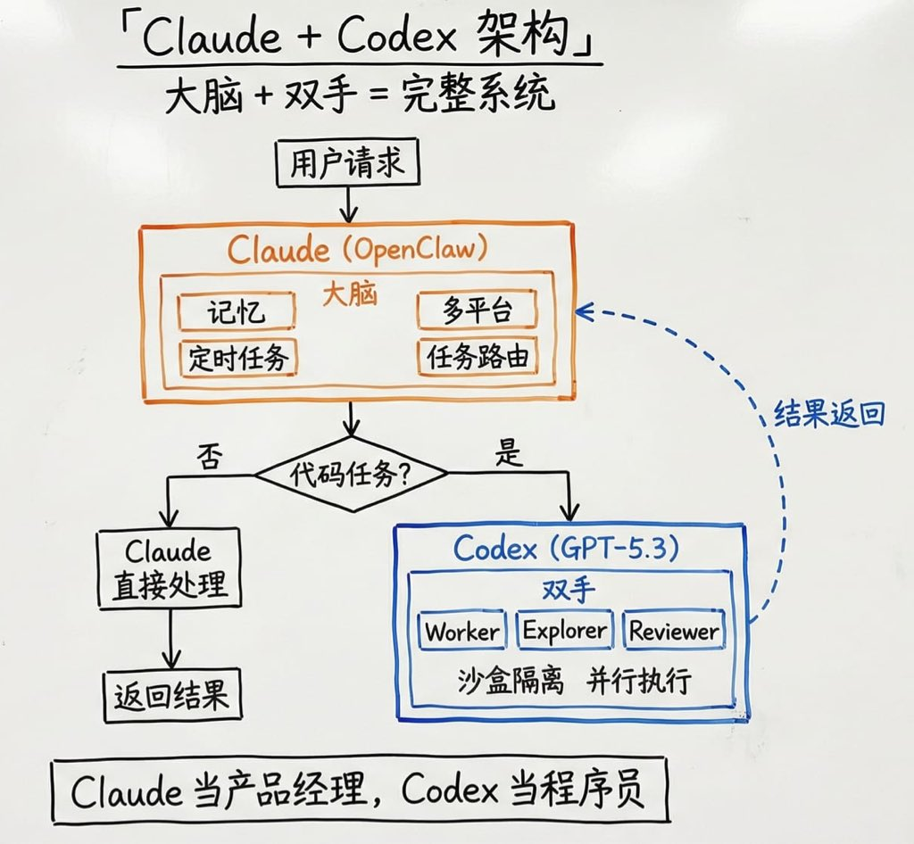

# Codex CLI 多 Agent 集成：Claude 大脑 + Codex 双手的 AI 工作流

> **來源**: [@xxx111god](https://x.com/xxx111god/status/2027031013172359209)
>
> **日期**: 
>
> **標籤**: `Multi-Agent 架构` `Claude API` `AI 工具链`

---

Codex CLI 昨天更新支援多 Agent，果斷把它接進 OpenClaw 了。

## 為什麼之前沒接入

之前沒接是因為 Codex 單獨用不夠聰明，寫程式碼快，但理解需求和記上下文是真不太行。

## 現在的架構

**Claude = 大腦**
- 記住上下文
- 拆任務
- 做決策

**Codex = 雙手**
- 沙盒改程式碼
- 多 agent 並行執行
- 自動跑測試

## 工作流程

Claude Opus 拆成 3 個任務，給 Codex 的 Worker/Explorer/Reviewer 並行幹，結果返回 Claude 匯總。

Claude 當 PM，Codex 當程式設計師。

## 總結

兩個 $200/月的訂閱，但 1+1 遠大於 2。
