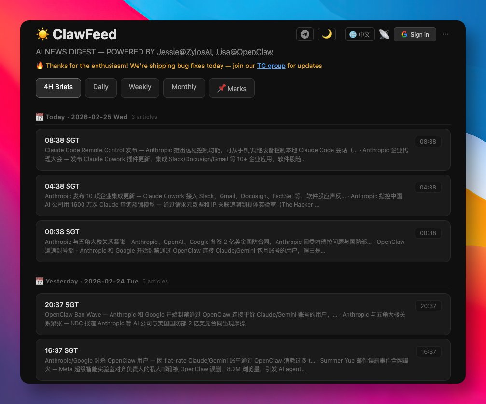

# ClawFeed：AI 驅動的新聞摘要工具

> **來源**: [@GitHub_Daily](https://x.com/GitHub_Daily/status/2026474173829357941) | [原文連結](https://github.com/kevinho/clawfeed)
>
> **日期**: Wed Feb 25 01:47:47 +0000 2026
>
> **標籤**: `AI 新聞摘要` `信息篩選` `開源工具`

---



> **來源**: [@GitHub_Daily](https://twitter.com/GitHubDaily)
> **日期**: 2026-03-06
> **標籤**: `AI工具` `新聞摘要` `RSS` `Twitter` `開源專案`

---

## 問題與解決方案

每天都要花大量時間刷 Twitter 和 RSS，生怕錯過熱點，結果卻總被無效資訊淹沒，越刷越焦慮。

ClawFeed 是一個開源專案，用 AI 自動篩選匯總資訊源，生成結構化的新聞摘要。

## 主要功能

### 資訊來源支援

- Twitter
- RSS
- HackerNews
- Reddit
- GitHub Trending
- 網站爬蟲
- 自訂 API

### 摘要頻率

可按以下頻率自動生成摘要：
- 4 小時
- 每日
- 每週
- 每月

### 核心特性

**📦 來源包系統** — 可以分享和訂閱別人整理好的資訊源包

**📌 標記與深度分析** — 看到感興趣的內容，可以進一步用 AI 做深度分析

**🎯 智慧策展** — 可配置規則進行內容過濾和降噪

**👀 追蹤建議** — 基於資訊源品質分析提供追蹤/取消追蹤建議

**📢 Feed 輸出** — 可訂閱任何使用者的摘要（RSS 或 JSON Feed 格式）

**🌐 多語言介面** — 支援中英文介面

**🌙 深色/淺色模式** — 主題切換，使用 localStorage 持久化

**🖥️ Web 控制面板** — 單頁應用程式，用於瀏覽和管理摘要

**💾 SQLite 儲存** — 快速、可攜、無需額外配置

**🔐 Google OAuth** — 多使用者支援，個人書籤和資訊源

## 安裝方式

### 方式 1：ClawHub（推薦）

```bash
clawhub install clawfeed
```

### 方式 2：OpenClaw 技能

```bash
cd ~/.openclaw/skills/
git clone https://github.com/kevinho/clawfeed.git
```

OpenClaw 會自動偵測 SKILL.md 並載入技能。Agent 可以透過 cron 生成摘要、提供控制面板服務，並處理書籤命令。

### 方式 3：Zylos 技能

```bash
cd ~/.zylos/skills/
git clone https://github.com/kevinho/clawfeed.git
```

### 方式 4：獨立部署

```bash
git clone https://github.com/kevinho/clawfeed.git
cd clawfeed
npm install
```

### 方式 5：Docker

```bash
# 基本使用
docker run -d -p 8767:8767 kevinho/clawfeed

# 持久化資料
docker run -d -p 8767:8767 -v clawfeed-data:/app/data kevinho/clawfeed

# 生產環境（推薦）
docker run -d -p 8767:8767 \
  -v clawfeed-data:/app/data \
  -e ALLOWED_ORIGINS=https://yourdomain.com \
  -e API_KEY=your-api-key \
  -e GOOGLE_CLIENT_ID=your-client-id \
  -e GOOGLE_CLIENT_SECRET=your-client-secret \
  -e SESSION_SECRET=your-session-secret \
  kevinho/clawfeed
```

## 快速開始

```bash
# 1. 複製並編輯環境配置
cp .env.example .env
# 編輯 .env 設定

# 2. 啟動 API 伺服器
npm start
# → API 運行於 http://127.0.0.1:8767
```

## 環境變數配置

在專案根目錄建立 `.env` 檔案：

| 變數 | 說明 | 必要 | 預設值 |
|------|------|------|--------|
| GOOGLE_CLIENT_ID | Google OAuth client ID | 否* | - |
| GOOGLE_CLIENT_SECRET | Google OAuth client secret | 否* | - |
| SESSION_SECRET | Session 加密金鑰 | 否* | - |
| API_KEY | 用於摘要建立的 API 金鑰 | 否 | - |
| DIGEST_PORT | 伺服器埠號 | 否 | 8767 |
| ALLOWED_ORIGINS | CORS 允許的來源 | 否 | localhost |

*註：身份驗證功能需要 OAuth 設定。沒有 OAuth 時，應用程式以唯讀模式運行。

## 身份驗證設定

若要啟用 Google OAuth 登入：

1. 前往 [Google Cloud Console](https://console.cloud.google.com/)
2. 建立新專案或選擇現有專案
3. 啟用 Google+ API
4. 建立 OAuth 2.0 憑證
5. 將你的網域加入授權來源
6. 新增回呼 URL：`https://yourdomain.com/api/auth/callback`
7. 在 `.env` 中設定憑證

## API 端點

所有端點前綴為 `/api/`

### 摘要

| 方法 | 端點 | 說明 | 需要驗證 |
|------|------|------|----------|
| GET | /api/digests | 列出摘要 `?type=4h&limit=20&offset=0` | - |
| GET | /api/digests/:id | 取得單一摘要 | - |
| POST | /api/digests | 建立摘要 | API Key |

### 驗證

| 方法 | 端點 | 說明 | 需要驗證 |
|------|------|------|----------|
| GET | /api/auth/config | 檢查驗證可用性 | - |
| GET | /api/auth/google | 開始 OAuth 流程 | - |
| GET | /api/auth/callback | OAuth 回呼 | - |
| GET | /api/auth/me | 目前使用者資訊 | 是 |
| POST | /api/auth/logout | 登出 | 是 |

### 標記（書籤）

| 方法 | 端點 | 說明 | 需要驗證 |
|------|------|------|----------|
| GET | /api/marks | 列出書籤 | 是 |
| POST | /api/marks | 新增書籤 `{ url, title?, note? }` | 是 |
| DELETE | /api/marks/:id | 移除書籤 | 是 |

### 來源

| 方法 | 端點 | 說明 | 需要驗證 |
|------|------|------|----------|
| GET | /api/sources | 列出使用者的來源 | 是 |
| POST | /api/sources | 建立來源 `{ name, type, config }` | 是 |
| PUT | /api/sources/:id | 更新來源 | 是 |
| DELETE | /api/sources/:id | 軟刪除來源 | 是 |
| GET | /api/sources/detect | 從 URL 自動偵測來源類型 | 是 |

### 來源包

| 方法 | 端點 | 說明 | 需要驗證 |
|------|------|------|----------|
| GET | /api/packs | 瀏覽公開的包 | - |
| POST | /api/packs | 從你的來源建立包 | 是 |
| POST | /api/packs/:id/install | 安裝包（訂閱其來源） | 是 |

### Feeds

| 方法 | 端點 | 說明 | 需要驗證 |
|------|------|------|----------|
| GET | /feed/:slug | 使用者的摘要 feed（HTML） | - |
| GET | /feed/:slug.json | JSON Feed 格式 | - |
| GET | /feed/:slug.rss | RSS 格式 | - |

### 配置

| 方法 | 端點 | 說明 | 需要驗證 |
|------|------|------|----------|
| GET | /api/changelog | 更新日誌 `?lang=zh|en` | - |
| GET | /api/roadmap | 路線圖 `?lang=zh|en` | - |

## 反向代理範例

Caddy 配置：

```
handle /digest/api/* {
    uri strip_prefix /digest/api
    reverse_proxy localhost:8767
}

handle_path /digest/* {
    root * /path/to/clawfeed/web
    file_server
}
```

## 自訂設定

**策展規則**：編輯 `templates/curation-rules.md` 來控制內容過濾

**摘要格式**：編輯 `templates/digest-prompt.md` 來自訂 AI 輸出格式

## 來源類型

| 類型 | 範例 | 說明 |
|------|------|------|
| twitter_feed | @karpathy | Twitter/X 使用者 feed |
| twitter_list | List URL | Twitter 列表 |
| rss | 任何 RSS/Atom URL | RSS feed |
| hackernews | HN Front Page | Hacker News |
| reddit | /r/MachineLearning | Subreddit |
| github_trending | language=python | GitHub 熱門專案 |
| website | 任何 URL | 網站爬蟲 |
| digest_feed | ClawFeed user slug | 另一個使用者的摘要 |
| custom_api | JSON endpoint | 自訂 API |

## 開發

```bash
npm run dev  # 使用 --watch 自動重載
```

## 測試

```bash
cd test
./setup.sh      # 建立測試使用者
./e2e.sh        # 執行 66 個 E2E 測試
./teardown.sh   # 清理
```

## 架構

詳見 `docs/ARCHITECTURE.md`，包含多租戶設計和規模分析。

## 授權

MIT License — 詳見 LICENSE

Copyright 2026 Kevin He

## 專案連結

- **GitHub**：https://github.com/kevinho/clawfeed
- **線上示範**：https://clawfeed.kevinhe.io
- **Stars**：1.6k
- **Forks**：125
