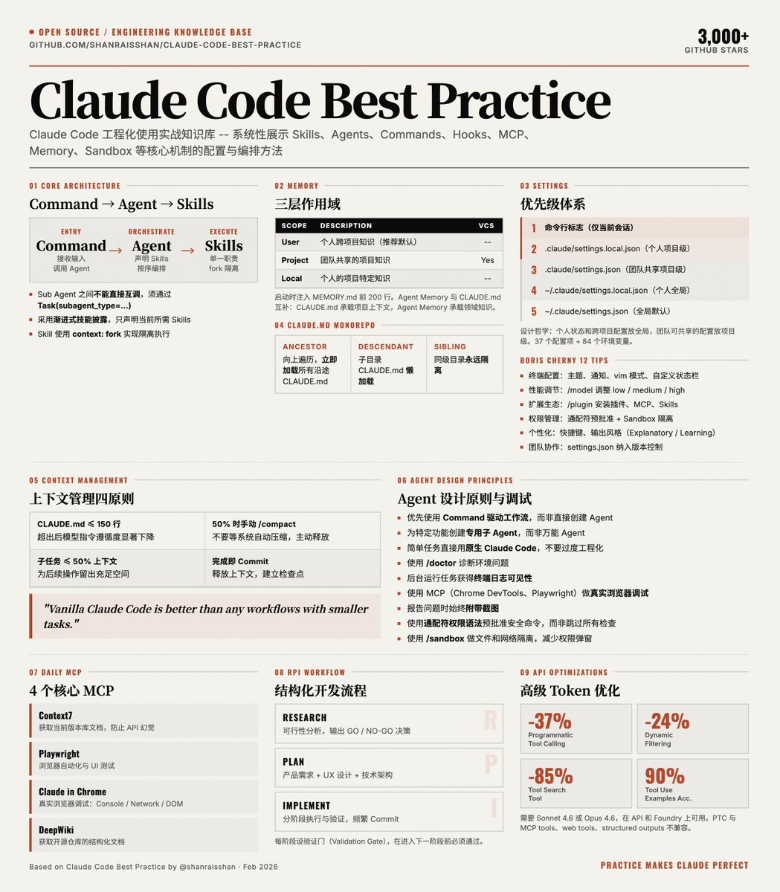

# Claude Code 工程化最佳實踐指南

> **來源**: [@shao__meng](https://x.com/shao__meng/status/2025417337101574154) | [原文連結](https://github.com/shanraisshan/claude-code-best-practice)
>
> **日期**: Sun Feb 22 03:48:18 +0000 2026
>
> **標籤**: `Claude Code` `工程化實踐` `開發工作流`

---

## 專案簡介

作者 @shanraisshan 開源的 Claude Code 工程化使用實戰知識庫，系統性地展示了如何配置、編排和優化 Claude Code 的各項能力，包括 Skills、Agents、Commands、Hooks、MCP Servers、Memory、Rules、Plugins、Sandbox 等核心機制。基於大量實際使用後提煉出的經驗模式和反模式，幫助開發者避免在 Claude Code 的工程化使用中走彎路。

## Boris Cherny 的 12 條定制技巧

Claude Code 創建者 Boris Cherny 提出的核心定制建議：

**終端配置**：主題、通知、vim 模式、自定義狀態欄（顯示模型、目錄、上下文、費用）

**推理設定**：使用 `/reasoning` 調整思考深度（medium=平衡，high=深度）

**擴展生態**：通過 `/plugin` 安裝插件、MCP、Skills

**權限管理**：通配符語法預批准安全命令 + Sandbox 隔離

**個性化**：自定義快捷鍵、加載動畫、輸出風格（Explanatory 適合新項目，Learning 適合學習指導）

**團隊協作**：將 settings.json 納入版本控制，團隊共享配置

## 核心概念

### Command → Agent → Skills 架構

- Command 通過 Task 工具調用 Agent，而非直接用 Bash 命令
- Agent 通過 frontmatter 聲明所需的 Skills、工具權限和模型
- Sub Agent 之間不能直接互相調用，必須通過 `Task(subagent_type=...)` 顯式編排
- Skill 使用 `context: fork` 實現隔離執行，避免上下文污染

### Memory 三層作用域

**User**：個人跨專案知識（推薦默認）

**Project**：團隊共享的專案知識

**Local**：個人的專案特定知識

系統啟動時注入 MEMORY.md 的前 200 行到 Agent 系統提示中。當記憶量增長後，Agent 會自動將內容拆分為主題文件進行組織。

Agent Memory 與 CLAUDE.md、`/memory` 命令是互補而非替代關係：CLAUDE.md 承載專案上下文，Agent Memory 承載特定 Agent 的領域知識。

### CLAUDE.md 在 Monorepo 中的加載策略

**Ancestor Loading**：從當前目錄向上遍歷到根目錄，立即加載所有沿途的 CLAUDE.md

**Descendant Loading**：子目錄中的 CLAUDE.md 採用懶加載，僅在會話中實際訪問時才加入

**兄弟隔離**：同級目錄的 CLAUDE.md 永遠不會互相加載

在 `/mymonorepo/frontend/` 啟動 Claude Code 時，你會立即獲得根目錄和 frontend 的配置，而 backend 的配置只在你實際操作 backend 文件時才會加載。這避免了「數百 KB 無關指令」佔用上下文窗口。

實踐建議：根目錄放通用編碼規範，各子包放各自的框架和架構細節，個人偏好用 CLAUDE.local.md（加入 .gitignore）。

### 設置優先級體系（高 → 低）

1. 命令行標誌（僅當前會話）
2. `.claude/settings.local.json`（個人專案級）
3. `.claude/settings.json`（團隊共享專案級）
4. `~/.claude/settings.local.json`（個人全局）
5. `~/.claude/settings.json`（全局默認）

### RPI 工作流：Research-Plan-Implement

**Research**：可行性分析，輸出 GO/NO-GO，需求分析師、產品經理參與

**Plan**：產品需求 + UX + 技術架構，架構師、UX 設計師參與

**Implement**：分階段執行與驗證，高級工程師、代碼審查者參與

## 關鍵實踐經驗

### 1. 上下文管理

- CLAUDE.md 控制在 150 行以內——超過後模型對指令的遵循度會下降
- 在上下文使用量約 50% 時手動執行 `/compact`——不要等到系統自動壓縮
- 子任務的上下文消耗不超過 50%——為後續操作留出空間
- 任務完成後立即 commit——釋放上下文，建立檢查點

### 2. Agent 設計原則

- 優先使用 Command 驅動工作流，而非直接創建 Agent
- 為特定功能創建專用子 Agent，而非萬能 Agent
- 採用「漸進式技能披露」—— Agent 只聲明當前任務所需的 Skills
- 簡單任務直接用原生 Claude Code，不要過度工程化——「vanilla Claude Code is better than any workflows with smaller tasks」

### 3. 調試方法論

- 使用 `/doctor` 命令診斷環境問題
- 後台運行任務以獲得終端日誌可見性
- 使用 MCP（Chrome DevTools、Playwright）做真實的瀏覽器調試
- 報告問題時始終附帶截圖

### 4. 推薦的 MCP 配置

**Context7**：獲取當前版本的庫文檔，防止 API 幻覺

**Playwright**：瀏覽器自動化、UI 測試

**Claude in Chrome**：真實瀏覽器調試

**DeepWiki**：獲取開源倉庫的結構化文檔

### 5. 權限與安全

- 使用通配符語法預批准常用安全命令（`/permissions`），而非直接跳過所有權限檢查
- 使用 `/sandbox` 做文件和網絡隔離，減少權限彈窗的同時保持安全性
- 敏感文件（.env、憑證文件）不應加入 CLAUDE.md 或被 commit

### 6. 高級 API 特性（依賴 Sonnet 4.6 和 Opus 4.6）

**Programmatic Tool Calling**：減少約 37% token 消耗

**Dynamic Filtering**：減少約 24% 輸入 token

**Tool Search Tool**：減少約 85% 工具定義 token

**Tool Use Examples**：準確率從 72% 提升至 90%

## 核心組件架構

### 功能組件

| 組件 | 位置 | 說明 |
|------|------|------|
| Commands | `.claude/commands/<name>.md` | 工作流的入口提示——用 `/command-name` 調用 |
| Sub-Agents | `.claude/agents/<name>.md` | 具有自己名稱、顏色、工具、權限和模型的自定義 agents |
| Skills | `.claude/skills/<name>/SKILL.md` | 可重用的知識、工作流和斜杠命令——按需加載或用 `/skill-name` 調用 |
| Hooks | `.claude/hooks/` | 在特定事件上運行於 agentic 循環外的確定性腳本 |
| MCP Servers | `.claude/settings.json`, `.mcp.json` | 連接到外部工具、資料庫和 API 的 Model Context Protocol |
| Plugins | 可分發包 | Skills、subagents、hooks 和 MCP servers 的組合包 |
| Settings | `.claude/settings.json` | 分層配置系統：權限、模型配置、輸出風格、Sandbox、快捷鍵、快速模式 |
| Memory | `CLAUDE.md`, `.claude/rules/`, `~/.claude/rules/`, `~/.claude/projects/<project>/memory/` | 通過 CLAUDE.md 文件和 @path 導入的持久上下文 |

### 熱門功能

**Agent Teams**：多個 agents 在同一代碼庫上並行工作，具有共享任務協調

**Voice Mode**：語音提示——用 `/voice` 激活

**Remote Control**：從任何設備（手機、平板或瀏覽器）繼續本地會話

**Git Worktrees**：用於並行開發的隔離 git 分支——每個 agent 擁有自己的工作副本

**Ralph Wiggum Loop**：長時間運行任務的自主開發循環——迭代直到完成

## 開發工作流

**Cross-Model**：Claude Code + Codex

**RPI**：Research-Plan-Implement

**Boris Feb26 workflow**

**Ralph plugin with sandbox**

**Human Layer**

**AgentOs** - 2026 its overkill (Brian Casel)

**Github Speckit**

**GSD** - Get Shit Done

**OpenSpec**

**OPSX Superpower**

**Andrej Karpathy Workflow**

**Clawd Bot Workflow**

## 技巧和訣竅

### 工作流

- CLAUDE.md 應該控制在每個文件 200 行以下（60 行在 humanlayer 中仍不 100% 保證）
- 對 monorepos 使用多個 CLAUDE.md —— ancestor + descendant loading
- 使用 `.claude/rules/` 拆分大型指令
- 使用 commands 作為工作流，而非 sub-agents
- 使用具有特定功能的 sub-agents（額外上下文）配合 skills（漸進式披露），而非通用的 QA、後端工程師
- `/memory`、constitution.md 不能保證任何事情
- 避免 agent dumb zone，在最多 50% 時手動執行 `/compact`
- 始終從 plan mode 開始
- vanilla CC 比任何帶有較小任務的工作流都要好
- 在 monorepos 中使用子文件夾中的 skills
- 使用 tmux 和 git worktrees 進行並行開發的 agent teams
- 使用 Ralph Wiggum plugin 進行長時間運行的自主任務
- 在提示中使用 ultrathink 關鍵字進行高努力推理
- 使用 `/model` 選擇模型和推理，`/context` 查看上下文使用，`/usage` 設置每週限制，`/config` 配置設置

### 每日更新

- 每天更新 Claude Code，並通過閱讀 changelog 開始新的一天
- 關注 Reddit 上的 r/ClaudeAI、r/ClaudeCode
- 關注 X 上的 Boris、Thariq、Cat、Lydia

### 每小時

- 經常 commit，任務一完成就 commit

### 實用工具

- 使用 iTerm / Ghostty / tmux 終端而不是 IDE（VS Code / Cursor）
- Wispr Flow 用於語音提示（10 倍生產力）
- claude-code-voice-hooks 用於 claude 反饋
- status line 用於上下文感知和快速壓縮
- `/permissions` 配合通配符語法（`Bash(npm run *)`、`Edit(/docs/**)`）而不是 dangerously-skip-permissions
- `/sandbox` 通過文件和網絡隔離減少權限提示
- 探索 settings.json 功能，如 Output Styles（例如學習新代碼庫時使用 Explanatory）、Plans Directory、Spinner Verbs 以獲得個性化體驗
- `/rename` 重要會話（例如 [todo refactor task]）並稍後 `/resume` 它們

### 調試

- `/doctor` 總是有用
- 要求 claude 將終端作為後台任務運行（你想看到日誌）以獲得更好的調試
- 使用 MCP（Claude in Chrome、Playwright、Chrome DevTools）讓 claude 自己查看 chrome 控制台日誌
- 提供問題的截圖
- 使用不同的模型進行 QA —— 例如 Codex 用於計劃和實施審查
- 要求 Claude 使用 AskUserQuestion 工具採訪你（Thariq）

## 重要參考資料

- Boris setup - 5 tips | 2025/1/3
- 10 tips for using claude code by team itself | 2026/2/1
- 12 ways how people are customizing their claudes | 2026/2/12
- Git Worktrees - 5 ways how boris is using | 2026/2/21
- Seeing like an Agent - lessons from building Claude Code (Thariq) | 2026/2/28

## 常見問題

### Memory & Instructions

1. 究竟應該在 CLAUDE.md 中放什麼——以及應該省略什麼？
2. 如果你已經有 CLAUDE.md，是否真的需要單獨的 constitution.md 或 rules.md？
3. 應該多久更新一次 CLAUDE.md，以及如何知道它何時變得過時？
4. 為什麼 Claude 仍然會忽略 CLAUDE.md 指令——即使它們用全大寫字母寫著 MUST？

### Agents, Skills & Workflows

1. 何時應該使用 command vs agent vs skill——何時 vanilla Claude Code 更好？
2. 隨著模型改進，應該多久更新一次 agents、commands 和 workflows？
3. 給 subagent 一個詳細的人設會提高質量嗎？「完美人設/提示」對於 research/QA subagent 應該是什麼樣子？

### Specs & Documentation

1. 你的倉庫中的每個功能都應該有一個 markdown 文件作為規範嗎？
2. 需要多久更新一次規範，以便在實現新功能時它們不會過時？
3. 在實現新功能時，如何處理對其他功能規範的連鎖反應？

## 研究報告

**Agent SDK vs CLI System Prompts**：為什麼 Claude CLI 和 Agent SDK 輸出可能不同——系統提示架構和確定性

**Browser Automation MCP Comparison**：Playwright、Chrome DevTools 和 Claude in Chrome 的自動化測試比較

**Global vs Project Settings**：哪些功能僅限全局（`~/.claude/`）vs 雙作用域，包括 Tasks 和 Agent Teams

**Skills Discovery in Monorepos**：大型 monorepo 專案中技能的發現和加載方式

**Agent Memory Frontmatter**：subagents 的持久記憶作用域（user、project、local）—— 使 agents 能夠跨會話學習

**Advanced Tool Use Patterns**：Programmatic Tool Calling (PTC)、Tool Search 和 Tool Use Examples

**Usage, Rate Limits & Extra Usage**：使用命令（`/usage`、`/extra-usage`、`/cost`）、速率限制和按需付費溢出計費
