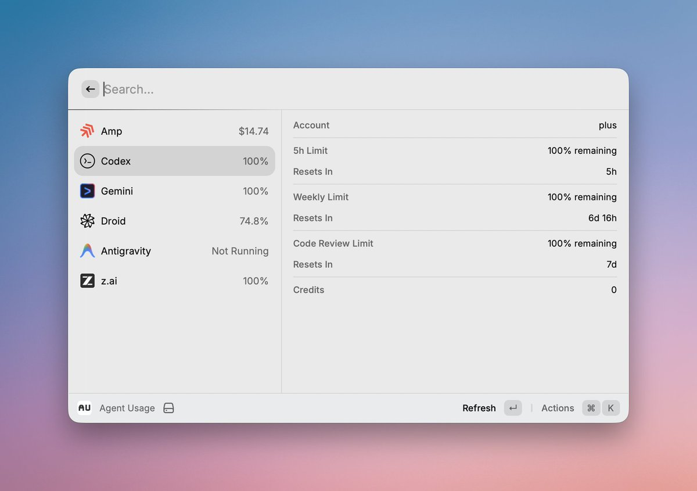
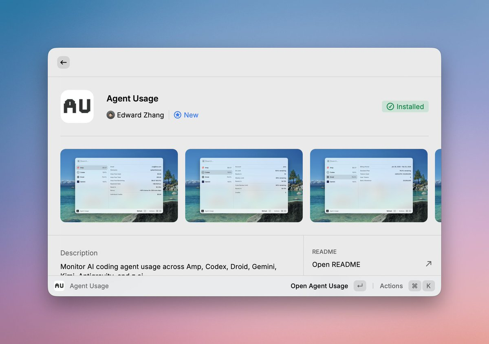

# Raycast Agent Usage：AI 訂閱餘額查看工具

> **來源**: [@spikeinthemood](https://x.com/spikeinthemood/status/2025122837141614775) | [原文連結](https://twitter.com/spikeinthemood/status/2025122837141614775/photo/1)
>
> **日期**: Sat Feb 21 08:18:03 +0000 2026
>
> **標籤**: `Raycast` `AI 訂閱管理` `效率工具`

---

CodexBar 有點重，還要瀏覽器權限。作者最初的想法是把 Amp 每日餘額用完，不需要實時監控用量。

因此開發了一個 Raycast Extension：**Agent Usage**，已發布可以在 Store 直接安裝。

## 功能特點

一鍵查看各類 AI 訂閱餘量，目前支援以下服務：

- Amp Code
- Codex
- Droid
- Gemini CLI
- Kimi
- GLM
