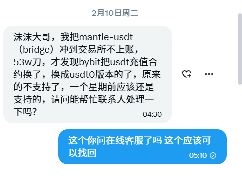

# 加密貨幣安全與風險防範經驗分享

> **來源**: [@zhamomo666](https://x.com/zhamomo666/status/2022289019137376649)
> **日期**: Fri Feb 13 12:37:29 +0000 2026
> **標籤**: `安全` `風險管理` `投資` `經驗分享` `防騙`

---

## 加密貨幣安全與風險防範經驗分享

### 總覽：安全防範重點速查表

| 主題          | 風險                                     | 防範措施                                                                                                                                                                                                                                                                             |
|---------------|------------------------------------------|----------------------------------------------------------------------------------------------------------------------------------------------------------------------------------------------------------------------------------------------------------------------------------------|
| 精神狀態      | 判斷失誤，導致操作錯誤                     | 保持清醒，避免在飲酒、疲勞、心情不佳時進行操作。                                                                                                                                                                                                                              |
| 交易所轉帳    | 提現至錯誤地址                         | 定期清理交易所白名單地址，不再使用的地址及時刪除。                                                                                                                                                                                                                                     |
| 錢包轉帳      | 轉帳至錯誤地址                         | 使用專用手機進行錢包操作，開啟掃臉驗證，轉帳時手動輸入密碼，避免誤觸。                                                                                                                                                                                                                         |
| 錢包安全      | 授權風險，被盜風險                       | 交易專用錢包避免過多授權，跨鏈、質押等操作使用獨立錢包。                                                                                                                                                                                                                             |
| CEX充值       | 充值至錯誤合約地址                       | 充值前確認CEX是否支援該鏈，檢查充值地址的合約地址是否正確。                                                                                                                                                                                                                         |
| 合約交易      | 倉位管理不當，爆倉風險                     | 合理設定套保倉位，有耐心設置止盈止損。                                                                                                                                                                                                                                               |
| 跨鏈操作      | 合約地址錯誤，跨鏈失敗                   | 小額測試，確認跨鏈後的代幣合約地址是否正確，確保跨鏈能成功到帳。                                                                                                                                                                                                                         |
| CEX套利       | 資金被卡住，帳戶被封                     | 小額嘗試，避免大額資金操作，留意潛在風險。                                                                                                                                                                                                                                               |
| 私鑰安全      | 私鑰洩漏，資產被盜                       | 安全保存私鑰，避免在不安全的設備上登錄錢包。                                                                                                                                                                                                                                          |
| 資訊辨別      | 被詐騙                                   | 保持警惕，不要輕易相信他人，認清官方渠道。                                                                                                                                                                                                                                                |

### 經驗分享：加密貨幣安全與風險防範

以下分享作者在加密貨幣交易中遇到的各種安全問題和防範措施，希望能幫助大家避免低級錯誤，保護資產安全。

#### 1. 操作前的精神狀態

*   **風險：** 狀態不好時容易判斷失誤，導致操作錯誤，造成虧損。
*   **建議：** 避免在飲酒、疲勞、心情不佳等影響判斷力的情況下進行交易。
*   **案例：** 作者曾因酒後操作，誤將 1000 BONK 合約開成價值 50 萬 U 的倉位，最終虧損 5% 止損。

#### 2. 交易所轉帳安全

*   **風險：** 提現至錯誤地址。
*   **建議：** 定期清理交易所白名單地址，不再使用的地址及時刪除。
*   **案例：** 作者過去參與 Launchpool 時，在多個幣安帳戶中添加了白名單地址，停止參與後未及時刪除，導致提現時轉帳至錯誤地址。

#### 3. 錢包轉帳安全

*   **風險：** 轉帳至錯誤地址。
*   **建議：**
    *   使用專用手機進行錢包操作。
    *   開啟掃臉驗證，轉帳時手動輸入密碼，避免誤觸。
*   **案例：** 作者曾因點錯白名單地址，將幣安 (BY) 的幣轉到火幣，雖然及時發現，但已經掃臉驗證，無法撤回。

#### 4. 錢包授權與隔離

*   **風險：** 授權風險，被盜風險。
*   **建議：**
    *   交易專用錢包避免過多授權，只保留 SWAP 功能。
    *   跨鏈、質押等操作使用獨立錢包。
*   **案例：** 作者在 2024 年因錢包被駭客入侵，損失 5 萬 U。

#### 5. CEX 充值注意事項

*   **風險：** 充值至錯誤合約地址。
*   **建議：**
    *   充值前確認 CEX 是否支援該鏈 (BSC/ETH/BASE 等)。
    *   檢查充值地址的合約地址是否正確。
    *   留意 CEX 是否開放充提功能。
*   **案例：** 朋友向 BYBIT 充值 50 萬 USDT，結果合約地址錯誤，導致充值失敗。

#### 6. 合約交易倉位管理

*   **風險：** 倉位管理不當，爆倉風險。
*   **建議：**
    *   合理設定套保倉位。
    *   有耐心設置止盈止損。
*   **案例：** 作者在 10 月份開 seraph 倉位 5 萬 U，虧損 11.7 萬 U。

#### 7. 跨鏈操作的風險

*   **風險：** 合約地址錯誤，跨鏈失敗。
*   **建議：**
    *   小額測試，確認跨鏈後的代幣合約地址是否正確。
    *   確保跨鏈能成功到帳。

#### 8. CEX 套利的風險

*   **風險：** 資金被卡住，帳戶被封。
*   **建議：**
    *   小額嘗試，避免大額資金操作。
    *   留意潛在風險。
*   **案例：** 朋友在 CEX 套利時，20 萬 U 被卡住，無法上帳。

#### 9. 私鑰安全

*   **風險：** 私鑰洩漏，資產被盜。
*   **建議：**
    *   安全保存私鑰，避免在不安全的設備上登錄錢包。
*   **案例：** 作者早期在使用家用電腦登錄錢包時，私鑰洩漏，被盜 20 萬 U。

#### 10. 資訊辨別與防騙

*   **風險：** 被詐騙。
*   **建議：** 保持警惕，不要輕易相信他人，認清官方渠道。
*   **案例：** 有人冒充作者在 TG、Youtube 上進行詐騙。

### 總結

加密貨幣交易充滿機會，但也伴隨著風險。希望以上分享能幫助大家在交易過程中更加謹慎，避免低級錯誤，保護資產安全。

