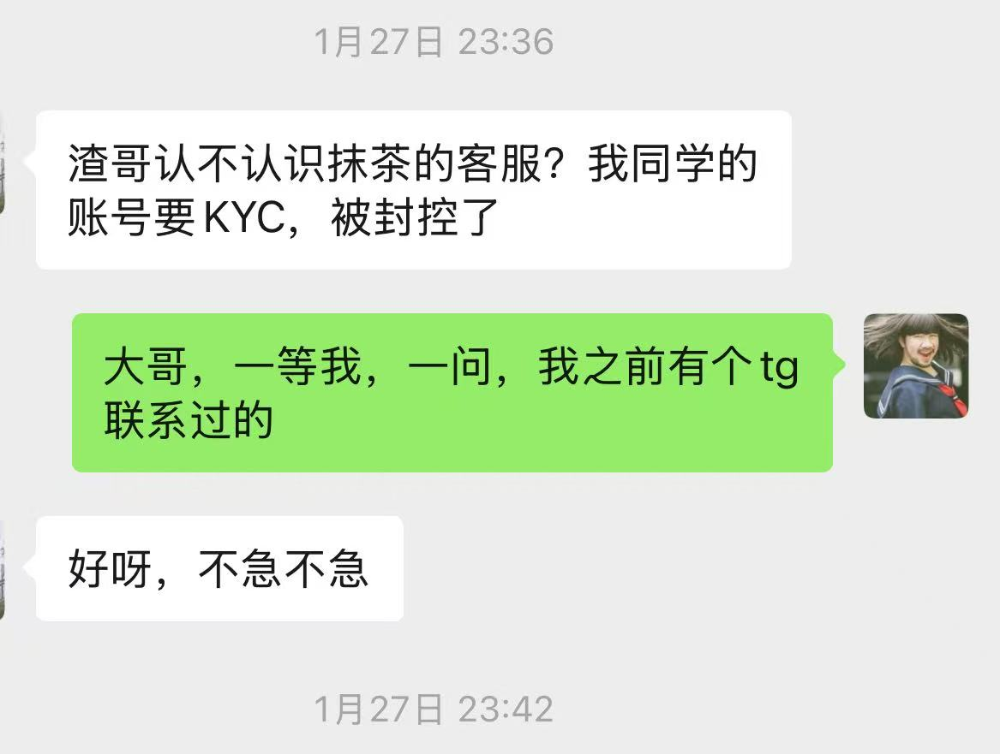
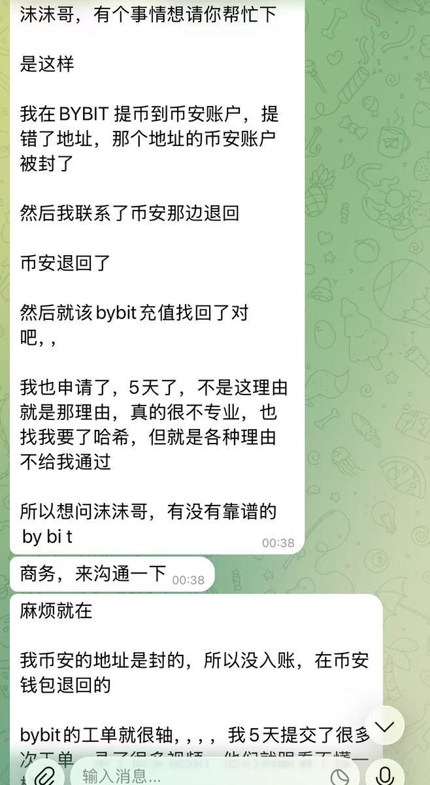
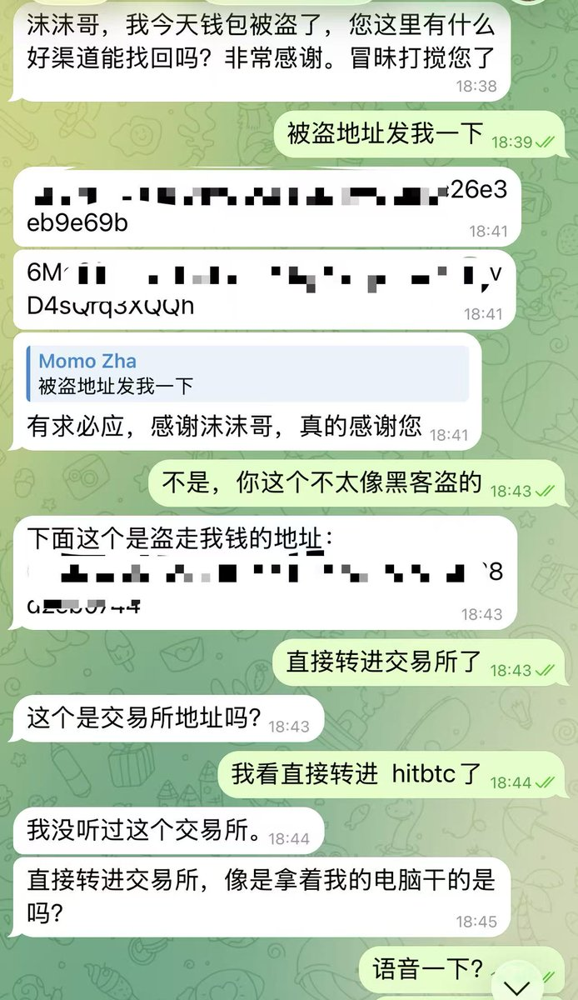

# 加密貨幣投資安全與風險管理

> **來源**: [@zhamomo666](https://x.com/zhamomo666/status/2022289019137376649)
>
> **日期**: Fri Feb 13 12:37:29 +0000 2026
>
> **標籤**: `安全` `風險管理` `交易所` `錢包` `防詐騙`

---

## 加密貨幣投資安全與風險管理：實戰經驗分享

### 總覽：投資安全重點速查

| 重點領域 | 具體建議                                                                       | 風險警示                                                              |
| -------- | ----------------------------------------------------------------------------- | -------------------------------------------------------------------- |
| 交易前     | 保持清醒理智，狀態不佳時避免操作。                                                       | 情緒化或不清醒的狀態易導致錯誤決策。                                              |
| 交易所轉帳 | 定期清理交易所白名單地址，不用的及時刪除。                                                     | 錯誤提幣地址可能導致資金損失，且找回困難。                                           |
| 錢包轉帳   | 使用專用手機或APP管理錢包，轉帳時手動輸入密碼。                                                  | 掃臉驗證可能在錯誤操作時來不及反應，導致資金轉出。                                        |
| 錢包安全   | 將交易用錢包與授權用錢包分離，確保交易錢包僅有 SWAP 授權。                                        | 惡意授權可能導致黑客清空錢包。                                                |
| CEX充值   | 充值前確認幣種的鏈、合約地址以及交易所的充提狀態。                                                 | 充錯鏈或合約地址可能導致資金無法到帳。                                             |
| 倉位管理   | 套保倉位要合理，設定止盈止損。                                                           | 未設定止盈止損可能導致重大虧損。                                                |
| 跨鏈操作   | 跨鏈交互進行小額測試，確認合約地址及到帳情況。                                                   | 不同鏈上的幣種合約可能不同，跨鏈可能導致資金損失。                                       |
| CEX套利  | 對於高風險的 CEX 幣種，小額嘗試，避免大資金投入。                                                | 可能面臨到帳延遲甚至封號的風險。                                                 |
| 私鑰保護   | 妥善保管私鑰，避免在不安全的設備上使用錢包。                                                      | 私鑰洩露是導致資金被盜的主要原因。                                                |
| 防範詐騙   | 學習他人經驗，保持獨立思考，不要輕信他人，尤其是冒充名人的詐騙。                                          | 詐騙手法層出不窮，提高警惕，避免上當受騙。                                              |
| 心態調整   | 接受天才只佔少數的事實，腳踏實地累積財富。                                                     | 避免急功近利，保持理性投資心態。                                                |

### 細節決定成敗：加密貨幣投資安全要點

#### 1. 交易前的狀態管理

*   **避免不清醒狀態下交易：** 無論是飲酒、睡眠不足、情緒不佳等，只要會影響判斷力的情況，都應避免進行交易。
    *   **案例：** 作者曾因酒後操作 BONK 合約，誤將 1000 BONK 誤認為是 500U 現貨價值，導致虧損。

#### 2. 交易所轉帳安全

*   **定期清理白名單地址：** 不再使用的交易所白名單地址應及時刪除，避免提幣時誤操作。
    *   **案例：** 作者曾因忘記刪除 Gate.io 的白名單地址，導致提幣錯誤，花費大量時間找回帳戶。

#### 3. 錢包轉帳安全

*   **專用設備和APP：** 使用專用手機或APP管理錢包，避免其他應用程式干擾。
*   **手動輸入密碼：** 轉帳時手動輸入密碼，取代掃臉驗證，給自己更多時間檢查。
    *   **案例：** 作者曾因點錯白名單地址，雖然及時發現，但由於掃臉驗證已通過，無法阻止交易。

#### 4. 錢包使用習慣

*   **區分交易和授權錢包：** 將交易用錢包與需要授權（如跨鏈質押）的錢包分開。
*   **限制授權：** 確保交易錢包僅有 SWAP 授權，避免不必要的風險。
    *   **案例：** 作者曾因錢包授權問題，被黑客清空價值 50WU 的資產。

#### 5. CEX 充值注意事項

*   **確認鏈、合約地址和充提狀態：** 充值前務必確認幣種的鏈（例如 BSC/ETH/BASE）、合約地址是否正確，以及交易所是否開放充提。
*   **CEX 合約地址驗證：** 許多 CEX 會顯示充值代幣的合約地址，務必仔細核對。
    *   **案例：** 有人向 Bybit 充值 50W USDT，但因合約地址錯誤導致資金無法到帳。

#### 6. 倉位管理

*   **合理套保倉位：** 發現套利空間時，設定合理的套保倉位。
*   **設定止盈止損：** 耐心設定止盈止損，避免重大虧損。
    *   **案例：** 作者曾因未設置止盈止損，在 Seraph 倉位上虧損 117WU。

#### 7. 跨鏈操作

*   **小額測試：** 跨鏈操作前，進行小額測試，確認合約地址及到帳情況。
*   **注意差價：** 即使存在巨大差價，也要謹慎，跨過去的幣種合約可能不正確，或無法到帳。

#### 8. CEX 幣種套利

*   **小額嘗試：** 對於套利空間大的 CEX 幣種，小額嘗試即可，避免大資金投入。
*   **警惕風險：** 可能面臨到帳延遲甚至封號的風險。
    *   **案例：** 有人卡了 20W 未到帳。

#### 9. 私鑰保護

*   **謹慎保管：** 妥善保管私鑰，避免在不安全的設備上使用錢包。
*   **避免洩露：** 創建錢包時注意安全，避免不經意間洩露私鑰。
    *   **案例：** 作者早期搬磚時，因在家用電腦登錄錢包，導致價值 20W 的資產被盜。

#### 10. 防範詐騙

*   **學習他人經驗：** 學習他人的經驗教訓，提高警惕。
*   **相信自己：** 保持獨立思考，不要輕信他人，尤其是冒充名人的詐騙。
    *   **案例：** 甚至有人冒充作者進行詐騙，騙取他人數萬 U。

#### 11. 心態調整

*   **接受現實：** 接受天才只佔少數的事實，大部分人都是通過長期努力和累積來賺錢。
*   **腳踏實地：** 腳踏實地，從小的金額開始累積，避免急功近利。

### 總結

加密貨幣投資充滿機會，但也潛藏風險。細節的疏忽可能導致資金損失。學習他人經驗，養成良好的安全習慣，保持清醒理智，才能在幣圈穩健前行。

