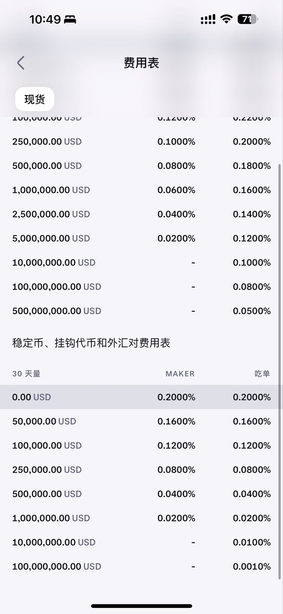

# USDC 無損兌換 USDG 搬磚套利

> **來源**: [@richrichardoz](https://x.com/richrichardoz/status/2011860176694051274)
>
> **日期**: 
>
> **標籤**: `USDC` `USDG` `Kraken` `OKX` `搬磚` `套利` `加密貨幣` `美股`

---

## 利用 USDC 無損兌換 USDG 搬磚套利指南

### 總覽/重點

| 交易所  | 操作                 | 手續費 | 備註                                                                                                                                                                                             |
|-------|----------------------|------|-------------------------------------------------------------------------------------------------------------------------------------------------------------------------------------------------|
| Kraken | USDG 兌換 USD (掛單) | 0    | 需等待成交，時間約半天。                                                                                                                                                                                     |
| OKX    | USDC 閃兌 USDG      | 0    | 1:1 兌換。                                                                                                                                                                                           |
| Kraken (會員) | USDT 兌換 USD       | 見備註 | 月費 3-4 美元，每月首 1 萬美元成交免手續費。適合小額出金，省時快速。超過 1 萬美元部分仍需手續費。                                                                                                                                |

### 背景

社群用戶 @richrichardoz (小Z) 分享了一種利用 Kraken 和 OKX 將 USDC 無損兌換為 USDG 的搬磚方法，旨在降低傳統出金的手續費成本。此方法特別適用於希望將資金轉為美元進行理財或投資美股/港股的用戶。

### USDC 溢價與美股投資

小Z 猜測，USDC 在行情較差時相比 USDT 溢價，可能是因為 USDC 更容易兌換成美元，方便投資美股和其他美元計價市場。當 USDC 溢價回落時，便出現了搬磚的機會。

### 低成本出金美元方案

以下介紹兩種低成本出金美元的方案：

**方案一：USDC -> USDG -> USD (無損兌換)**

1.  **OKX 閃兌：** 在 OKX 交易所使用閃兌功能，將 USDC 以 1:1 的比例兌換為 USDG，且免手續費。
2.  **充值至 Kraken：** 將 OKX 兌換好的 USDG 充值到 Kraken 交易所。
3.  **Kraken 掛單交易：** 在 Kraken 上將 USDG 掛單交易為 USD，手續費為 0。通常需要等待約半天才能成交。

此方案的優點是幾乎無手續費磨損 (0%)，相較於傳統出金方式，每 10 萬美元可節省約 200 美元的手續費（0.2%）。

**方案二：Kraken 會員 (小額出金)**

1.  **開通 Kraken 會員：** 在 Kraken 上開通會員（注意不是 Kraken Pro），月費約 3-4 美元。
2.  **USDT 兌換 USD：** 每月前 1 萬美元的交易免手續費，可以直接使用 USDT 兌換 USD，成交速度快，無需掛單等待。

此方案適合小額出金，可以省下少量手續費。但超過 1 萬美元的部分仍需支付手續費。

### 注意事項

*   方案一需要一定的等待時間 (掛單成交)。
*   方案二僅適用於小額出金 (每月 1 萬美元以內)。
*   需留意各交易所的充值和提現規則。

