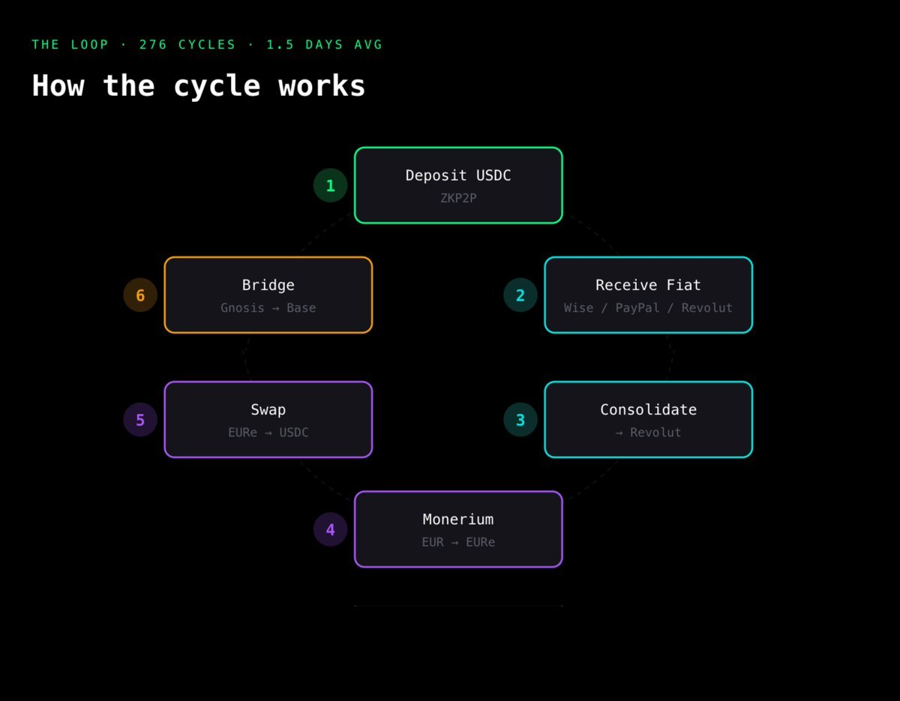

# 利用 P2P 出入金利差進行套利

> **來源**: [@AirdropAlchemis](https://x.com/AirdropAlchemis/status/2009454566593712383)
>
> **日期**: Fri Jan 09 02:37:57 +0000 2026
>
> **標籤**: `P2P` `套利` `加密貨幣` `投資機會` `Web3`

---

## 利用 P2P 出入金利差進行套利：Web3 的隱藏機會

### 總覽

本篇文章整理了 @AirdropAlchemis (炼金叔叔) 分享的一種利用 P2P 出入金利差進行套利的投資策略。該策略強調即使不參與高風險操作，Web3 仍然存在許多未被發掘的獲利機會，並鼓勵讀者積極嘗試，抓住潛在的市場機會。

### 策略核心

作者分享了一則案例，一位投資者在九個月內將 6300 美元變成 12700 美元，年化收益率高達 152%。這個驚人的成績並非透過炒作迷因幣、參與 DeFi 協議或挖礦實現，而是透過反覆操作 P2P 出入金的利差獲利。

### 套利邏輯 (參考下圖，原作者未提供，此處為理論推導)

*   **尋找利差：** 透過觀察不同 P2P 平台，或是同一平台不同交易對，尋找買入價與賣出價之間存在利差的機會。
*   **低買高賣：** 在買入價較低的平台買入加密貨幣，然後轉移到賣出價較高的平台賣出，從中賺取價差。
*   **重複操作：** 透過不斷重複上述步驟，可以累積利潤，達成可觀的收益。

**注意事項：**

*   實際操作時，需要考慮交易手續費、轉帳費用以及匯率波動等因素。
*   平台的信譽及安全性至關重要，應選擇可靠的 P2P 平台進行交易。
*   由於政策及市場變化快速，應持續關注相關資訊，調整策略。

### 實踐建議

作者並未實際嘗試該 ZKP2P 平台的策略，但認為只要擁有 WISE 或 Paypal 以及海外銀行卡，理論上可以嘗試。

### Web3 機會的啟示

作者強調，Web3 的各個角落都可能隱藏著機會，鼓勵讀者勇於嘗試，即使可能面臨虧損，也比錯失機會更好。

### 參考資料

*   @unhappyben 的推文連結：[https://t.co/GXNbTyz4dC](https://t.co/GXNbTyz4dC) (來源資訊中的連結)

