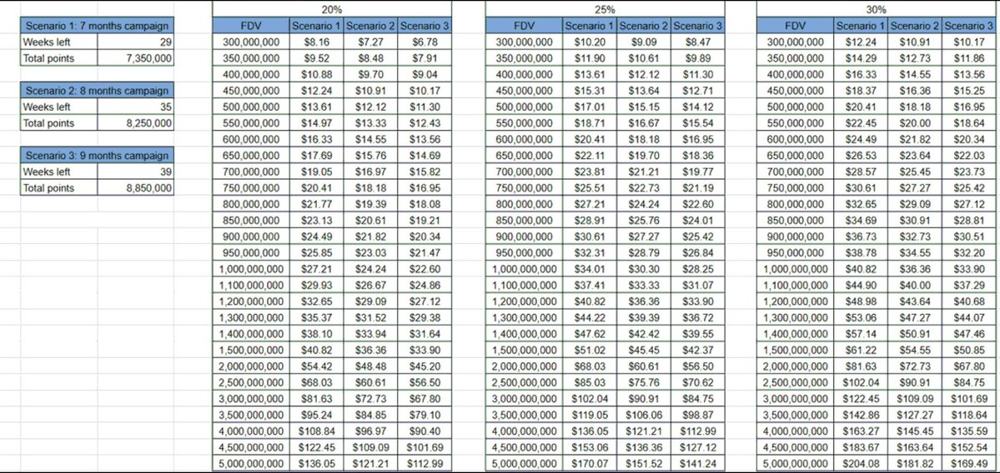

# Variational 第四週積分增長策略

> **來源**: [@tiger_web3](https://x.com/tiger_web3/status/2008907099149852963) | [原文連結](https://x.com/tiger_web3/status/2008292159032893630)
>
> **日期**: Wed Jan 07 14:22:30 +0000 2026
>
> **標籤**: `加密衍生品` `積分挖礦` `對沖策略`

---

# Variational 第四週積分增長策略

> **來源**: [@tiger_web3 (TIGER)](https://twitter.com/tiger_web3)  
> **日期**: 2026-02-14  
> **標籤**: `Variational` `DeFi` `積分策略` `對沖交易` `持倉管理`

---

## 概述

作者基於前三週的實踐經驗以及社群內的中外復盤，總結出 9 條 Variational 平台積分增長策略。核心觀點：**Variational 的積分將非常值錢，預計會達到 $30/分**。

## 策略總覽

| 策略編號 | 核心要點 | 適用場景 |
|---------|---------|---------|
| 1 | 小幣種持倉 + 跨平台對沖 | 高積分收益 |
| 2 | ETH 空單 + BTC 多單組合 | 過夜持倉風險管理 |
| 3 | 拆單開平倉 | 點位差大的小幣種 |
| 4 | 延長持倉天數 | 已承擔點位費的倉位 |
| 5 | 3-5 天重新開倉 | 避免積分衰減 |
| 6 | 不建議純刷量 | - |
| 7 | 虧損時分次關倉 | 提高損失返還概率 |
| 8 | 多倉位組合管理 | 長期 + 機動倉位 |
| 9 | 週四快照前注入大資金 | 可能有加成效果 |

## 詳細策略說明

### 1. 小幣種持倉對沖

- **操作方式**：在 Variational 選擇小幣種持倉（給分較多），在其他 perp 平台（Paradex、Standx 等）做對沖
- **優勢**：最大化 Variational 積分收益，同時控制價格風險

### 2. 跨幣種組合拳過夜

- **操作方式**：ETH 空單 + BTC 多單
- **目的**：防止單方面行情插針造成大幅虧損
- **適用時機**：需要持倉過夜時

### 3. 點位差管理

- **現象**：部分小幣種點位差很大，開倉時會有較大損耗（雖無手續費）
- **解決方案**：拆單進行開倉平倉，降低滑點成本

### 4. 延長高點位差倉位持倉

- **邏輯**：點位差大的幣種通常持倉積分也不少
- **建議**：既然已承擔點位費成本，不如多持有幾天以回收成本

### 5. 定期重新開倉

- **原因**：持倉時間過長會有積分衰減
- **建議週期**：3-5 天重新開倉一次

### 6. 避免純刷量

- **結論**：純刷交易量沒有實質意義

### 7. 關倉策略

- **時機選擇**：盡量選擇 Variational 有虧損的時候關倉
- **操作方式**：分多次關倉
- **潛在收益**：有概率抽中損失返還

### 8. 多倉位管理策略

**長期倉位（2-3 個）**：
- 跨平台對沖持有
- 穩定獲取持倉積分

**機動倉位（2 個）**：
- 3-5 小時開關一次
- 保持跨平台對沖

### 9. 週四快照前資金配置

- **操作**：快照前挪入一筆大資金
- **依據**：根據經驗可能有加成效果
- **建議**：值得嘗試

## 參考資源

- [Variational 最全積分增長黑客匯總（中文區）](https://t.co/JPdMF4KdTk)
- [Variational 最全積分增長黑客匯總（英文區）](https://t.co/GZYteskCvN)

## 邀請碼福利

- 邀請碼：`OMNI9X3XZ1K0`
- 使用福利：12% 積分加成 + 返點返還
- 平台連結：https://t.co/JcAx0noFMX
