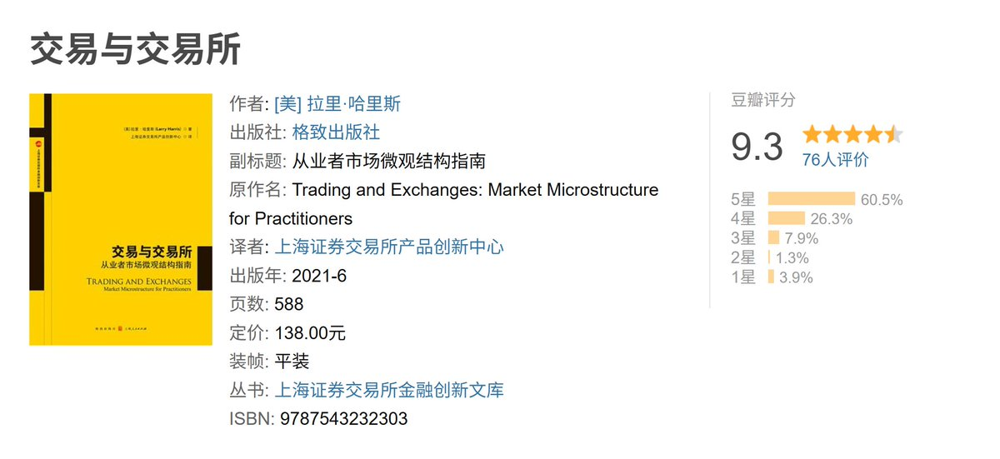

# 熊市學習路線圖：交易、KOL、編程三大方向

> **來源**: [@LumaoDoggie](https://x.com/LumaoDoggie/status/1989319307478884429)
>
> **日期**: Fri Nov 14 13:07:37 +0000 2025
>
> **標籤**: `熊市學習` `交易系統` `鏈上套利`

---

# 熊市學習路線圖：交易、KOL、編程三大方向

> **來源**: [@LumaoDoggie (撸毛小狗)](https://twitter.com/LumaoDoggie)  
> **日期**: 2024-XX-XX  
> **標籤**: `熊市` `學習路線` `交易員` `KOL` `區塊鏈開發`

---

## 總覽

熊市是提升自己的黃金時期。本文整理了幣圈三條核心學習路線，幫助你在下個週期來臨前積蓄力量：

| 路線 | 核心技能 | 適合對象 |
|------|----------|----------|
| **交易員路線** | 交易理論、量化系統、風險管理 | 喜歡數據分析與市場研究者 |
| **KOL/嘴撸路線** | 內容創作、社群影響力、信息整理 | 擅長表達與社群經營者 |
| **編程/科學家路線** | 以太坊開發、Solidity、MEV 套利 | 有技術背景或願意學習編程者 |

三條路線並非互斥，而是相輔相成——你可以根據興趣選擇，也可以全部學習，技多不壓身。

---

## 1️⃣ 交易員路線

### 📚 必讀書籍（傳統金融經典）

雖然來自傳統金融界，但內在知識與加密貨幣市場相通：

#### **《交易與交易所》(Trading and Exchanges)**
- 證券行業公認必讀書籍
- 對初學者友好
- 核心內容：
  - 交易市場的構成
  - 流動性的形成機制
  - 交易所運作原理

#### **《量化交易：如何建立自己的算法交易事業》**
- 量化投資交易系統的優秀入門書
- 核心內容：
  - 如何創造 alpha 收益（模型建立）
  - 風險管理策略
  - 自動化指令執行系統
  - 實用交易策略

### 🐦 幣圈實戰學習

看完理論書籍後，進入實戰學習階段：

**Twitter 大佬學習法**
- 尋找做 Perp 交易的資深交易員
- 推薦關注：[@gch_enbsbxbs](https://twitter.com/gch_enbsbxbs)、[@lnkybtc](https://twitter.com/lnkybtc)
- 方法：慢慢往前翻他們的發言記錄，全文閱讀並背誦

**開源交易系統研究**
1. 在 GitHub 搜尋開源的合約交易系統
2. 下載到本地
3. 使用 AI 工具（Claude Code / 豆包 / Trae）幫你總結邏輯
4. 在理解的基礎上，加入自己的交易思路

---

## 2️⃣ KOL/嘴撸路線

### 📝 學習特點

- 目前**沒有系統性書籍**
- 需要自己搜集零散文章
- 拼凑起來形成自己的體系

### 🌟 推薦學習資源

**大牛參考**
- [@Nickp_xxx](https://twitter.com/Nickp_xxx) - 嘴撸界大牛，閱讀歷史文章
- [@zohanlin](https://twitter.com/zohanlin) - 嘴撸界大牛，閱讀歷史文章

**系統教學**
- [@gokunocool](https://twitter.com/gokunocool) 的《做 KOL 超級超級基礎教學》系列

**實用技巧**
- Twitter 直接搜尋關鍵字：「kaito 算法」等
- 學習如何利用算法提升曝光

---

## 3️⃣ 編程/科學家路線

### 📖 學習路徑

#### **階段一：以太坊基礎知識**
- 資源：以太坊官網
- 內容：區塊鏈基本原理、以太坊運作機制

#### **階段二：編程語言學習**
- [@Alchemy](https://twitter.com/Alchemy) 官方免費教程
  - JavaScript 編程
  - Solidity 智能合約開發
- Solidity 語言官網教程

#### **階段三：數據獲取能力**
- B 站 Python 爬蟲教程
- 目的：搜集項目方信息
- 核心邏輯：**信息差 = 套利空間**

#### **階段四：MEV 套利技術**
- 學習 MEV（Maximal Extractable Value，最大可提取價值）
- 夾子機器人是 MEV 的一種應用
- 推薦：Flashbots 官方博客文章

### 💡 實際應用場景

雖然無法直接用於求職，但可提供大量鏈上獲利機會：

| 應用場景 | 說明 |
|----------|------|
| **搶跑存錢活動** | 在活動開始前用合約搶先存入 |
| **鏈上監控異動** | 觀察代幣大額轉移，推測項目方動向 |
| **聰明錢跟單** | 自建機器人跟蹤聰明錢的前包操作 |

---

## 🔗 三條路線的協同效應

三條路線並非孤立，而是可以相互增強：

### 案例：2024 年 10 月 11 日 05:12 幣安暴跌事件

**路線協同運作示範**：

1. **編程能力發揮作用**
   - 自建機器人電話告警
   - 即時發現市場異常

2. **交易知識支撐判斷**
   - 觀察流動性異常減少
   - 運用交易所知識推測：只是幣安做市商問題
   - 判斷低價是暫時的 → 果斷抄底獲利

3. **KOL 能力放大成果**
   - 將抄底過程圖文並茂寫出
   - 語言精煉生動
   - Twitter 收獲大量曝光和粉丝

---

## 💭 思考題

熊市期間，你有什麼樣的學習計劃？
