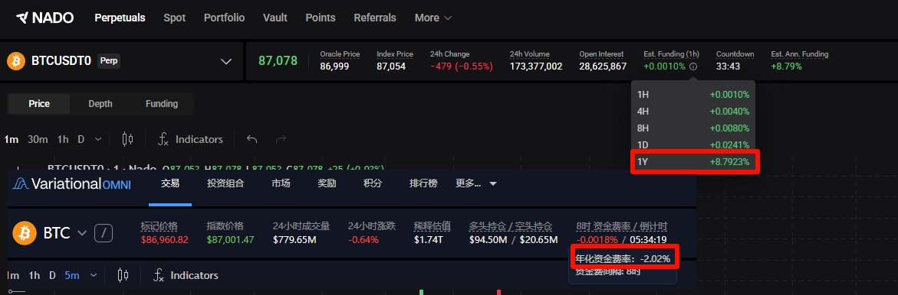

# 你真的在乎 20% 年化收益嗎？— DeFi 借貸策略收益分析

> **來源**: [@0xAllen](https://x.com/0xAllen/status/2003777353357689257)
>
> **日期**: Wed Dec 24 10:38:44 +0000 2025
>
> **標籤**: `DeFi 借貸` `收益率分析` `投資心態`

---



以下是整理後的正文內容：

---

## 核心觀點

當市場出現所謂「20% 年化收益」的理財產品時，許多投資者會蜂擁而至。但真正值得思考的問題是：這個看似誘人的數字，對你的實際投資組合影響有多大？

作者通過具體計算案例，揭示了一個重要真相：**高年化收益率的吸引力，往往被數字本身所誇大，而實際收益可能遠低於預期。**

## 案例分析：DeFi 借貸套利策略

假設投資者手中有 5 萬 USDT，採用以下策略在 Vara 和 Nado 兩個協議中開槓桿借貸：

| 協議 | 投入資金 | 槓桿倍數 | 總敞口 | 平均費率年化 |
|------|----------|----------|---------|--------------|
| Vara | 25,000 USDT | 3 倍 | 75,000 USDT | 2% |
| Nado | 25,000 USDT | 3 倍 | 75,000 USDT | 8% |

### 實際收益計算

```
Vara 年收入 = 75,000 × 2% = 1,500 USDT
Nado 年收入 = 75,000 × 8% = 6,000 USDT
總年收入 = 7,500 USDT
實際年化收益率 = 7,500 ÷ 50,000 = 15%
```

**加上潛在空投獎勵**，實際綜合年化約為 **15% + 空投**。

## 關鍵思考

### 1. 真實吸引力的質疑

即使有超過 20% 年化收益且帶空投預期的項目，市場 FOMO 情緒並不強烈。這反映出：
- 投資者對單純的高年化數字已產生疲勞
- 實際可持續性和執行難度成為更重要的考量因素

### 2. 執行難度

關鍵問題在於：**這個策略能否持續執行超過 1 個月？**

大多數高年化收益策略面臨的挑戰：
- 資金容量限制
- 費率波動風險
- 協議流動性變化
- 脫錨風險（文中已暫且排除討論）

### 3. 機會成本

7,500 USDT 的年收入聽起來不錯,但需要考慮：
- 資金鎖定期間的其他機會
- 市場波動帶來的潛在收益
- 操作成本和時間成本

## 總結

**20% 年化收益真的那麼重要嗎？** 答案取決於：

1. **規模效應**：對於 5 萬 USDT 的本金,15% 年化意味著 7,500 USDT 的收入
2. **持續性**：能否長期穩定執行比短期高收益更重要
3. **風險評估**：需要全面考量脫錨、清算、協議風險等因素

作者通過這個案例提醒投資者:**不要被表面的高年化數字迷惑,而應該深入計算實際收益,並評估策略的可持續性。**
