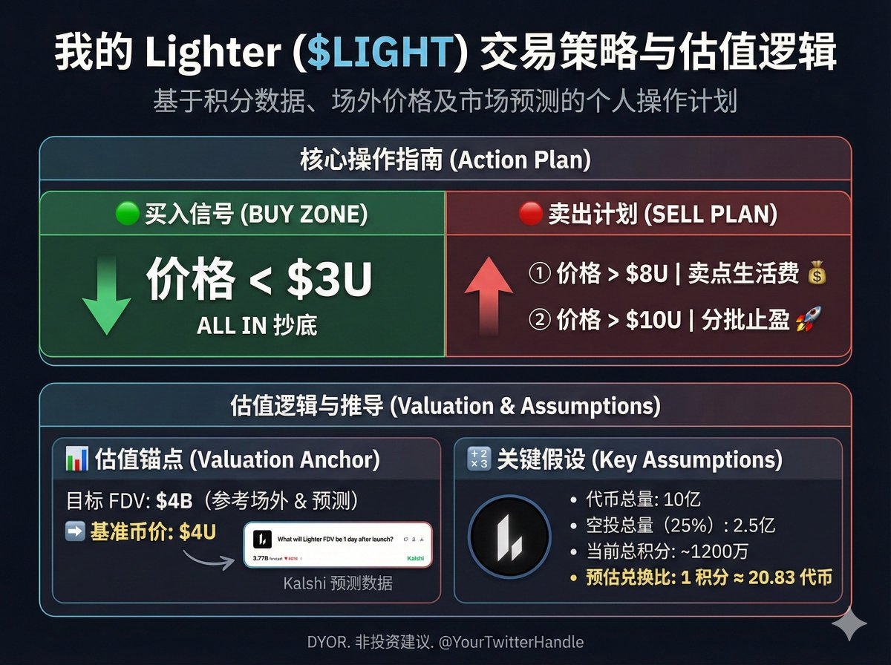
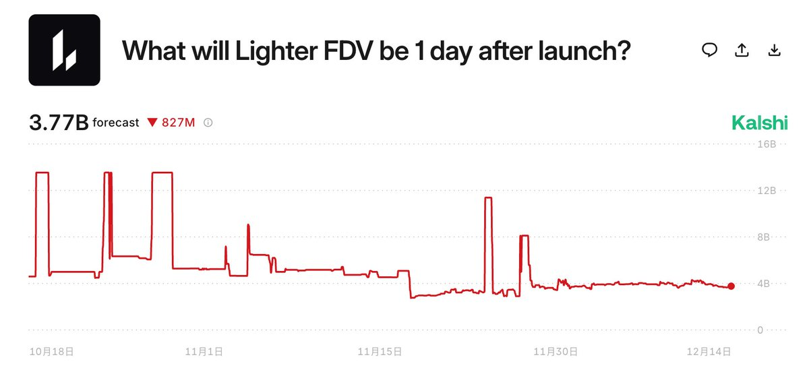

# Lighter 代幣估價與買賣策略分析

> **來源**: [@c_dylanber](https://x.com/c_dylanber/status/2000068985769873474)
>
> **日期**: Sun Dec 14 05:03:00 +0000 2025
>
> **標籤**: `代幣估價` `投資策略` `空投規劃`

---





# Lighter 代幣估價與買賣策略分析

> **來源**: [@c_dylanber (诺诺Dylan)](https://x.com/c_dylanber)  
> **參考**: [@timemoonc](https://x.com/timemoonc) 的空投份額計算方法  
> **日期**: 2024-12  
> **標籤**: `Lighter` `代幣估價` `空投策略` `場外交易`

---

## 核心數據總覽

| 項目 | 數值 | 說明 |
|------|------|------|
| 代幣總量 | 10 億枚 | 已公布代幣合約確認 |
| 空投比例 | 25% | 保守估計（原 30%，融資稀釋後調整） |
| 空投總量 | 2.5 億枚 | 10 億 × 25% |
| 總積分量 | 1,200 萬 | 預估聖誕節空投時數據 |
| **積分兌換率** | **20.83 枚/積分** | 2.5 億 ÷ 1,200 萬 |
| 場外報價 | 80-83 USDT/積分 | 1M 資金量級的市場價格 |
| **推算單幣價** | **≈4 USDT** | 80 USDT ÷ 20.83 |
| 推算 FDV | 4B USDT | 與 Kalshi 預測市值一致 |

## 買賣策略

### 買入策略
- **<3 USDT**: All in 買入
  - 理由：低於推算合理價 25%，具備安全邊際

### 賣出策略
- **>8 USDT**: 賣出部分作為生活費
  - 理由：較推算價溢價 100%，可變現部分收益
- **>10 USDT**: 分批賣出
  - 理由：較推算價溢價 150%，逐步獲利了結

## 估價邏輯推導

### 空投份額調整

原始空投比例為 30%，但 2024 下半年完成新一輪融資：

- 融資金額：68M USDT
- 融資估值：15 億 USDT
- 稀釋比例：4.533%（含折扣後按 5% 計算）
- **調整後空投比例：25%**（總比例不變前提下）

### 單幣價格推算

```
場外報價：80 USDT/積分
積分兌換率：20.83 枚代幣/積分
單幣價格 = 80 ÷ 20.83 ≈ 4 USDT
```

### FDV 驗證

```
FDV = 單幣價格 × 總供應量
    = 4 USDT × 10 億
    = 4B USDT
```

此數值與 Kalshi 預測市場的估值一致，增加估算可信度。

## 市場觀察

★ **Insight ─────────────────────────────────────**

1. **場外價格錨定**: 場外報價 80-83 USDT/積分已形成共識，反映市場對項目的基本預期
2. **估值對標參考**: 作者提到"去年冬天某個項目的 TGE 價格"暗示，可能參考同類 DeFi 項目的上市表現
3. **積分稀釋風險**: 若實際空投比例低於 25%，或總積分高於 1,200 萬，兌換率將下降

─────────────────────────────────────────────────

## 關鍵假設與風險

### 假設前提
1. 代幣總量為 10 億（已確認）
2. 空投比例至少 25%（保守估計）
3. TGE 時總積分約 1,200 萬
4. 按積分固定比例兌換代幣

### 潛在風險
- 實際空投比例可能低於 25%
- TGE 前積分總量可能繼續增長
- 市場情緒可能偏離理性估值
- 流動性不足導致實際成交價偏離場外報價

## 決策框架

本策略核心在於：

1. **成本錨定**：以推算的 4 USDT 為合理價值中樞
2. **安全邊際**：3 USDT 以下提供 25% 折價空間
3. **獲利紀律**：8-10 USDT 區間分階段變現，避免貪婪

這種分層策略適合希望在 TGE 時做出理性決策的投資者，既不盲目追高，也不過早離場。
