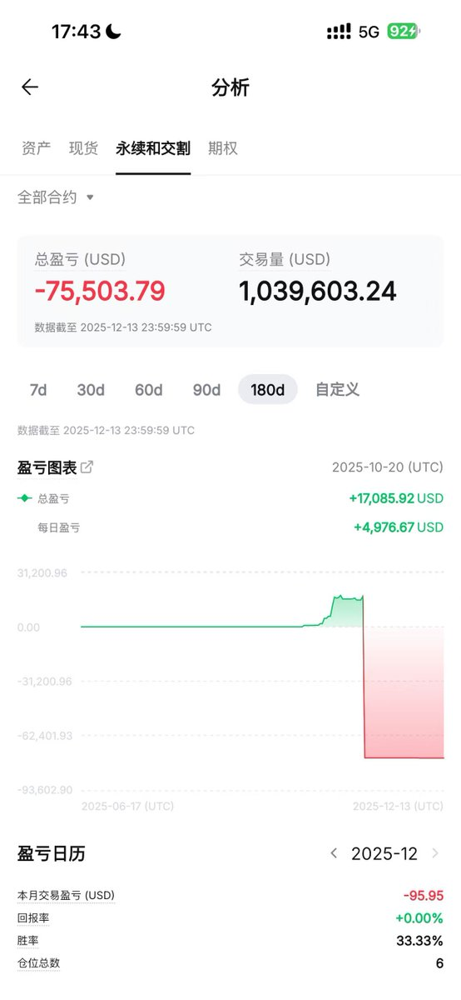
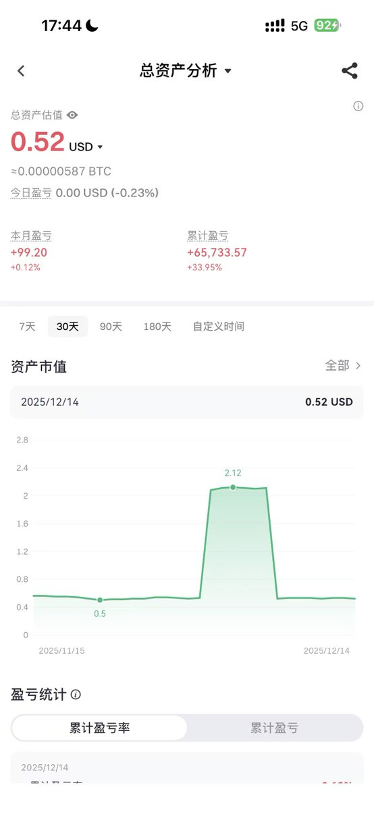

# 大學生幣圈一年真實賬單：從撸毛到套利的復盤

> **來源**: [@fivepointwater5](https://x.com/fivepointwater5/status/2000140228233953448)
>
> **日期**: Sun Dec 14 09:46:05 +0000 2025
>
> **標籤**: `心態管理` `交易策略` `風險控制`

---




# 大學生幣圈一年真實帳單：從擼毛到套利的復盤

> **來源**: [@fivepointwater5 (五点水)](https://twitter.com/fivepointwater5)
> **日期**: 2026-02-15
> **標籤**: `crypto-investing` `trading-psychology` `risk-management` `arbitrage` `defi`

---

## 重點總覽

| 項目 | 說明 |
|------|------|
| **總結論** | 知識和認知才是幣圈穩定賺錢的關鍵，合約交易是送錢陷阱 |
| **資金規模** | 小本金起步（幾萬-小幾十萬） |
| **最大教訓** | 合約交易兩次歸零，單次套利失誤虧損十幾萬 |
| **成功策略** | 鏈上機制研究、打新策略、DeFi 套利 |
| **時間軸** | 一年七個階段，從新手到技術覺醒 |

---

## 七個階段復盤

### 階段一：新手光環

**特徵：執行力強，小額起步**

- **本金**：1 萬多
- **策略**：交易所擼空投、新用戶活動
- **成果**：幾個月累積到幾萬塊
- **心態**：覺得自己是天選之子

---

### 階段二：合約地獄（第一次歸零）

**特徵：貪快心態，風控崩潰**

- **起因**：嫌擼毛慢，開始合約交易
- **結果**：即使勝率 90%，幾次大虧直接歸零
- **教訓**：高勝率無法對抗單次大額虧損

---

### 階段三：搬磚回血

**特徵：痛定思痛，回歸穩健**

- **策略**：幣安 Alpha 機會 + 繼續擼毛
- **方式**：苦力執行，不走捷徑
- **成果**：成功把本金攢回來

---

### 階段四：賭性難改（第二次幾乎歸零）

**特徵：好了傷疤忘了痛**

- **行為**：再次碰合約
- **結果**：比第一次更慘，利潤歸零 + 心態崩潰
- **影響**：這次是真正的轉折點

---

### 階段五：技術覺醒（轉折點）

**特徵：徹底戒賭，專注學習**

- **學習內容**：
  - 鏈上機制研究
  - 打新策略
  - DeFi 操作
  - 套利技巧
- **時間**：3 個月
- **成果**：靠認知和執行力賺了十幾萬
- **關鍵**：知識 + 執行力的結合

---

### 階段六：滑鐵盧

**特徵：過度自信的代價**

- **心態**：以為自己無敵
- **事件**：一次套利因特殊問題失誤
- **虧損**：直接虧損十幾萬
- **教訓**：再強的技術也需要風險控制

---

### 階段七：穩定獲利（現在）

**特徵：心態平和，持續成長**

- **策略**：運用掌握的鏈上知識和技巧
- **成果**：半個月穩定賺回近 10 萬
- **狀態**：不再追求暴富，專注穩定收益

---

## 核心觀點

### 💡 關於合約交易

> 「合約是把錢扔進大海，知識才是你的救生圈。」

- **合約特性**：即使勝率 90%，只要多虧幾次大的，就會歸零
- **心理陷阱**：好了傷疤忘了痛，容易重蹈覆轍
- **結論**：合約是「送錢」而非「賺錢」的地方

### 💡 關於穩定獲利

**三大要素：**

1. **知識積累**：鏈上機制、DeFi、套利原理
2. **認知提升**：理解市場運作邏輯，而非盲目跟風
3. **執行力**：策略可複用，但需要持續執行

### 💡 關於策略分享

- **可複用性**：作者的策略和方法可以完全複用
- **階段性**：不同資金規模、不同階段策略不同
- **實證效果**：有人用其方法賺到幾千到十幾萬
- **核心目標**：希望大家學會主動思考，而非照抄

---

## 資金曲線特徵

```
新手光環（幾萬）
    ↓
合約歸零（0）
    ↓
搬磚回血（幾萬）
    ↓
再次歸零（0）
    ↓
技術覺醒（十幾萬）
    ↓
套利失誤（虧損十幾萬）
    ↓
穩定獲利（持續成長）
```

---

## 給新手的啟示

### ❌ 避免的陷阱

1. **空想主義**：以為自己能在幣圈輕鬆賺錢
2. **合約誘惑**：被高槓桿、快速獲利吸引
3. **過度自信**：幾次成功後以為自己無敵
4. **不學習**：只想賺錢，不願意投入時間學習

### ✅ 正確的路徑

1. **從小做起**：擼毛、空投等低風險起步
2. **持續學習**：鏈上機制、DeFi、套利知識
3. **認知升級**：理解為什麼這樣做能賺錢
4. **風險控制**：即使有技術，也要做好風控
5. **穩定心態**：不追求暴富，專注長期穩定收益

---

## 作者承諾

- 後續會分享具體策略
- 適合小本金（幾萬到小幾十萬）的方法
- 目標：讓學習者每年穩定賺 10 萬+
- 強調：最重要的是學會自己主動思考
