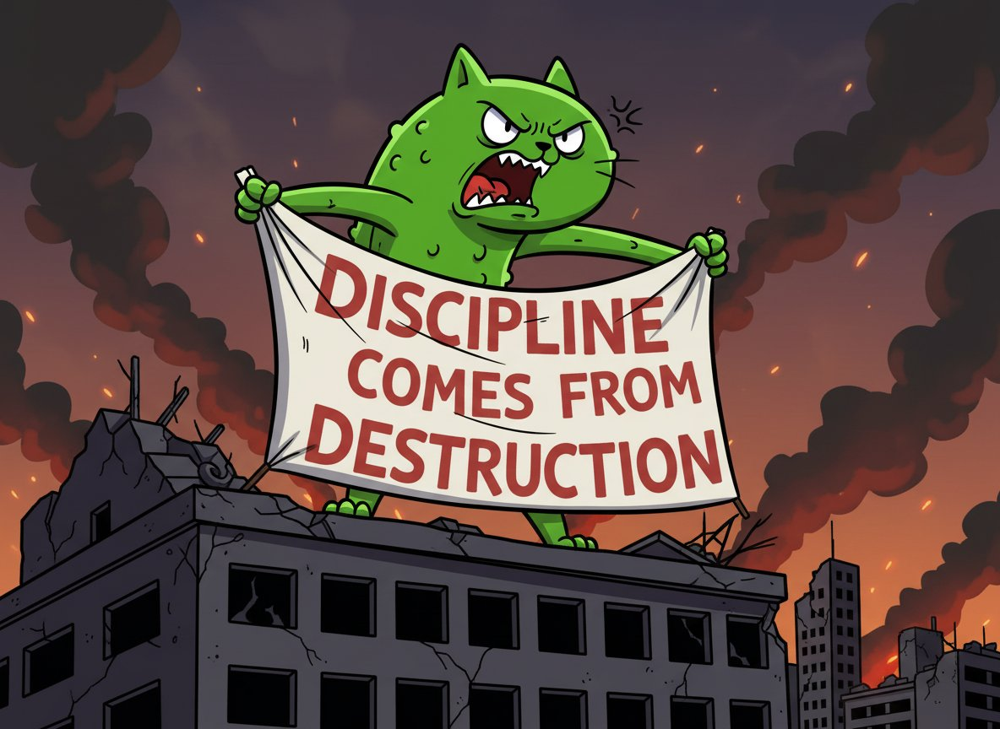

# 交易紀律：從逆境中鍛鍊真實的心理韌性

> **來源**: [@0xPickleCati](https://x.com/0xPickleCati/status/1998688722859016309)
>
> **日期**: Wed Dec 10 09:38:20 +0000 2025
>
> **標籤**: `心態管理` `心理韌性` `虧損恢復`

---

## 核心觀點

交易紀律的本質不是「練習」出來的習慣，而是經歷多次毀滅性打擊後「被迫」重塑的心理韌性。真正的紀律來自破壞（destruction），而非決心（determination）。

---

## 一、常見誤區：紀律可以練出來？

### 零售交易者的錯誤建議

| 錯誤觀念 | 現實 |
|---------|------|
| 找到策略 + 建立紀律 = 賺錢 | 策略再好，心理素質不夠就是白搭 |
| 紀律像運動一樣可以重複練習 | 紀律無法透過「練習」培養，必須經歷真實痛苦 |
| 假紀律在順境中有用 | 真正壓力來臨時會完全崩潰 |

**核心問題**：如果你的心態是整個交易系統中最脆弱的部分，再好的策略也無法在你身上發揮作用。

---

## 二、真實紀律的來源：破壞，而非決心

> **殘酷真相**：如果人生從未多次擊碎過你，你根本不具備複製成功交易者紀律的心理韌性。

### 成功交易者的特質

| 表象 | 本質 |
|------|------|
| 冷靜沉著的執行力 | 經歷過足夠痛苦，舊本能已死 |
| 看似「練出來」的紀律 | 從毀滅中鍛造出來的生存能力 |
| 高勝率策略 | 策略 + 內在韌性的結合 |

### 類比：爭吵中的反應差異

- **情緒崩潰者**：缺乏經歷，無法承受壓力
- **冷靜致命者**：經歷過更大風暴，這點壓力根本不算什麼

差別不在「自制力」，而在於**見過更大的世面，內心已經死過一次**。

---

## 三、如何獲得真實紀律？

### 1. 紀律不是漸進式成長

> 紀律的獲得是突然且暴力的，通常發生在你最低谷的時刻，當舊的自我被徹底撕碎。

### 2. 別浪費你的低谷

**大多數人在低谷時的錯誤**：
- ❌ 攻擊外在世界
- ❌ 推開愛你的人
- ❌ 浪費情緒能量在無意義的事上

**正確做法**：
- ✅ 將能量投入自我進化
- ✅ 面對你的羞恥與恐懼
- ✅ 列出 30 件最害怕或最羞愧的事

> 「做得好」的你永遠不會有勇氣面對那份清單。低谷是人生少數能經歷蛻變的機會，別浪費它。

---

## 四、學習的正確方向

### ❌ 不要研究：成功本身

| 為什麼不該複製成功 |
|-------------------|
| 成功有一半是運氣、時機和你不具備的優勢 |
| 別人的策略、作息、知識不會神奇地在你身上生效 |

### ✅ 該研究：他們如何撐過最低谷

| 值得學習的真實部分 |
|-------------------|
| 如何處理失去一切 |
| 大部分人放棄時他們如何堅持 |
| 如何將痛苦轉化為力量而非自我憎恨 |

> 成功是個人的，但「死亡→重建→更強」的路徑是普世的。這才是唯一值得複製的部分。

---

## 五、給交易者的反思

### 交易的秘密不在於：
- ❌ 更多策略
- ❌ 更多宏觀研究
- ❌ 更多知識

### 真正的關鍵在於：
- ✅ 完全跳出交易，認識並接受你破碎的部分
- ✅ 面對你的心魔
- ✅ 在極端逆境中重塑自我

---

## 總結表

| 假紀律 | 真紀律 |
|--------|--------|
| 練習培養的習慣 | 經歷破壞後的重生 |
| 順境中有效 | 任何壓力下都穩定 |
| 基於決心 | 基於已死過的經驗 |
| 可以運氣加持短期賺錢 | 能長期守住財富 |
| 複製成功者的策略 | 學習他們如何撐過低谷 |

**最終結論**：作者經歷三次爆倉才開始賺錢，因為真正的交易紀律不是知識或技巧，而是在反覆失敗中鍛造出的、無法被壓力摧毀的心理韌性。
