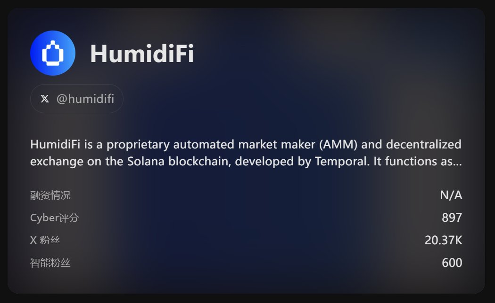

# 普通人對抗科學家包場的公售策略

> **來源**: [@DGYC999](https://x.com/DGYC999/status/1996468503948431853)
>
> **日期**: 
>
> **標籤**: `公開銷售` `錢包配置` `交易優化`

---

好的，我來整理這篇關於公售競爭策略的文章。

## 核心策略總覽

| 要素 | 推薦配置 | 說明 |
|------|----------|------|
| 錢包 | Jupiter Wallet + 3-5個多錢包 | 官方聲稱簽名提交速度優於 Phantom |
| RPC 節點 | Helius、ERPC、QuickNode | 避免使用公共 RPC，提升交易速度 |
| Gas 費 | 調至最高檔或手動提升 | 確保交易優先被打包 |

## 錢包配置

### 首選錢包
- **Jupiter Wallet**：根據官方說明，其簽名提交速度優於常見的 Phantom 錢包
- **多錢包策略**：準備 3-5 個錢包，分散風險並提高成功率

### 為什麼需要多個錢包
在競爭激烈的公售環境中，單一錢包容易受限於網路延遲或交易擁堵。使用多個錢包可以：
- 提高至少一筆交易成功的機率
- 分散資金降低單點風險
- 在某個錢包失敗時仍有備案

## RPC 節點優化

### 推薦節點服務
1. **Helius**：提供免費方案，適合預算有限的用戶
2. **ERPC**：付費服務，穩定性更高
3. **QuickNode**：付費專業級 RPC 服務

### 配置方法
在錢包設置中切換至自定義 RPC，避免使用公共節點。公共 RPC 因為使用人數眾多，在高峰時段容易擁堵，導致交易延遲。

## Gas 費設置

### 最佳實踐
- **預設配置**：在高級設置中預先調至最高檔位
- **手動調整**：在交易確認前仍可手動拉升 Gas 費

### 為什麼 Gas 費重要
更高的 Gas 費意味著交易會被優先打包。在公售搶購場景中，幾秒甚至幾毫秒的差距就可能決定成敗。

## 普通用戶常見失誤

| 問題 | 影響 |
|------|------|
| 使用公共 RPC | 交易延遲，成功率低 |
| Gas 費用默認低檔 | 交易排隊靠後，容易失敗 |
| 僅使用單一錢包 | 沒有備案，風險集中 |

## 風險提醒

⚠️ **重要警告**：
- 即使做足準備，仍存在運氣成分
- **務必提前防範釣魚風險**，確認官方正確連結
- 切勿點擊可疑的假冒網站或連結

---

**實務建議**

這些優化措施可以顯著提升你在公售中的競爭力，但無法保證 100% 成功。在與科學家（專業搶購腳本）競爭時，普通用戶的優勢在於靈活性和多樣化策略。建議在正式公售前：

1. 提前測試所有錢包和 RPC 配置
2. 確認每個錢包都有足夠的 SOL 支付 Gas 費
3. 將官方公售頁面加入書籤，避免臨時搜尋誤入釣魚網站
4. 設定鬧鐘提前 15 分鐘準備
