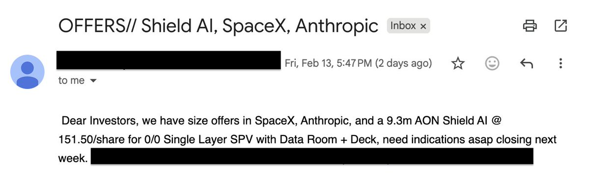

# Pre-IPO 投資指南：SPV 結構、成本分析與靠譜渠道

> **來源**: [@yourQuantGuy](https://x.com/yourQuantGuy/status/2023011893489594476)
>
> **日期**: Sun Feb 15 12:29:55 +0000 2026
>
> **標籤**: `Pre-IPO投資` `SPV結構` `資產配置`

---

> **來源**: [@yourQuantGuy](https://x.com/yourQuantGuy)
> **日期**: 2026-02-17
> **標籤**: `pre-ipo` `投資` `SPV` `風險投資`

---

## 核心建議

評論區部分評論是認真的，大多都是瞎建議的。作者已購買小 $1M 的 pre-ipo，分享以下經驗。

## 不推薦的投資方式

### 1. 鏈上基金
純粹宰割區塊鏈散戶的工具，存在以下問題：
- 估值高
- 手續費高
- 每年管理費高
- 甚至還有 carry（盈利退出後要給分成）

### 2. 鏈上 Tokenized Shares
同樣存在問題：
- 估值高
- 資金費高

### 3. 不合理的 SPV 結構
正經的 pre-ipo 的 SPV 一般都只收一次性的手續費。如果碰到每年還需要收高額管理費和利潤分成的，基本不用考慮。

**邏輯**：SPV 唯一的功能就是持有 pre-ipo，其他什麼都不用做，即使有股份的買賣，收一次性手續費就行了，收什麼管理費和利潤分成？

## SPV 結構說明

### 什麼是 SPV
99% 的 pre-ipo 的股份都是通過 SPV 持有，但 SPV 只是持有的方式，和去哪裡買是完全兩回事。

### SPV 類型

#### Single Layer SPV（單層 SPV）
- **優點**：最優選擇，風險層級少
- **限制**：某些公司（如 SpaceX）小於 $1M 的基本沒法進 single layer SPV

#### Double Layer SPV（雙層 SPV）
- **結構**：多了一層持有關係
- **風險**：多了一層風險
- **適用場景**：當 single layer SPV 門檻過高時（如 SpaceX 小於 $1M 的投資）

### 合理的 SPV 費用結構
- **0 管理費**
- **0 carry**
- **只有一次性費用（3%-6%）**

## 靠譜且長期有效的渠道

### 1. Web2 平台（Hiive、Forge Global 等）

#### 運作方式
不需要考慮網站上顯示的掛單深度。注冊後：
- 會有人直接來聯繫你
- 或者你主動聯繫客服，說明需求（關注的 pre-ipo 公司、行業）
- 一旦有符合要求的公司股份，會直接發郵件聯繫
- 也會直接幫你找貨源

#### 實際體驗
- 作者在 Hiive 和 Forge Global 都買過
- 雖然看起來偏向散戶，但 size 不算小
- 最近在 Forge 上成交的一筆最低要求 $25 萬
- 參與的所有 SPV 都是：0 管理費、0 carry、只有一次性費用（3%-6%）

### 2. 找 VC 購買

#### 優點
- 貨源多
- 聯繫一次後，定期會來找你兜售
- 附圖顯示：0/0 就是 0 管理費、0 carry

#### 存在的問題

**大 VC 問題**：
- 要求的 size 太大（一單幾個 $M）

**小 VC 問題**：
- 支持幾十萬 U 的小額
- 但擔心他們的 SPV 不靠譜

#### SPV 風險說明
Pre-ipo 的風險，除了你投的公司本身以外，最大的風險就是 SPV。因為：
- SPV 持有股份
- 你持有 SPV 的股份
- 要是 SPV 做惡，那就麻煩了

**平台對比**：
- Hiive 和 Forge Global 的 SPV 基本不用擔心
- 小 VC 的 SPV 總還是會讓人不放心

#### 找 VC 的建議方法
1. 找行業內的人問問有沒有認識的靠譜的 VC 在賣
2. 自己發郵件找 VC 問問

## 總結表格

| 投資方式 | 是否推薦 | 主要問題 | 費用結構 |
|---------|---------|---------|---------|
| 鏈上基金 | ❌ | 估值高、手續費高、管理費高、carry | - |
| 鏈上 Tokenized Shares | ❌ | 估值高、資金費高 | - |
| Web2 平台（Hiive/Forge） | ✅ | SPV 可靠 | 一次性 3%-6% |
| 大 VC | ⚠️ | Size 要求太大（幾個 $M） | 0/0（0 管理費、0 carry）|
| 小 VC | ⚠️ | SPV 可靠性存疑 | 需確認 |
| 不合理的 SPV | ❌ | 每年管理費 + carry | - |
