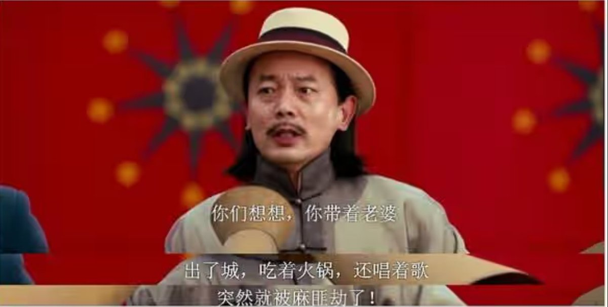

# River 項目 20 萬美元虧損教訓：代幣套利陷阱與項目方信用危機

> **來源**: [@liguagua](https://x.com/liguagua/status/1994714361500479713)
>
> **日期**: Sat Nov 29 10:25:38 +0000 2025
>
> **標籤**: `項目風險` `套利失敗` `人品勝於代碼`

---

> **來源**: [@liguagua (瓜哥)](https://twitter.com/liguagua)
> **日期**: 2026-02-17
> **標籤**: `crypto-investing` `風險管理` `項目方信用` `積分套利`

---

## River 項目虧損事件始末

### 初期吸引力

@RiverdotInc 這個項目，瓜哥起初注意到它，是因為上了 @binancezh alpha + 永續。

積分可以以一定比例兌換為代幣，利潤率超過年化 1000%，於是瓜哥買了 28 萬刀積分。

### 項目方突然暫停兌換

在回本後準備開開心心挖提賣的第一天，項目方暫停了兌換，已經半個多月了。

自那之後：
- River 幣價跌了 50%
- 積分價格跌了 90%

### 項目方意圖分析

項目方的所有表態，瓜哥明確講，就是想要 rug。只是作為一個現貨還上了 @Bitget_zh @krakenfx 的項目，也許很多人會認識項目方，導致他們想跑不好跑的狀態。

**項目方的利益點在哪裡？**

當初積分價格 0.04u 的時候，是積分-代幣套利模式最廣為傳播的時候，瓜哥及身邊朋友買了上百萬刀。然後積分價格維持不變，說明項目方賣了幾百萬刀的積分。

## 核心教訓

這個項目，破了瓜哥維持至少 2 年的不虧金身，也讓瓜哥認識到：

**區塊鏈的世界，code 並不是 law，項目方的人品才是 law。**

@binancezh alpha 也不是什麼信譽背書，有錢就能上，公共汽車，票價不貴。

以後玩項目，瓜哥要先打聽下項目方的背景了。

有任何認識 @RiverdotInc 項目方個人信息的，可以私信瓜哥，驗真後有酬。

## 其他交易案例

### ENA 做空案例

瓜哥在 9 月底的 ena 帖子裡，說押注牛市結束，實際在 0.6 附近做空了 100 萬個 ena。

**做空的市場原因**：
- 幣安 9 月新幣合計抽血 100 億刀，近 2 年歷史最高記錄

**做空的個體原因**：
1. 如果 ena 在 s5 能繼續給出高比例空投，那麼 yt 跟幣價之間肯定有不少差價，那如果空錯了，可以回補 yt
2. 如果 ena 在 s5 不怎麼給空投了，那就沒多少人願意玩了，tvl 會下跌，利空幣價

實際走了 2，不過瓜哥的空單在 0.37 附近就結束了。

### CB Monad 打新案例

這一次的 cb monad 打新，瓜哥合計打中 37.5 萬刀，在 0.033 平倉，盈利 12 萬刀。

在幣安盤前 oi 很低、難以套保的情況下，在要結束的那天早上，感謝 @yuren477 看多市場，做多 monad，從而讓我決定以及可以上倉位幹。

帶有二級性質的套利，當然有更高的風險，但瓜哥似乎自 ena 以來，最後都贏了。
