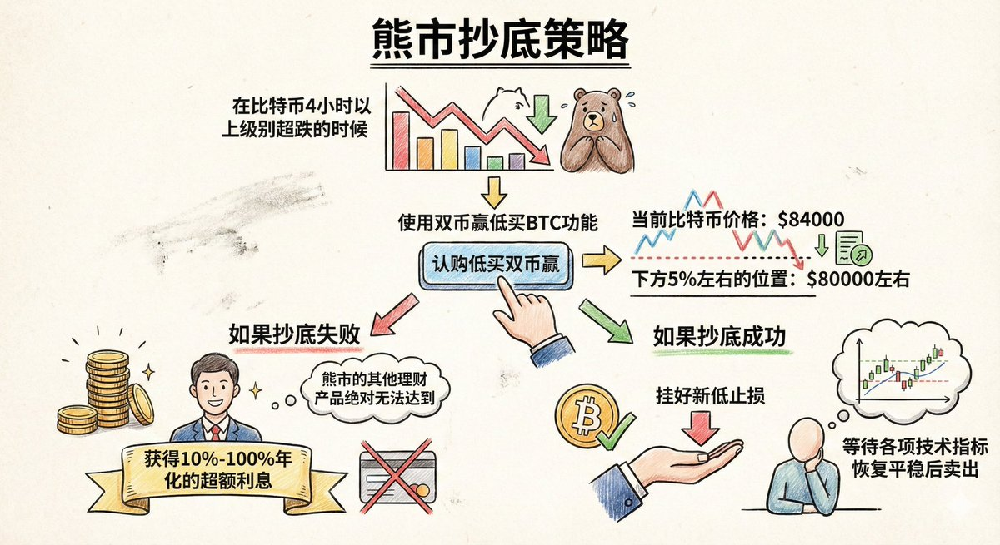

# 熊市抄底策略：雙幣贏低買操作指南

> **來源**: [@discountifu](https://x.com/discountifu/status/1992216690273530100)
>
> **日期**: Sat Nov 22 13:00:47 +0000 2025
>
> **標籤**: `抄底策略` `雙幣贏` `風險管理`

---

> **來源**: [@discountifu (大夢想家迪士尼)](https://twitter.com/discountifu)
> **日期**: 2026-02-17
> **標籤**: `熊市策略` `雙幣贏` `BTC` `抄底` `理財產品`

---

## 策略概述

分享一個穩健的熊市抄底策略，使用雙幣贏低買 $BTC 功能，在比特幣 4 小時以上級別超跌的時候進行操作。

## 操作方法

在下方 5% 左右的位置認購低買雙幣贏。

**範例**：
- 當前比特幣價格：84,000 美元
- 認購價格：80,000 美元左右的雙幣贏

## 兩種結果

### 抄底失敗
可以獲得 10%-100% 年化的超額利息，熊市的其他理財產品是絕對無法達到的。

### 抄底成功
不要貪戀，按以下步驟操作：
1. 掛好新低止損
2. 等待各項技術指標恢復平穩後賣出
