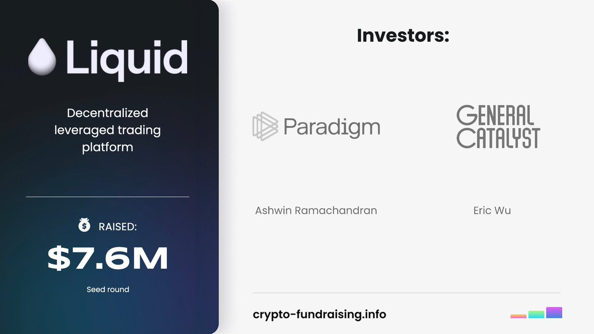
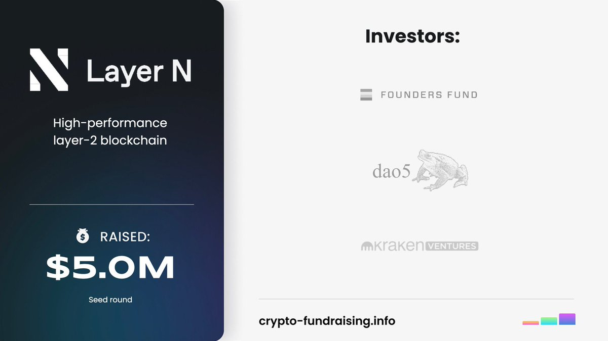
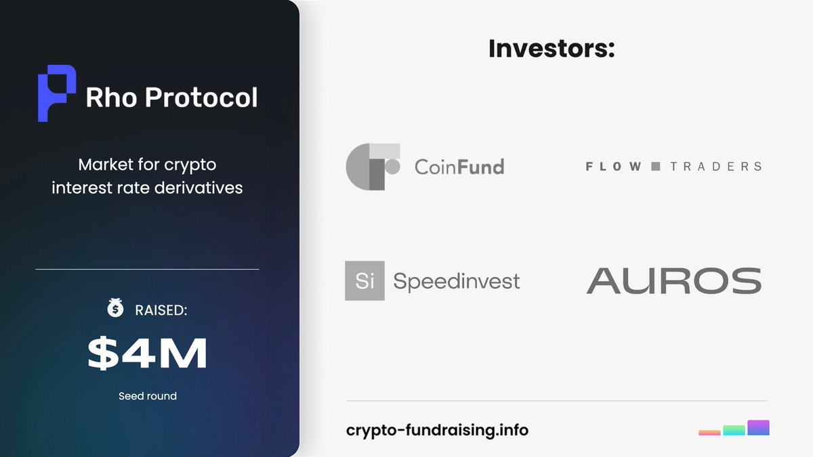

# 永續合約交易所參與策略——成本與積分系統評估

> **來源**: [@0xleng1](https://x.com/0xleng1/status/1991687954893312087)
>
> **日期**: Fri Nov 21 01:59:46 +0000 2025
>
> **標籤**: `永續合約` `項目評估` `積分成本`

---

> **來源**: [@0xleng1 (Leng)](https://twitter.com/0xleng1)
> **日期**: 2026-02-17
> **標籤**: `永續合約` `交易所` `空投策略` `積分系統`

---

## 項目篩選原則

作者表示不會參與大部分人都在討論的項目，除非是最早發現的。關注重點在於尋找別人沒有發現的機會和項目，雖然也會有踩坑的風險。

## 未參與的 Perp 類項目

以下項目作者並未參與：
- Light
- StandX
- EdgeX

## 目前參與的四個項目

### GTE (@GTE_XYZ)

- **特點**：融資陣容不亞於 Light
- **狀態**：尚未開主網
- **策略**：觀察後續積分成本

### Liquid Trading (@liquidtrading)

- **特點**：Paradigm 單獨投資的項目
- **使用方式**：透過 App 交易
- **優勢**：有積分系統，非常不卷

### 01 Exchange (@01Exchange)

- **觀察重點**：主網開始後的積分成本
- **現狀**：看起來一點都不卷，三個賽季 800 萬積分
- **評估**：基本上第一個賽季就能看出成本

### Rho Labs (@Rho_Labs)

- **風險評估**：風險最大的項目
- **亮點**：
  - CoinFund 投資
  - 成本非常低
- **策略**：需要找機會參與，成本合理時會發布策略
