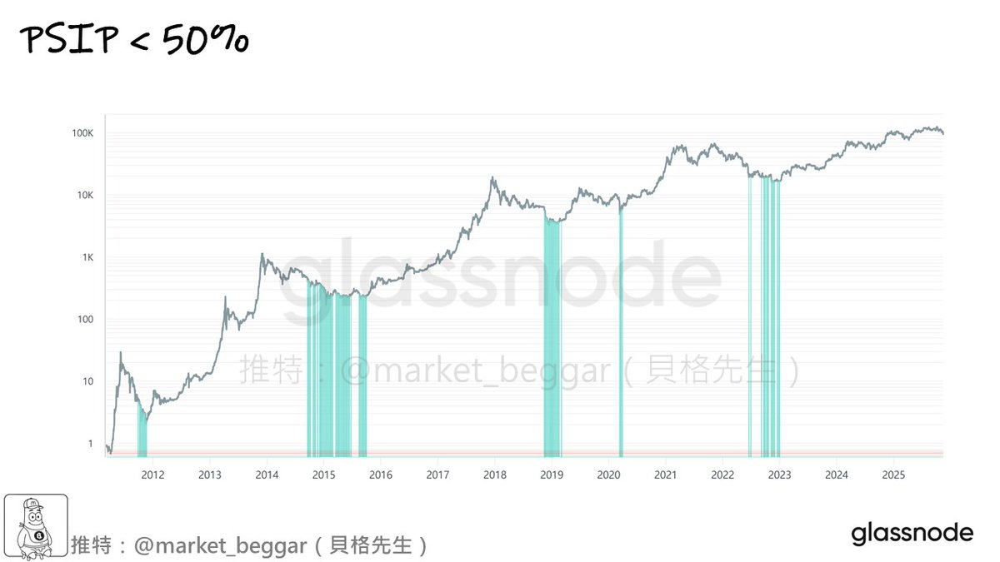
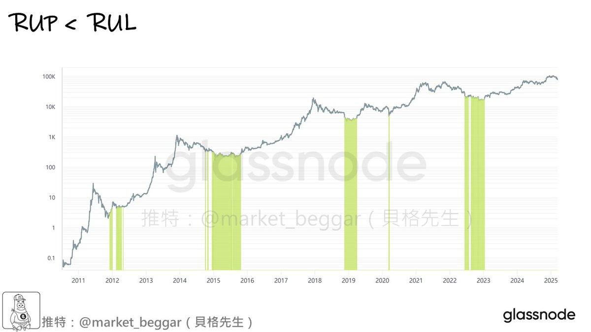
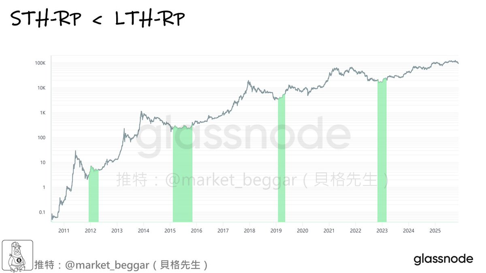
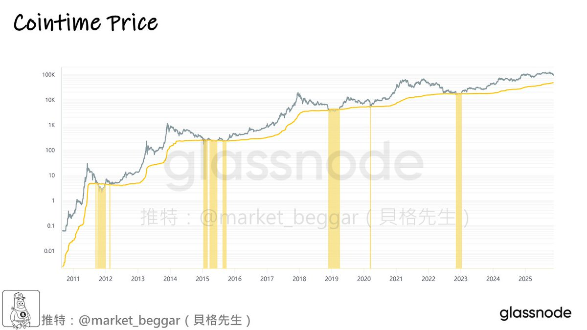
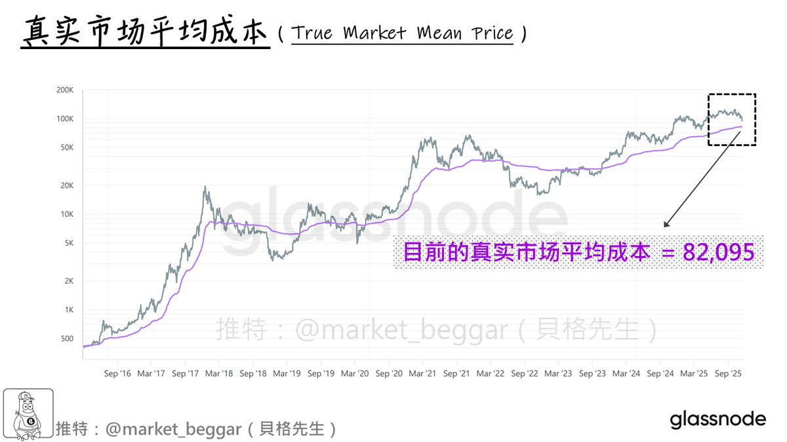

# 深熊抄底四大神器：PSIP、RUP、RP 與 Cointime Price

> **來源**: [@market_beggar](https://x.com/market_beggar/status/1990959747517067753) | [原文連結](https://x.com/market_beggar/status/1868924708852580858)
>
> **日期**: Wed Nov 19 01:46:08 +0000 2025
>
> **標籤**: `抄底策略` `技術指標` `風險管理`

---

> **來源**: [@market_beggar (貝格先生🐢)](https://twitter.com/market_beggar)
> **日期**: 2026-02-17
> **標籤**: `加密貨幣` `比特幣` `鏈上分析` `抄底指標` `熊市策略`

---

## 概述

在最近幾日的分享中，我和各位表明了自己的態度：「我認為淺熊劇本的可能性較大」。

但即便如此，依然有很多朋友對於「深熊」感到恐懼，並且對於深熊的底部目標區域感到好奇。

本文整理出四項在深熊來臨時的「抄底神器」，即便未來再次出現深熊，手握這些抄底神器，一旦出現訊號，就能把握最佳進場時機。

## 四大抄底指標

### 1. 情緒之極：PSIP < 50%

**原理**：「別人恐慌我貪婪」，如果全市場的情緒位於極端的低點，那通常就是一個絕佳的抄底時刻。

**指標說明**：
- **PSIP**：全稱「Percent Supply in Profit」，指的是「盈利籌碼的占比」
- 📝 [詳細介紹連結](https://t.co/i62X6nWt7A)

**判斷邏輯**：
- 如果此指標降至極端低位（< 50%），說明市場上大部分的籌碼都在虧損
- 此時正是值得我們全力梭哈的時刻

**歷史表現**：
- 幾乎每次出現 PSIP < 50% 的訊號之時，都是歷史大底

### 2. 虧損當道：RUP < RUL

**原理**：和 PSIP < 50% 的原理相似，如果我們今天發現「市場上浮虧的總量，大於浮盈的總量」，說明市況已經跌到慘不忍睹，此時也通常是極佳的出手區。

**指標說明**：
- **RUP** 和 **RUL**：「相對未實現損益」的概念
- 📝 [詳細介紹連結](https://t.co/UzG3zvDDUf)

**判斷邏輯**：
- 當 RUL > RUP 時，代表虧損當道
- 此時基本也都是週期性的大底

### 3. 倒反天罡：STH-RP < LTH-RP

**情境設想**：
作為市場上最聰明的「BTC 長期持有者」，如果某一天他們面臨了嚴重虧損，甚至其持倉成本已經低於短期持有者，那該是多麼慘烈的市況？

**指標說明**：
- **RP** = Realized Profit，可想成「市場的平均持倉成本」
- **STH-RP** = 短期持有者的平均持倉成本
- **LTH-RP** = 長期持有者的平均持倉成本
- 📝 詳細介紹：
  - [連結 1](https://t.co/y8pA0gRZq2)
  - [連結 2](https://t.co/EAarKfb7wq)

**判斷邏輯**：
- 在大部分時間中，LTH-RP 都存在輾壓性的優勢，比 STH-RP 低非常多
- 這是因為長期持有者通常更早買入，並且拋售頻率低
- 一旦出現了「STH-RP < LTH-RP」的怪況，說明市場基本已經絕望至極
- 就連「短線仔」的成本都低於「鑽石手」了

**歷史表現**：
- 一旦此跡象出現，基本也都是非常接近週期底部的時刻

### 4. 極限估值：Cointime Price

**指標說明**：
- 出自 Ark 和 Glassnode 聯合產出的「Cointime Economics」
- 對 BTC 籌碼採「時間加權」的計算，並進行公允估值
- 排除了遠古、丟失籌碼的影響，只考慮「有移動」的籌碼
- 相比 LTH-RP 更精確、更敏感，參考度更高

**詳細介紹**：
- 📖 [一套嶄新、#Ark 參與研究的 $BTC 神奇定價方法論 (I)](https://t.co/xqqTdGZcCx)
- 📖 [一套嶄新、#Ark 參與研究的 $BTC 神奇定價方法論 (II)](https://t.co/C2KNR0sfeU)
- 📖 [一套嶄新、#Ark 參與研究的 $BTC 神奇定價方法論 (III)](https://t.co/21Ias3aioO)

**判斷邏輯**：
- 當「BTC 價格低於 Cointime Price」時
- 抄底的效果非常恐怖，基本上都對應週期中的「底中底」

## 結語

再次強調，就目前的市場條件而言，我個人更傾向於「淺熊」劇本。

本文旨在安定各位的心神：即便未來出現再次出現深熊，貝格先生依然手握諸多抄底神器，倘若屆時真不幸跌到更低的位置，我也必將堅守岡位，一旦出現上述任何一項抄底訊號，必將和各位分享🫡
