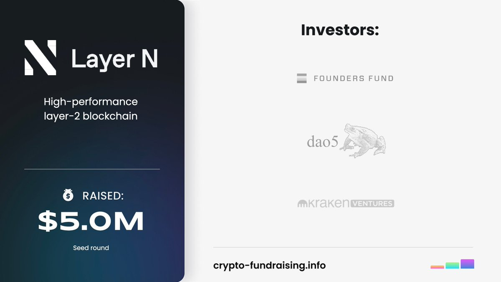
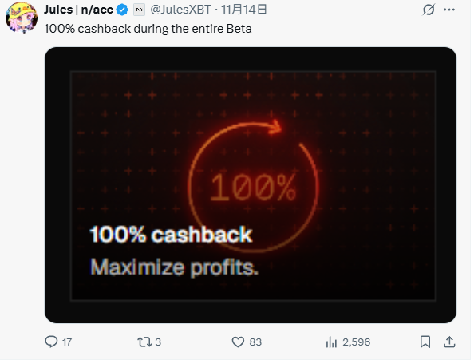

# 01Exchange Perpetual 積分活動分析 - N1Chain 生態機會

> **來源**: [@0xleng1](https://x.com/0xleng1/status/1990185046221693131)
>
> **日期**: Sun Nov 16 22:27:45 +0000 2025
>
> **標籤**: `積分活動` `項目評估` `成本效益`

---

> **來源**: [@0xleng1](https://twitter.com/0xleng1)
> **日期**: 2026-02-17
> **標籤**: `01Exchange` `N1Chain` `積分活動` `DeFi` `Perp`

---

## 項目背景

這個 Perp 項目感覺積分性價比蠻高的，感興趣的可以去申請 waitlist，等主網開放。

@01Exchange 背靠 @N1Chain，也是 Founders Fund 投資的 L1，目前沒什麼人關注。

## 活動階段

活動分為 3 個階段，每個階段 10 週：

1. **Private 主網**
2. **Alpha 主網**
3. **Beta 主網**

如果磨損不高的話，我大概率只刷前兩個階段，後面肯定卷了。

## 積分機制

每週都是固定分數，也就是**越早刷越便宜**。我會算算第一週的成本，成本高的話就可以直接 pass。我也在申請 waitlist。

這也是 N1 目前唯一的積分活動。

## 風險提示

唯一缺點就是融資週期有點久，經歷了幾個交代盤，我現在對交代盤有點陰影了。有一定概率是交代盤，為了發幣而發幣。不過目前來說項目方給我的感覺還挺好的。

## 額外資訊

@JulesXBT 有發推暗示 100% cash back 返還，如果我沒理解錯的話，不知道這裡說的是 beta 階段還是全部階段的手續費。
