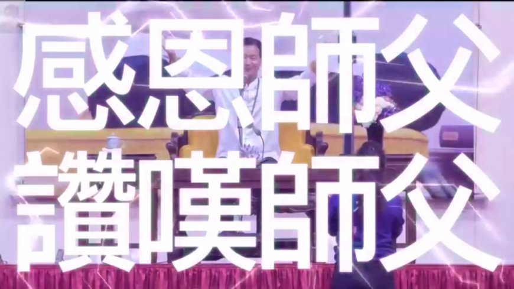

# River Inc 坐庄側分析——龐氏結構的客觀規律與項目困境

> **來源**: [@thecryptoskanda](https://x.com/thecryptoskanda/status/1987821400514855404)
>
> **日期**: Mon Nov 10 09:55:28 +0000 2025
>
> **標籤**: `龐氏結構` `項目風險` `盤面分析`

---

> **來源**: [@thecryptoskanda (加密韋馱｜Skanda 🔶)](https://twitter.com/thecryptoskanda)
> **日期**: 2025-01-15
> **標籤**: `DeFi` `龐氏經濟學` `代幣經濟` `River Inc` `項目分析`

---

## 無利益相關的 River Inc 坐莊側分析——不得不作的惡

雖然我自己跟 @RiverdotInc 沒什麼利益關係,連第一期投票獎勵的 PT 我都沒動過(或者說不知道怎麼動)

項目方目前的這個問題,就是各位為什麼一定要研究龐氏的原因,即:**不管項目方主觀想不想作惡,最後都沒有別的選擇,因為龐氏本身是有客觀規律的**

## 1. 團隊面臨多少拋壓

目前 River 整體的控籌率,看了一下應該是在 95% 左右,710M FDV 的話,外部流通就是 $35M

Point 方面,已經分發包括荷蘭拍了 6.43 億(占 64.3%),中間荷蘭拍了 5000 萬,收了 320 萬 U。其中已經轉換成 River 的積分是 6.57%,換了 26 萬多 River 也就是按照 $7 算 $140 萬

而在昨天之前,已分發未兌換的積分數量,占 22%,潛在可以換 667 萬 $River,也就是 $4600 多萬

**也就是說後續還得接 $35M + $46M = $81M 的拋壓。**而目前項目只有合約 + alpha,River 池子目前有 80 萬 U,積分有 5 萬多 U

## 2. 團隊掙錢了嗎?

合約 OI 最高的一天有 $28M,價格 9.727(10/24),前兩天價格為 $5.54,OI 是 $8.25M,價格上漲梯度 75%

考慮到一般來說 OI 中 2/3 都是莊自己的,有效 OI 也就是在 3M - 9M 左右之間,2 天時間,2 倍以上全部爆。看了一下歷史多空比一直都很勢均力敵,理論上最大獲利可能也就是個 2-4M 左右(應該都沒有)

後續價格回落也就到 7 左右,一個 20% 多的回撤

**只能說明一個問題:項目方沒出貨,supply 都在手上**

顯然沒賺到錢

## 3. 盤面 + 三盤邏輯復盤

這就意味著,單純從盤面上,如果打不開現貨大所上幣,這個拋壓是根本不可能接的住的,除非價格跌 10x

但是這裡很顯然項目方不想讓它跌,那就只有兩種可能:

- 項目方還不想下班,參考 AIA 的第三波
- 項目方想要博上幣

項目方的想法,至少我知道的,是二。因為他們對第一種打法了解不多

但是我不認為這樣的期待在現在這個時間段是正確的——或者說,任何項目方哪怕是穩上 spot 的,都不應該把 spot 納入退出計劃中,因為 spot 行情也是 perp 推動的

想法是好的,那你拿頭接盤嘛?

### 項目方的敗筆

從純盤面復盤的角度來說,**項目方的敗筆在於做了 River Point 嘴擼**

因為嘴擼人相當於玩無成本分紅盤,就算激活 300 個 KOL,一個月發 5 條,一人算 500U 一條好了,也就是 75 萬 U,這種效果已經是鋪天蓋地了(至少版面效果如此),也比現在便宜

更重要的是,其實 **Point 換 River 是一個類似於 VDS 或者當年的泰山金融的互助盤**

### 互助盤崩盤模型

我們再再再復習一遍,互助盤崩盤模型是:

**系統性債務 > 可清算資產 + 外部流動性**

作為盤主,你需要想辦法的是等比例,甚至超額增加可清算資產和外部流動性。上所沒有進展所以外部流動性增加不了,那麼可清算資產,也就是合約的對手盤 OI,就必須增加

然而媽的問題就是:**嘴擼人不套保!**

這些人是純粹的零擼選手,我剛才說 $500 那都是照著腰部 KOL 最高標準去報的,其實很多人根本就沒有什麼成本

看看 MMT,看看 XPL,看看 MONAD

那都是大戶,有錢的做交易的,會去套保;要麼就是我這種對某個項目底細太清楚,抬槓心態作祟的人去做空

**否則 OI 根本上不去**

10/11 以後我做過一波 alpha 合約撿金子,但一週以後全部退出。就是因為觀察到 OI 上不去,項目方一定會改日再戰

## 結論:不得不作的惡

**所以在這種情況下,即使團隊不想作惡,也必須作惡**

**因為不作惡,今天就得死**

很多項目方想法是好的,可以理解。但是殘酷的事實就是,在當下的空投環境以及合約驅動市場中:

**所謂好的盤子,就是帶領一批人,割另一批人。出錢被你帶領的人,才算是你的社區**

最後,

**當時買荷蘭拍的人**

**是真正的菩薩**

**下次搞項目,還賣你**

---

**引用 @Wuhuoqiu:**
> @thecryptoskanda 看了一圈,怎麼改本質還是沒變,大獎出來就崩?🤔
