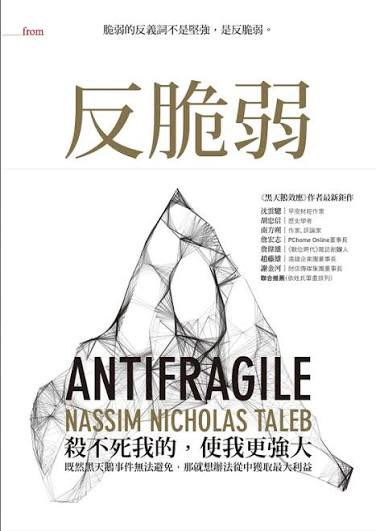

# 《反脆弱》與槓鈴策略：不追求穩定，而是活得最久

> **來源**: [@hazenlee](https://x.com/hazenlee/status/1985882779058651358)
>
> **日期**: Wed Nov 05 01:32:05 +0000 2025
>
> **標籤**: `反脆弱` `槓鈴策略` `風險管理`

---

> **來源**: [@hazenlee (𝙃𝘼𝙕𝙀𝙉𝙇𝙀𝙀)](https://x.com/hazenlee)
> **日期**: 2026-02-17
> **標籤**: `反脆弱` `槓鈴策略` `風險管理` `人生哲學`

---

我用了三年才真正看懂《反脆弱》。

第一次讀的時候，覺得塔勒布在賣弄——

一個交易員寫這麼厚一本書講哲學,還動不動罵經濟學家和銀行家。

但三年後再翻，我發現他說的每一句話都是對的，只是我當時沒資格懂。

## 現代生活最大的謊言：穩定

這本書最狠辣的地方，是它揭穿了現代生活最大的謊言：穩定。

我們被教育要追求穩定——穩定的工作、穩定的收入、穩定的關係、穩定的人生規劃。

整個社會都在販賣這個幻覺：只要你足夠努力，就能得到一份「穩定」的生活。

但塔勒布說，這是在自殺。

因為真實世界不是線性的。

你以為躲開了小波動，積累的能量會在某一天以黑天鵝的形式爆發。

2008 年，那些在大銀行工作的人，以為自己端著鐵飯碗，結果一夜之間全部失業。

那些一輩子沒生過病的人，一場大病就垮了。

那些從不吵架的夫妻，離婚時最決絕。

為什麼？

因為他們從來沒有接受過小的壓力測試，失去了自我修復的能力。

## 什麼是反脆弱

塔勒布舉了個例子我一直記得。

如果你給一個包裹貼上「易碎品」的標籤，你是在乞求搬運工小心翼翼地對待它。

但現實是，沒有人會真的小心。

這個包裹遲早會被摔。

真正的解決方案，不是乞求別人小心，而是讓包裹本身能扛摔，甚至摔了之後變得更結實。

這就是——反脆弱。

## 創新來自試錯，不是規劃

塔勒布書裡還有一個觀點震撼了我：大部分的創新不是來自規劃，而是來自試錯。

我們以為是科學家在實驗室裡發明了技術，然後工程師拿去應用。

但歷史的真相是反過來的——工匠在瞎搞的過程中發現了有用的東西，然後科學家寫論文解釋它為什麼有用。

蒸汽機不是牛頓力學的產物，是工匠修修補補搞出來的。

飛機不是空氣動力學的產物，是萊特兄弟摔了幾百次摔出來的。

但我們的教育系統、公司管理、職業規劃，全都建立在一個錯誤的假設上：

你要先想清楚再去做，你要有完美的計劃，你要能預測結果。

這種思維最致命的地方是——它剝奪了你試錯的權利。

它讓你覺得失敗是可恥的，是說明你沒想清楚。

所以大家都不敢動，都在等一個「完美的時機」。

但塔勒布說，反脆弱系統的特徵，就是大量的小試錯。

每一次小失敗都在給系統提供訊息，讓它知道什麼不該做。

只要你控制好每次試錯的成本，讓它不至於毀掉你，那麼隨著試錯次數的增加，你遇到大機會的機率就在不斷上升。

這徹底改變了我對失敗的看法。

以前我怕失敗，因為覺得失敗意味著我不行。

現在我知道，只要我控制好風險敞口，失敗就是在給我反饋。

## 槓鈴策略：極端保守 + 極端激進

那麼，怎麼在這個充滿不確定的世界裡生存？

塔勒布給出了一個具體的方法：槓鈴策略。

槓鈴策略的意思是，把資源分配到兩個極端：一頭極端保守，一頭極端激進，避開中間地帶。

在投資上，就是 90% 的錢放在幾乎零風險的地方，10% 投在高風險高回報的機會上。

最壞的情況是損失 10%，但收益沒有上限。

而那些百分之百投資「中等風險」的人，會因為風險計算錯誤而完全毀滅。

中等風險最危險，因為它給你一種「穩定」的錯覺，但其實既沒有安全墊，也沒有爆發力。

## 用槓鈴策略重新分配生活

看完這本書，我開始用槓鈴法則重新分配生活，整個人的狀態變了。

以前我總想在工作和創業之間找平衡，結果兩邊都做不好。

工作不敢太投入怕沒時間創業，創業不敢全力以赴怕沒收入。

看起來在平衡，其實是在兩頭搖擺，焦慮得要死。

後來我明白了，塔勒布說的「槓鈴」不是妥協，而是極端化。

**一頭極端保守**：上班，拿工資，這是我的安全墊。

我不追求在公司裡升職做到高管，也不幻想靠這份工作實現財務自由。

它的作用只有一個——讓我活下來，給我時間。

**一頭極端激進**：創業項目，all in，不設上限。

失敗了最多損失的是時間和小額成本，但成功了收益是指數級的。

我不再追求那種「穩步上升」的幻覺。

因為在一個非線性的世界裡，穩步上升本身就是個偽命題。

我上班的這幾年，不是在浪費時間，而是在買一個保險。

它保證了即使我的創業項目全都失敗，我也不會流落街頭。

有了這個保底，我才敢在創業項目上真正冒險，去嘗試那些回報很高但不確定性也很高的方向。

沒有這個槓鈴結構，我要麼困在舒適區不敢動，要麼破釜沉舟賭一把然後爆掉。

而現在，我在用時間換可選擇性。

每一個失敗的項目都在給我反饋，告訴我什麼行不通。

每一次小規模的成功都在積累勢能。

我不知道哪一個項目會真正起飛，但我知道——只要我一直在場、一直在試錯，我遇到它的機率就在增加。

## 核心精髓

這才是槓鈴策略的精髓——用確定性保護你的下限，用可選擇性打開你的上限。

這才是真正的反脆弱——不是跑得最快，而是活得最久。

世界不會變得更穩定，只會更混亂。

與其追求一個不存在的穩定，不如讓自己成為那個能在混亂中獲益的人。
