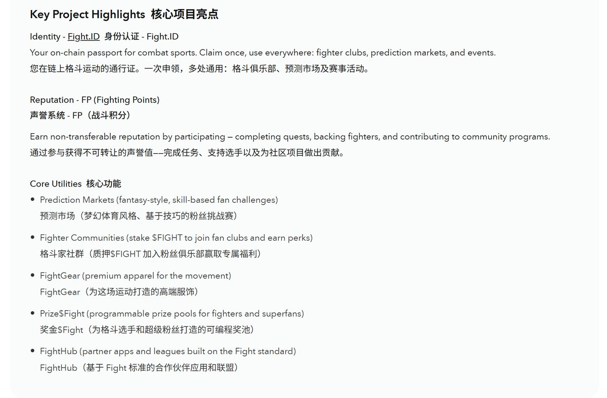

# Fight ($FIGHT) — UFC 授權粉絲代幣與 Hololaunch 打新機會

> **來源**: [@lxx794](https://x.com/lxx794/status/1982470684464021646) | [原文連結](https://app.hololaunch.ai/ico/fight)
>
> **日期**: Sun Oct 26 15:33:38 +0000 2025
>
> **標籤**: `打新機會` `UFC 生態` `Fan Token`

---

> **來源**: [@lxx794 (以前有个霄宝)](https://x.com/lxx794)  
> **日期**: 2024-10-27  
> **標籤**: `Fight` `UFC` `Hololaunch` `代幣發行` `打新`

---

## 打新時間表

### 10 月 27 日
- **18:00** — BuidlPad 平台 MMT 專案打新，單號 3000 USD，BSC 鏈 USDC
- **20:00** — Kaito 平台 zkPass 專案打新，準備 5000 USD，Base 鏈 USDC
- **21:00** — MegaETH 在 Sonar 平台預售，單號最低 2650 USD，最高 186,282 USD，需準備 ETH 鏈 USDT
- **22:00** — **Holo 打新 Fight 專案** (本文重點)

### 10 月 28 日
- **00:20** — Nemesis 打預售，準備 0.05 Base ETH
- **02:00** — PayStream 專案退款代幣和 USDC

### 其他待定時程
- **10/29 19:00** — 375ai 專案 TGE
- **10/30 00:20** — Nemesis 空投
- **10/31 18:00** — BuidlPad 平台 MMT 專案退款
- **11 月?** — Legion 軍團打新 @useTria 支付專案
- **11 月?** — Sonar 平台 Infinex 專案
- **11/6** — Metaplex 平台 @BeamableNetwork 專案打新

### Vultisig 專案
存款 10,000 USD USDT + 0.01 ETH，等待打新資格（時間待公布）

---

## Fight ($FIGHT) 專案詳情

### 專案定位
Fight ($FIGHT) 是格鬥運動的**官方 IP 代幣**，是一個授權的 Web3 生態系統，將格鬥粉絲轉化為身份、聲譽和所有權。由**與 UFC 的多年合作夥伴關係**支持，Fight 透過統一體驗連接數百萬粉絲、運動員和創作者，參與即可獲得價值。

每個比賽週都成為鏈上事件：粉絲領取他們的 FightID，賺取 FP (Fighting Points)，並在選手社群、周邊商品和獎勵中使用 $FIGHT。

**Fight 不是產品 — 是一場運動。如果你掙扎但仍然堅持，你就是 Fight。**

---

## Hololaunch 打新資訊

### 募資數據
- **已募集金額**: $199,537,853
- **目標金額**: $2,250,000
- **FDV (完全稀釋估值)**: $150,000,000
- **狀態**: 超額認購公開池已結束，退款處理中

### 募資結構

#### Round 1 — BSC 鏈募資 (已結束)
- **目標**: $750,000
- **幣種**: USDT
- **必須完成 KYC 驗證**
- **允許超額認購**，超額部分將在募資結束後退款

#### Round 2 — Solana 鏈募資 (已結束)
- **目標**: $1,500,000
- **幣種**: USDC
- **KYC 開放時間**: 10/27 - 11/3
- **允許超額認購**，若最終分配低於存款金額，多餘的 USDC 將退款至 Solana 錢包

**Round 2 分配分為 4 個部分**:
1. **Public**: 開放給合格貢獻者的公開池，按比例分配
2. **$HOLO Stakers**: 優先分配給在 ICO 前支持 Holoworld 生態系統的已驗證 $HOLO 質押者
3. **Holler Campaign**: 專門獎勵為 FIGHT 敘事貢獻的頂級內容創作者
4. **[REDACTED]**: 保留給即將推出的策略性啟動，將在 TGE 前公布

### 官方存款錢包
- **Solana**: `FNFc4...8Fqy` (已結束)
- **BSC**: `0x639...4598` (已結束)

---

## 參與流程

### Step 1: 存入 USDC (Solana)
透過參與頁面，或直接發送 USDC 到錢包地址

### Step 2: 綁定錢包
如果直接在鏈上發送資金，只需連接同一個錢包。你的分配將發送到那裡

### Step 3: 完成 KYC
在募資結束前完成此步驟。**未驗證用戶的存款將被退款且不符合資格**

### Step 4: 領取
TGE 後返回此處領取你在 Solana 上的 $FIGHT 代幣分配

---

## 專案核心功能

### 身份 - Fight.ID
你在格鬥運動的鏈上護照。領取一次，到處使用：選手俱樂部、活動等。

### 聲譽 - FP (Fighting Points)
透過參與賺取不可轉讓的聲譽 — 完成任務、支持選手、為社群計劃做出貢獻。

### 核心應用
- **Fighter Communities** (質押 $FIGHT 加入粉絲俱樂部並獲得福利)
- **FightGear** (運動優質服飾)
- **Prize$Fight** (為選手和超級粉絲提供可程式化獎金池)
- **FightHub** (基於 Fight 標準構建的合作夥伴應用和聯盟)

---

## 團隊與顧問

### 核心團隊
- **Alex Casassovici** — 執行董事，Fight 基金會  
  Azarus 創始人(被 Animoca Brands 收購)，4 次退出經驗，領導治理、生態系統和代幣策略
  
- **Rob Winkler** — UFC Strike 總經理 & 運動員委員會主席  
  監督選手計劃和社群效用設計，前 Scopely 和 5th Planet Games
  
- **Jordan Friedman** — 首席商務官  
  前 Forbes / Abra / Nova Infinite，專注於資本市場和交易所策略

### 機構與戰略投資者
Anthos Capital、Aquanow Ventures、Blockchain Coinvestors、Fabric VC、Jupiter / Meteora (Solana)、Memeland

### 知名個人
Luca Netz (Pudgy Penguins / Memeland)、Yat Siu (Animoca Brands)、Meow (Jupiter / Meteora)、Ray Chan (9GAG / Memeland)、Steve Aoki、Vinny Lingham、Baron Davis、Charles Wayn

### 運動員委員會
由專業選手和教練組成的正式顧問委員會,確保效用和激勵措施優先服務運動員。由 Rob Winkler (UFC Strike 總經理) 領導，創始成員包括：Josh Emmett、Gilbert Burns、Vicente Luque、Alexandre Pantoja、Dan Ige、Gregory "Robocop" Rodrigues 和教練 Eric Nicksick。

---

## 專案使命

**對選手有利的，對社群有利。對社群有利的，對選手有利。**

---

## 路線圖

### Pre-TGE (現在)
- 身份任務與選手活動
- UFC 比賽週啟動
- 白皮書、代幣經濟學、治理上線

### TGE (2025 Q4)
- 在 Solana 上推出代幣
- 質押與排行榜上線
- 首個 Prize$Fight 賞金
- 周邊商品/門票軌道啟動

### 2026 Q1
- 多交易所上市
- 擴展選手社群質押

### 2026 Q2–Q3
- Fighter Communities 全球擴展
- FightGear 限量系列發布
- 新聯盟整合

### 2027+
- FightHub 合作夥伴網絡推出
- DAO 全面運營
- 全球吸引 7 億+ 粉絲

---

