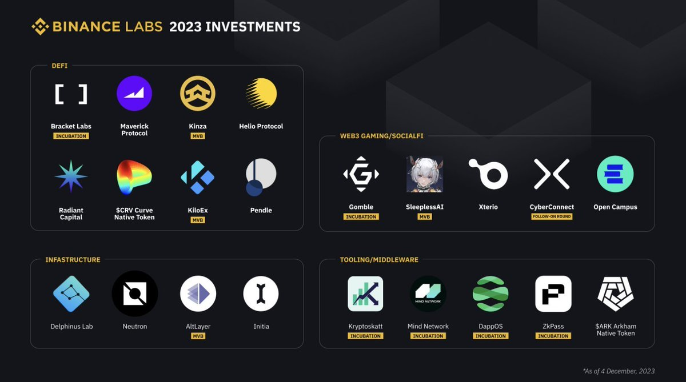

# 加密貨幣新幣打新策略分享｜多個項目風險收益評估

> **來源**: [@0xleng1](https://x.com/0xleng1/status/1982370473100063059)
>
> **日期**: Sun Oct 26 08:55:26 +0000 2025
>
> **標籤**: `打新策略` `風險管理` `加密投資`

---

> **來源**: [@0xleng1 (Leng)](https://twitter.com/0xleng1)  
> **日期**: 2026-02-17  
> **標籤**: `打新策略` `風險評估` `IDO` `Megaeth` `Metadao` `zkPass`

---

總結一下最近幾個打新和我自己的策略，僅供參考，不構成投資建議。

## Echo 上的 Megaeth (@megaeth)

我應該會大號打滿 18 萬 U，剩下幾個小號打低保，其實這次人那麼多，蠻多人都走的小號策略拿低保，我感覺是沒有低保的。但是防患於未然也沒什麼問題。打滿我估摸著能拿到 5-10% 的額度分配，然後 2-3X 這樣。結束和公布額度的時候一定是大量人套保的，選擇權在自己。怎麼去賣就看自己了。

- **風險**：⭐️⭐️
- **收益**：⭐️⭐️⭐️

## Metadao 的 Paystream (@Paystreamlabs)

這個到時候看看情況，現在 Metadao 上面的項目情緒比較差，除了 Umbra 有點效應，其他表現都一半，我可能也就打個 1-2 萬 U 嘗嘗鹹淡，這個項目也僅僅是比之前的幾個好一些，多個 Frankie 轉推，加上市值便宜，其他優點倒沒有太多，風險來自於項目方的格局，只拿 1.5M 內就好了。只要不拿走太多錢，我估計開盤 50%-100% 應該沒啥問題。會比之前幾個表現好點。

- **風險**：⭐️⭐️⭐️⭐️
- **收益**：⭐️⭐️⭐️

## Kaito 上的 zkPass (@zkPass)

其實這個項目之前關注的時候是在幣安 2023 年公布的優選名單上，優選名單上無一例外都是現貨，當然被 Kilo 和 Xterio 給打破了這個規律，可以小玩一下，1 億估值，開盤解鎖一半。到時候看超發情況吧，我最多也就塞 1-2 萬 U 看看情況，全解鎖就好了，這個鎖著一半，給我的預期不高，項目也拖了很久。看看 3 億市值有沒有機會吧。

- **風險**：⭐️⭐️
- **收益**：⭐️⭐️

## Buidlpad 的 MMT (@MMTFinance)

沒啥好說的啊，我剛剛買了 USD1 等著塞了，現在還便宜點。直接打滿就好了，就是理財項目。

- **風險**：⭐️
- **收益**：⭐️⭐️⭐️

## Legion 上的 Tria (@useTria)

Tria 的話說實話沒看到這個項目有任何的亮點，融資機構也一般。KOL 輪我看了下規則：

- 100M FDV，30% 解鎖，2 個月鎖倉，6 個月線性
- 200M FDV，60% TGE 解鎖，2 個月鎖倉，6 個月線性

估計 Legion 的公開輪會在貴點，據說這個不上海妖打新，不上海妖的話不建議，如果上的話再看看情況。

- **風險**：？
- **收益**：？

## 其他計畫

還留了 20 萬 U 給 Stable，看看有沒有機會存進去吧。

不知道有沒有遺漏的項目，可以提醒我下。
