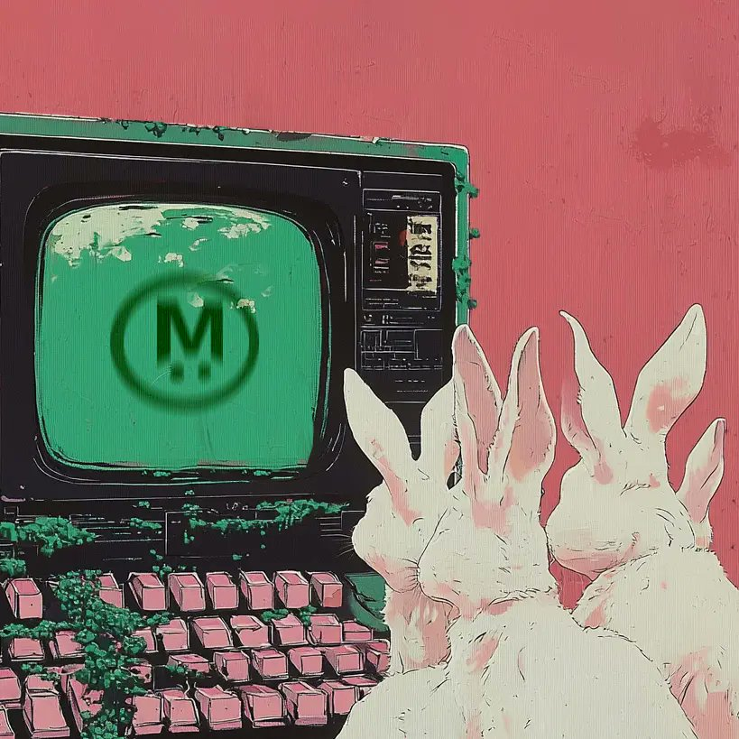

# MegaETH 代幣銷售常見問答整理

> **來源**: [@0xfreshguy](https://x.com/0xfreshguy/status/1982335738986520865)
>
> **日期**: Sun Oct 26 06:37:24 +0000 2025
>
> **標籤**: `代幣銷售` `MegaETH` `投資機制`

---

> **來源**: [@0xfreshguy (freshguy)](https://twitter.com/0xfreshguy)
> **日期**: 2024-11-04
> **標籤**: `MegaETH` `代幣銷售` `常見問答` `項目打新`

---

逛了一圈 @megaeth 的團隊成員 @0xMutopia、@hotpot_dao、@0xHeisenbruh 對這次代幣銷售的解答，總結了一些問題和答案：

## 最低投入 / 最低分配

都是 2650 美元，有別於其他超額分配，不存在拿到幾十美元額度的情況。

## 退款時間

- **沒有獲得分配**：11 月 5 日
- **獲得分配**：11 月 21 日

## 退款階段要手動領取嗎，需要人臉驗證嗎？

不用，自動退款到你的錢包。

## 我現在購買 / 交互提到的 NFT / 項目還來得及嗎？

來不及，已經快照。

## 需要在競拍一開始就存進去嗎？

不用，有 3 天時間，不用拼 gas，純拼個人實力。

## 假設所有人都拿最低額度？

18,678 人，但實際情況會比這個人數要少。

## 選擇鎖倉 1 年，獲得分配的機會能變高？

是的，還有 10% 的折扣，選擇後無法反悔。

## 目前的參與人數？

截止週一，超過 10 萬人報名。
