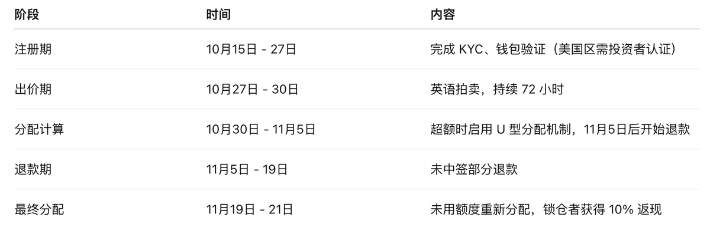

# MegaETH 27號公售關鍵資訊與常見問答

> **來源**: [@tyw1984](https://x.com/tyw1984/status/1981951612890558477) | [原文連結](https://x.com/naersxd/status/1981602048496795778)
>
> **日期**: Sat Oct 25 05:11:02 +0000 2025
>
> **標籤**: `代幣公售` `英式拍賣` `項目參與`

---

> **來源**: [@tyw1984 (nanatang)](https://x.com/tyw1984)  
> **日期**: 2026-02-17  
> **標籤**: `MegaETH` `代幣公售` `英式拍賣` `加密貨幣`

---

## 公售關鍵資訊

**一句話總結**：註冊並完成 KYC → 出價（≥$2,650）→ 可選 1 年鎖倉享折扣或不鎖 → 等待拍賣結束與清算分配退回資金

### 代幣基本資訊

- **代幣總量**：10,000,000,000 枚 $MEGA
- **公開發售份額**：500,000,000 枚（佔總量 5%）
- **網路**：Ethereum 主網
- **支付方式**：USDT

### 拍賣規則

- **發售形式**：有封頂價的英式拍賣（English Auction）
- **起拍價**：$0.0001（FDV = $1M）
- **封頂價**：$0.0999（FDV = $999M）
- **最小加價單位**：$0.0001
- **個人出價區間**：$2,650 ～ $186,282

### 策略建議

做好準備直接以封頂價購買，鎖倉一年不僅有 10% 折扣，超額認購的時候可能獲得更高配額。

### 優先分配條件

除此以外，優先分配給：

- **鏈上行為**：是否為早期以太坊活躍用戶、合約交互記錄
- **社交身份**：是否綁定 Twitter / Discord / GitHub
- **文化參與**：是否持有 Fluffle NFT、製作過社群內容、參與過生態文化

可以理解為一場增加了英式拍賣規則的 Legion 打新。

---

## 常見問答（FAQ）

### Q1：我還是不太明白什麼是英式拍賣？

英式拍賣（English Auction）指參與者在一定價格區間內自主出價，價格隨著出價遞增。

在 MegaETH 拍賣中：

- 出價範圍為 $0.0001（對應 $1M FDV）至 $0.0999（對應 $999M FDV）
- 每次加價最小單位（tick size）為 $0.0001
- 隨著參與者不斷出價，整體 FDV 會逐步上升，直至拍賣結束確定最終清算價

### Q2：最初的 5000 個 Fluffle NFT 擁有者能獲得多少分配？

首批 Fluffle 持有者將獲得總供應量 2.5% 的 $MEGA 代幣分配，這一比例與此前公佈的一致。

### Q3：如果我沒有獲得配額，會退錢嗎？

會。

- 若在銷售結束後未獲得任何分配，你將在分配階段完成後自動收到全額 USDT 退款
- 退款從 11 月 5 日起開始處理
- 若獲得分配（中籤者），代幣將在 11 月 21 日起（最終分配階段）開始發放

### Q4：關於白皮書裡提到的 TGE、代幣釋放等傳言是真的嗎？

白皮書主要是為了符合 MiCA 合規要求，本質上是免責聲明文件。

正如 @0xHeisenBruh 所說，TGE 及代幣釋放等具體細節將由 MegaETH 官方公告發佈，而非以白皮書內容為準。目前尚無確切時間，請關注後續官方更新。

### Q5：測試網（Testnet）的活動是否計入貢獻或分配？

一般情況下，測試網活動不計入貢獻或分配。只有部分特定 NFT 系列的活動會被納入貢獻統計，之前已有說明。

### Q6：NFT 如何計入貢獻？

NFT 的貢獻按類型計算，而非數量。

也就是說：

- 持有多個相同 NFT 不會提高貢獻權重
- 例如：20 個相同 NFT = 1 個 NFT（貢獻度相同）

### Q7：在 Kaito 排行榜上是否能保證獲得分配？

不能保證。

上榜可以幫助提高可見度，但不是必要條件，也不是分配保證。許多未上榜的用戶也會被納入分配，而部分上榜者可能不會獲得額度。

### Q8：與 MegaETH 相關 NFT 的快照是否已經完成？

是的，快照已經完成。

### Q9：快照具體是什麼時候進行的？

官方未公佈確切時間，但確認已在主網公開發售（Sonar 輪）之前完成。

### Q10：主網啟動後新加入的用戶還能獲得 $MEGA 嗎？

如果你未曾：

- 持有 Fluffle NFT
- 參與 Echo 輪銷售
- 註冊 Sonar 公募

則你將**無法參與初始獎勵活動（Rewards Campaign）**中的額外 $MEGA 分配。

### Q11：是否需要搶時間參與？

不需要。

拍賣總時長為 3 天（72 小時），無論哪一天參與結果都相同。

### Q12：如果我在 Sonar 階段 KYC 無法通過怎麼辦？

可聯繫以下官方協助帳號：

- @Moonshot211
- @hotpot_dao
- @0xHeisenbruh
- @0xAlexjultz
