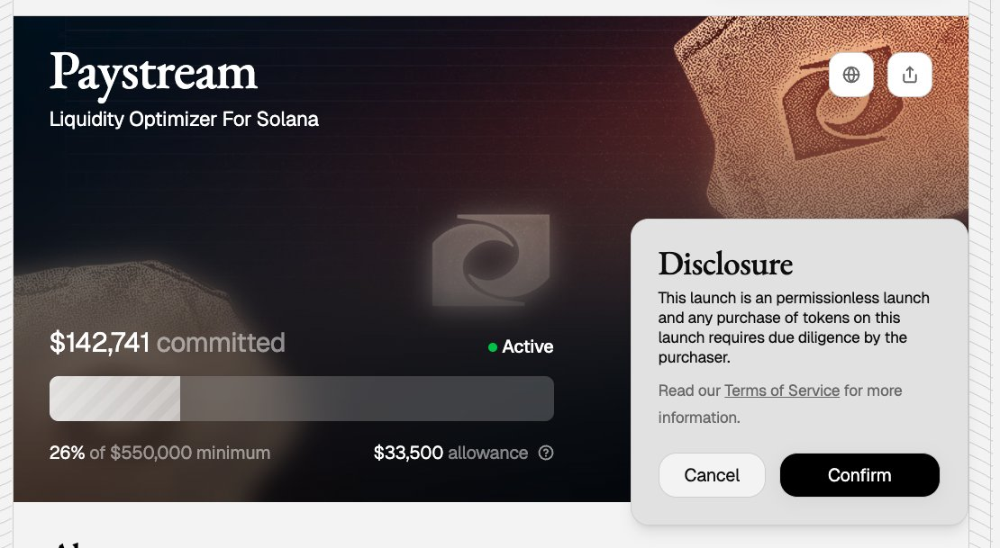
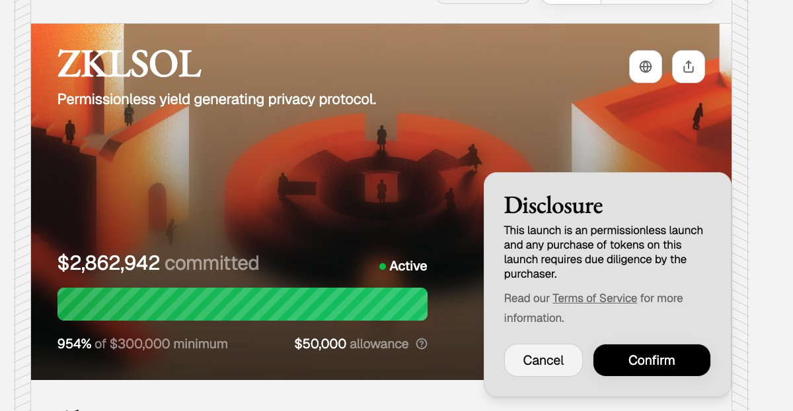

# Solana 鏈 MetaDAO 打新 Paystream 項目分析

> **來源**: [@bclaobai](https://x.com/bclaobai/status/1981947895801909264)
>
> **日期**: Sat Oct 25 04:56:15 +0000 2025
>
> **標籤**: `打新策略` `Solana 生態` `代幣經濟學`

---

> **來源**: [@bclaobai (老白｜LaoBai 🌊🌳)](https://twitter.com/bclaobai)
> **日期**: 2025-01-XX
> **標籤**: `MetaDAO` `Paystream` `Solana` `IDO` `DeFi`

---

## MetaDAO 預售現況總結

### ZKLSOL 打破賺錢金身

昨天 ZKLSOL 以 $0.0969 發售，目前 $0.0857，上線後一直低於打新價格，FDV 徘徊在 220 萬美元。這是 MetaDAO 打新首次出現破發情況。

### 破發原因分析

#### 1. 紙手積累
前幾期打新賺錢效應積累大量紙手，只想第一時間賺錢走人。

#### 2. 項目質量一般
項目共識弱，上線能賣則賣，不願長期持有。

#### 3. 項目方擠泡沫需求
雖然項目方自己代幣不能解鎖，但可以：
- 少加流動性
- 預售時自己也買幣
- 開盤後拋售帶動紙手一起砸盤
- 達到快速洗盤效果

#### 4. 打新原則轉變
這標誌著 MetaDAO 最新打新原則：**只需要真正看好項目的用戶，想辦法割紙手**。

---

## Paystream 項目分析

### 項目簡介

專注於 P2P 借貸協議與槓桿流動性供應 (LLP) 機制，幫助用戶實現更高收益和零閒置流動性優化。

**簡單理解**：DeFi 借貸 + 槓桿的項目，存錢進去通過槓桿幫你放大收益，當然風險也升高。

### 項目背景

Solana 黑客松 DeFi 類排名第五項目，但**沒有進入加速器**，質量一般。

### 代幣經濟學

- **代幣名稱**: $PAYS
- **預售數量**: 1000 萬枚（占總量 40%）
- **最低籌款目標**: 55 萬美元
- **預售 FDV**: 137 萬美元

#### FDV 計算分析

根據之前經驗，項目會多拿籌款：
- 如果拿到 100 萬，FDV 將到 250 萬
- 這個 FDV 對比之前幾期，**存在破發可能**

---

## 打新策略建議

**打新指數：50 分 🌟**

### 策略一：眾籌金額高
如果此次眾籌金額依然非常多，可等破發低點買入，等一個反彈賣出。

### 策略二：眾籌金額低
如果眾籌金額不多，謹慎小額參與。

---

## 附錄：上期 ZKLSOL 項目回顧

### 項目特點

ZKLSOL 是一個基於 Solana 的隱私協議項目，專注提供「收益承載隱私」。

**簡單理解**：可以把鏈上收益隱藏，別人難以追蹤到你的鏈上收益。

### 代幣經濟學

| 分配項目 | 數量 | 說明 |
|---------|------|------|
| 公開發售 | 10M | |
| 流動性 | 2.9M | |
| 團隊 | 12.9M | 18 個月懸崖期，以 ICO 價格的 2 倍、4 倍、8 倍、16 倍和 32 倍等額解鎖 |
| **代幣總量** | **25.8M** | |

### 估值計算

- 銷售 1000 萬枚
- 如果團隊拿走目標眾籌金額的 5 倍（150 萬，原計劃 30 萬）
- 預售估值：387 萬美元

### 實際數據

- 筹款總額：7500 萬
- 團隊實際拿走：250 萬
- 退款率：96.7%
- 預售 FDV：525 萬美元
- **總投入收益**：約 1.5%（現已跌破成本價）

### 打新體驗變化

MetaDAO 打新從上一期看，基本上就變成**小時理財**了：
- 車非常重
- 大家都最後打款
- 項目方會調高籌款額，相當於增大估值
- 上個項目本來籌 50 萬，最後拿走 250 萬，相當於代幣成本上漲 5 倍
