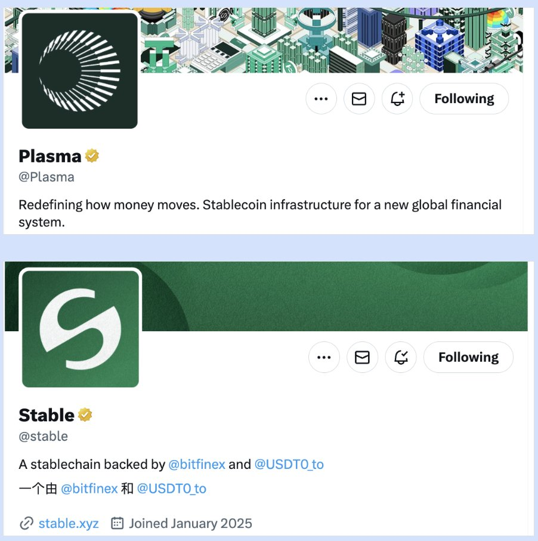
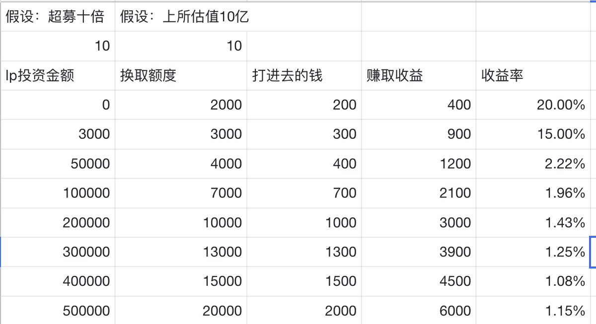

# 近期主流打新項目收益率排序分析（Stable、Flying Tulip、MegaETH、MMT）

> **來源**: [@DefiFarmerYue](https://x.com/DefiFarmerYue/status/1981226789902176261)
>
> **日期**: 
>
> **標籤**: `打新項目` `收益率比較` `風險評估`

---

> **來源**: [@DefiFarmerYue (阿越真的很嚴格)](https://x.com/DefiFarmerYue)
> **日期**: 2024-10-17
> **標籤**: `打新` `收益率` `風險評估` `DeFi`

---

## 概述

近期打新項目眾多，以下按收益率與風險回報比進行排序分析（也是作者自己的配倉順序）。

## 項目排序與分析

### 1. Stable (@stable)

**建議倉位**：50%+（如果開啟存款）

**核心邏輯**：
- @tether 真正的親兒子，對比 $stable 和 @Plasma 的推特簡介即可看出
- 可能性分析：
  - 泰達公司是否在內部賽馬＋養蠱？
  - Stable 是否會對 Plasma 甚至 @trondao 發起吸血鬼攻擊？
  - $xpl 目前轉帳如此絲滑，Stable 需要在市場營銷方面撒多少錢？

**結論**：這些可能性意味著 Stable 是一個必須要參與的項目

**預期收益率**：30%+（大資金）

---

### 2. Flying Tulip (@flyingtulip_)

**項目背景**：
- @AndreCronjeTech DeFi 教父的回歸大作
- 目的是建立一個鏈上交易所
- 核心是打通如 $aave、$uni、$hyperliquid 等鏈上 DeFi 項目的流動性
- 在一定程度上確實符合用戶需求

**優勢**：
- **打新保本**，相當於一次性分配所有礦
- AC 有過翻車記錄，但是成名作 @yearnfi 就是率先採取代幣公平分配的項目，代幣價格從 $30 → $30,000
- 大戶保本 or 提現的博弈也比較有趣

**風險點**：
- @binance @cz_binance 是否會讓 $ft 上所（競對的平台幣）？
- NFT 退款是否存在安全風險？
- 產品何時正式交付？
- 沒有代幣激勵，如何吸引用戶……

**結論**：排在第二。雖然天花板有限，但是保本的話，盈虧比確實高

**預期收益率**：20%

---

### 3. MegaETH (@megaeth)

**基本數據**：
- 打新 FDV 10 億，價格 0.1
- 場外 0.4
- 11 月底分配代幣

**收益計算**：
- 看似 3 倍空間，但要算上超募稀釋
- 保守估計：假設超募十倍，上所後價格翻倍（對比 Linea）
- **全部資金淨收益率**：10%
- **單號資金容量**：18 萬 U

**結論**：很香的收益率，奈何碰到了 Stable 和 FT

---

### 4. MMT Finance (@MMTFinance)

**項目背景**：
- @buidlpad 出品，質量不多說
- 上所 FDV 基本沒低過 1B
- 不用鎖倉

**策略建議**：
- 平時肯定拉滿 LP 參與
- 但半路殺出個程咬金，被 Stable 打斷了節奏
- **如果 Stable 週四不開啟存款的話，先把錢放進 $mmt 當 LP**

**收益計算**：
- 假設超募十倍，上所 FDV 十億
- **大資金收益率**：約 1%
- **單號資金容量**：52 萬 U
- 好在只佔用資金兩三天，可以接受

---

## 總結

| 排名 | 項目 | 預期收益率 | 風險評估 | 資金容量 |
|------|------|------------|----------|----------|
| 1 | Stable | 30%+ | 中 | 待定 |
| 2 | Flying Tulip | 20% | 中高 | 待定 |
| 3 | MegaETH | 10% | 中 | 18萬U/號 |
| 4 | MMT Finance | 1% | 低 | 52萬U/號 |

歡迎補充其他項目，合適的項目會進行調研，一起賺認知內的錢！
