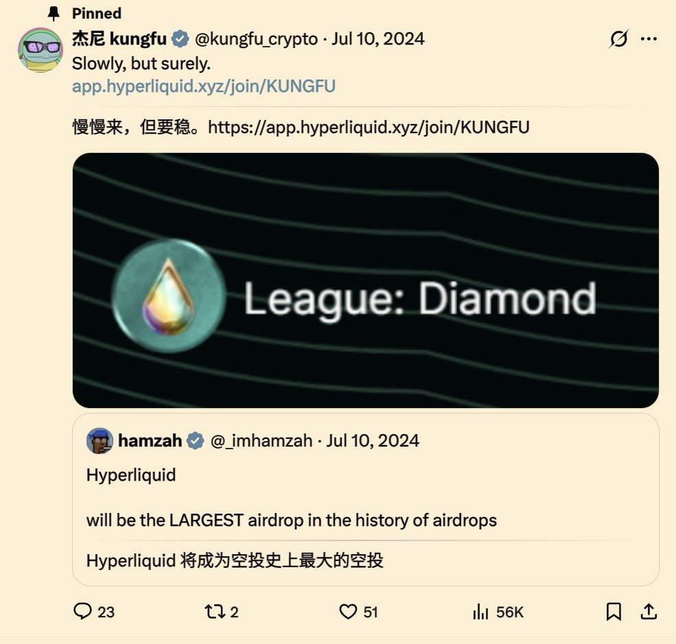
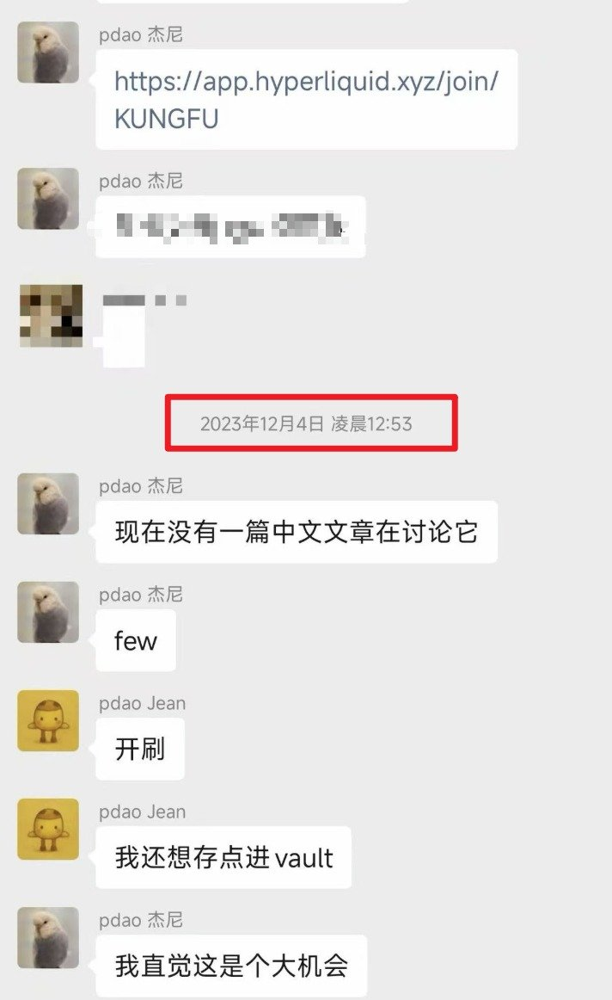

# Hyperliquid 永續 DEX 的早期參與經驗與跨資產交易機會

> **來源**: [@kungfu_crypto](https://x.com/kungfu_crypto/status/1980998856511979973) | [原文連結](https://trade.xyz/)
>
> **日期**: Wed Oct 22 14:05:07 +0000 2025
>
> **標籤**: `早期項目` `財富機會` `DEX永續`

---

> **來源**: [@kungfu_crypto (杰尼 kungfu)](https://twitter.com/kungfu_crypto)  
> **日期**: 2026-02-17  
> **標籤**: `Hyperliquid` `DEX` `跨資產交易` `早期參與` `Trade.xyz`

---

## 投資觀察：參與項目的三個關鍵要素

### Hyperliquid 的成功經驗

Hyperliquid 是我個人 23-24 年以來比較大的一波收穫，除了公開的號之外，當時也拉了朋友批量做號以及擼 Purr 換積分，和大的鯨魚沒法比，但是就目前各個號目前總共下來大概小 A8 是有的，當然很可惜有的部分賣早了。

能有這波財富效應的根本在於「參與項目最重要的 3 個點」：

1. **參與的足夠早期**：23 年的時候幾乎是沒人在玩的
2. **Community-first 的財富共享精神**：Hyperliquid 的團隊有絲滑的執行力
3. **證明有 revenue 和增長潛力的賽道**：切入到整個 Crypto 目前少數被證明有 revenue 以及能有增長的 DEX 永續合約賽道

參與地夠早，足夠大方和牛逼的團隊，和足夠長的雪道，從而幸運地獲取到了整個蛋糕的一塊。

## Trade.xyz：下一個早期機會

那還有什麼是足夠早期能參與，又有牛逼的團隊和足夠長的雪道能夠滾雪球的項目呢？我認為 Trade.xyz 是我目前比較關注的項目。

### 項目分析

**1. 團隊方面**

他們是 unit 推出來的，我相信 shoku 的團隊。

**2. 時機方面**

- 足夠早期，目前還在早期內測階段
- 只開放了 100 個 spot，隨後會推進到開放到 500 個 spot
- 撰寫時 OI ≈ $15.0m、24h 量 ≈ $2.22m
- 這個量你就算是散戶隨便刷也會佔很大的比例
- **足夠早期，這點是最重要的**

**3. 足夠有想象力和長度的雪道：跨資產交易**

萬物上鏈，這個是 SEC 已經提到過的，甚至 Nasdaq 已經在開始把一些資產和數據往鏈上搬了，我認為是很有想象力的賽道。

## 參與方式

**加入 Waitlist 條件**

需要在 Hyperliquid 上達成至少 5M 的交易額度，才能加入 Waitlist。目前我也在批量起號，手動試了一下，如果你是最偷懶的手工市價買賣策略，瞬間開瞬間關，不算點位差大概一個號手續費在 2000u 左右。

**優惠連結**

- 使用作者的 Hyperliquid link 可以減低手續費
- 達成後就能加入到 waitlist
- 如果透過作者的 HL 以及 tradexyz 鏈接成功加入 waitlist，可私信作者加入杰尼 Degen 群

## 總結

市場如此低迷之際，洋洋灑灑打了這麼多字，讓我想起 22 年熊市低谷時研究 Celestia 的感覺，運氣總是照顧執行力高的人，錢雖然是大風颳來的，但至少你家門窗也得打開才能吹進來。祝我們武運昌隆。
