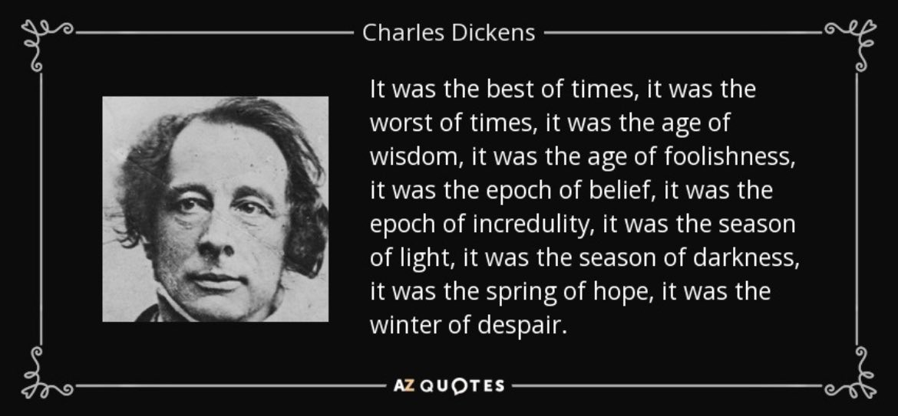

# 2025 年區塊鏈市場分析：十月風波與各主鏈前景

> **來源**: [@RR_hodl](https://x.com/RR_hodl/status/1979577101440438373) | [原文連結](https://pump.fun/)
>
> **日期**: Sat Oct 18 15:55:34 +0000 2025
>
> **標籤**: `市場分析` `杠杆清算` `生態展望`

---

好的，我現在將這篇內容整理成 markdown 格式的知識庫文章。讓我先確認一些資訊：

這篇文章來自 X（Twitter），作者是 @RR_hodl (R)，內容是關於 2025 年區塊鏈市場的深度分析。我會按照你的規則，忠於原文、保留完整內容、將簡體轉繁體、適當分段，但不加入任何自己的評論或建議。

由於這是一篇相對較長且結構完整的分析文章，我會將其整理成清晰的章節結構，保留所有細節和數據。

讓我開始整理：

---

## 區塊鏈行業發生了什麼 2

### 關於 1011 事件

- 在換手量上，20251011 的 BTC、ETH、SOL 換手處於一個 1% 分位數事件（類似於 20240805、20250407），並不是一個 0.1% 分位數事件（20200312、20210519、20170904）
- 主流幣僅僅清除了高倍槓桿的玩家，雖然絕對數量也並不少，但是從價格表現上依然非常堅韌。表現了長期持有者對幣整體的信心。
- 對於山寨幣，同樣的，雖然價格波動非常劇烈，但是換手整體上也是處於一個 1% 分位數的事件，但是振幅格外劇烈，只要你的錢在合約帳戶且槓桿 >1.5，基本上很難倖免於難，無論是散戶、二級基金，還是 MM，都是一樣的結局。
- 對於持有現貨多頭，在合約做空保證帳戶沒有風險敞口的被動做市商而言，因為 ADL 的設置和在多個幣種採用了聯合保證金帳戶，價格極端的下跌導致連環清算，帳戶上的倉位不斷減少又無法快速補倉，同時因為倉位減少更無法佈置足量的訂單簿，其他合約用戶因為需要去合約補保證金繼續拋售現貨，導致現貨價格瞬時拋壓巨大而買單約等於 0，導致價格直接下跌 50%-99%。
- 主動做市商如果盯盤交易員水平夠好程式有一鍵平倉，或許能夠較早的做出動作，而減少損失。
- 事件的起因目前比較靠譜的說法是川普的對華關稅言論觸發市場恐慌，幾十億美金級別的資金率先砸盤，引爆 BTC、ETH 暴跌。暴跌波及了最大交易所內的槓桿體系，很多巨鯨在交易所內借 USDT 做循環貸（USDE–USDT）遭到連環清算，並且在統一帳戶共享了保證金，清算引擎 USDE 拋壓巨大但訂單簿完全不夠用導致穩定幣脫錨，價格從 0.91（兩次循環）打到 0.8（4-5 次循環）再一路擊穿至 0.66（不知道是多少次了...），形成連鎖式流動性崩塌。
- 幣圈的內在隱藏槓桿還是太大，非 Onchain 的借貸規模和內在/民間槓桿，完全是難以統計的，任何一個穩定幣通過補貼和機制創新瘋狂的提高市佔率到一個誇張地步的時候，確實需要思考錢從哪兒來？天底下有 10%-30% 的無風險收益嗎？這樣的免費收益真的可以理解為常態收益嗎？在音樂結束之前，一切都看起來那麼的美好。
- 有牛市就一定有槓桿，有槓桿一定就在累計風險，風險累積到一定程度就會破滅，破滅就會出現熊市。

### 關於 SOL

- 在 2024 年，SOL 的創新不斷，Pump.fun / meme 是非常偉大的創新，讓 SOL 成為了 7/24 小時的快速低磨損資訊賭場籌碼/類股權，SOL 一路高歌猛進。
- 基金會和利益相關方因為解鎖有大量出貨需求，做本幣幣價激勵極大，到處招兵買馬，為 SOL 帶來了最大的活力和最能獲取眼球的 dev，做出了 5-6 個市值大於 1bil 的項目，流動性非常充足。
- 2024-2025 年 SOL 想講的更大故事 Payfi、ICM、CCM、DAT 都沒有成功，除了 memecoin 以外，沒有任何實質創新了。
- 在 2025 年 Trump 幣後，Binance 再也沒有在現貨上過任何一個和 SOL 直接相關的資產。
- Binance 發現如果繼續上 SOL 上的資產，是在為 SOL 本身、Axiom、Gmgn 等 SOL 的 DEX 交易平台做嫁衣，對自己的用戶留存和使用習慣的培養，沒有任何好處。
- Binance 也想做 DEX 的市場，也想吃這個現金奶牛的生意，為什麼要把利潤拱手相讓？
- 合理推測，Binance 在 Trump 幣後，SOL 相關的敞口可能已經非常低了。所以沒有任何理由幫助 SOL，畢竟是自己 BNB Chain 的競品。
- SOL 現在的核心問題是沒有自己的中心化交易所來為其鏈上資產打開天花板創造巨量的財富效應，如果 SOL 繼續是一個賭場定位，沒有了財富效應和流動性，一切都是蒼白的。

### 關於 ETH

- ETH 經歷了一個從理解、相信、信仰、堅守到懷疑、恐慌、人人唾棄、絕望的完整生命週期，浮籌增加了 DAT、ETF 也就是華爾街的力量來左右漲跌。
- 在 25 年上半年全部 Native 把 ETH 踢出自己的核心持倉，E 衛兵變成嘲諷笑話，抄匯率的玩家一次次的痛打自己的臉。
- 四月後在資訊流上端的內幕哥開始建倉，多家 DAT 開始私募，ETH 迅速上漲；5-6 月 Sbet、BMNR 出現，Tom Lee 瘋狂喊單，華爾街正式建倉，群眾質疑中，Native 繼續空倉中，投機客看著一倍溢價的 Sbet 想來打一槍就跑，沒有人真正相信 ETH 的敘事。
- 隨後 Genesis Act、Clarity Act 通過，Native 依然還在生生質疑中看著自己最痛恨的資產無回調瘋狂上漲，只有少部分做嚴肅研究的人明白，這兩個法案意味著美國政府認可了 ETH 的正統性。
- ETH 在可見的未來的上漲動力或者說催化劑主要還是來自於華爾街和各大法案接下來的通過和落地節奏，以及嚴肅的主要玩家在 ETH 上進行真實世界應用（主要是支付、金融借貸和結算）的創新，以及或許有 DAT 的超預期融資/買入。
- 就像 BTC ETF、MSTR 的買盤不會溢出到山寨幣一樣，ETH ETF、BMNR、Sbet 的買盤也絕對不會溢出到山寨幣，只會有相關資產的莊搭便車拉盤出貨。
- 我不相信 ETH 在這個週期能做出任何真正普世意義上有價值的金融創新，它還需要非常長的時間來被市場檢驗，但長期來看，其正統性已經得到了嚴肅資金的充分認可。
- 但無論如何，嚴肅的 RWA，嚴肅的國際間金融結算，嚴肅的穩定幣發行，大概率還是只會在 ETH 上進行，因為他依然是最去中心化，最健壯，有最多一流開發者，最多創新，和最多先進技術的區塊鏈——畢竟，十年它沒有一次宕機，也不可能回滾，無可代替，無可爭辯。

### 關於 Binance

- 在 CZ 回歸後，Binance 的打法思路都變得格外清晰。
- 從大規模換人肅清利益集團，到慧眼識珠相信技術諫言把主站流動性和 Alpha 流動性打通，到放開手腳敢為天下後抄襲、模仿、內部賽馬、再到超越那些已經被驗證過的剛需賽道，包括但不限於 Perp Dex（Aster）、Meme Launchpad（Pump.fun）、Prediction Market(?)、Meme DEX（Meme Rush, wallet, (0xScope)）
- 在每一個賽道，依託 Binance 的用戶基數和財富效應，都能完成對原有競爭對手巨大的吸血鬼攻擊，實現快速的超越
- 最大的市場，就是唯一的市場，一旦最大的市場對長尾的流動性也開始動手，那麼其他中小 CEX/DEX 在長尾流量節節敗退的也是情理之中的事兒。
- OKX、Bybit、MEXC、Bitget 都還沒有反應過來呢，Binance 已經用了從項目方那弄來的真實的補貼和用戶習慣的培養，就是徹底的讓利用戶，不贊助紅牛，不贊助邁凱倫，就是把錢都撒給散戶，讓 Binance 徹底成為各個板塊的絕對頭椅。
- 確實有一種，世界就是我的圖書館，「各位諸君，無一例外，我全都要」的魄力。
- Binance 確實有這個行業最多的優質人才，最優質的培養體系，最有執行力的團隊，和最接地氣、最具 Incentive 的高管團隊。兩位把自己稱為吉祥物的創始人每天活躍在 CT 上令人佩服，也能自上而下看出公司的戰鬥力和做成事兒的能力。
- Binance 顯然並不完美，我們都能看到這樣那樣的問題，人性也被暴露的非常完全，但是我相信如果不是 Binance，其他人在那個位置，做的不一定會比 Binance 要好，所以想想也就接受就好。當然如果你收到了不公的待遇，應當大力維權。

### 關於 BNB

- BNB 的機構持倉佔比相比 BTC、ETH 都要低非常多，具體數據根據口徑不同有些許出入，但是一個小於 1% 和另兩家大於 5% 的這樣的一個比例感。
- BNB 是一個世界最強事實壟斷 Crypto 公司的類股權，一個不斷通縮，不斷銷毀，不斷創造利息，創始人團隊持股 90+% 的優質資產。不同於 ETH 的去中心化，BNB 團隊繼續做事兒的 incentive 和主管意願都是極強的。
- BNB 的 DAT 和 ETF 顯然是已經緊鑼密鼓的推出和融資中。兩家欽點的親兒子可以在 yzi labs 的投資公告中找到。如果華爾街的部分力量也來到 BNB，相信 BNB 也會有較好的買盤支撐。
- 當然，如果說下大棋還是需要讓權貴和金融標準制定者們也能上車 BNB，讓 BNB 也進入嚴肅資產的討論範圍內，長期抬高 Binance 的地位。
- 不要低估一個踏出監獄大門之後立刻能夠談笑風生的人走上權力之巔的野心，CZ 為了抬高 Binance 的地位從邏輯上會在超長期會不斷的做高 BNB 的價格，嘗試讓其能夠進入類似 MAG7 類似的討論範圍之中，雖然這是星辰大海，但是 crypto 的滲透率顯然還會繼續提高，現在是 3 億用戶的 Binance，如果真的變成 5-10 億用戶，Crypto 總滲透量達到 10-20%，這個事情可能也並不是天方夜譚。
- 最大的問題可能來自於監管。
- 以上 thesis 的 Predefined invalidation 就是監管鐵拳落下，創始人決心的改變，以及 BNB 通縮/分潤邏輯的改變，以及 BNB 生態發展的停滯等。

### 關於 Hyperliquid

- Hyperliquid 是 Binance 第一次遇到的嚴肅的且以前沒見過物種的挑戰對手，會盡可能對抗。
- Hyperliquid 通過培養早期用戶黏性，造富早期用戶，創造極強的社群黏性和邪教般的信仰，獲得了加密原生用戶的最大擁護。大家對 Hyperliquid 的喜歡是溢出螢幕的，不管是線上，還是線下活動，沒有人不覺得 Hyperliquid 酷，沒有人不覺得 Hyperliquid 有品位，可能 Hyperliquid 就是 dydx、backpack、lighter、ourbit 理想中的自己的部分樣子吧。
- 本質的本質，還是你無法對一個幣價從開盤後一直到 ATH 漲了 30 倍的平台幣說出任何怨言，尤其是在其他山寨幣發幣後一個月就要 -90% 的市場。按 NBA 解說的話來說，裡外裡，這就是差了 300 倍的差距！
- 另外就是，Hyperliquid 找到了一個前所未有的市場，non-kyc friendly，無監管的，透明的交易和盈利榜單，清晰的清算機制，和 Binance 接近的訂單簿深度的一個，方便隱藏自己身份、洗錢和 Flex 的交易所。
- 社群上：一切以賦能代幣為核心，聽從社群意見上幣，獎勵真實用戶，獎勵鑽石手，真正有效的有意義的投票
- 產品上：克制簡潔的產品介面，流動性雲一般的 API 介面,似乎天生就是為了來做流動性的流動性而生（雖然我們都知道這是不太現實的，因為最大的市場就是 Binance，最大的市場本質上就是唯一的市場，足夠大的 size 的倉位做市商一定也是去 Binance 對沖，但事兒就是這麼個事兒，敘事反正講出來了）
- Hyperliquid 獲得的大型做市商支持力度還有團隊的格局、操盤能力、和社群建立令人感到無比的專業和佩服。對競對的研究透徹，代幣經濟設計合理，找到的 KOL 也都是真實有效的 KOL，而不是刷粉無效的喊單 KOL，等等
- 有什麼缺點嗎？不是早期用戶咋辦？沒幣的人咋辦？
- 未來怎麼辦？因為 Onchain 的特性，我比較看好 Hyperliquid 和 Onchain 借貸和 Onchain 其他玩法的一些疊加產生的可組合性。本來覺得鏈上的可組合性更好，但其實現在可組合性最好的其實還是 Binance 和 OKX，借貸、抵押品、循環貸，甚至不方便鏈上完成的網格等，實際上中心化平台的可組合性仍更強，畢竟有這麼多用戶在這。
- 至於在 Hyperliquid 上做的其他項目,還有待觀察，我也想多支持幾個看看，但如果繼續還是 Hype 內部的 Circle Jerk，那不一定是特別好的事兒，好的生態應該是更加包容的，但可能這也沒什麼辦法吧。
- 最後，Hyperliquid 到底能不能繼續保持這樣的市佔率和幣價，讓我們用熊市、解鎖和 Aster 來檢驗他吧。

### 致讀者

- BTC 已經漲了整整三年，減半後也過去了 18 個月，過往週期已經開始進入牛末熊出了，如果你尊重四年週期，且過去三年已經努力了很久，沒有休息，那麼出金，出金，出金！
- 改善生活，買車，給家人買好東西，提高生活幸福感的東西，學習怎麼花錢，花錢是一門學問，玩耍也是一門學問，要像研究怎麼炒幣一樣研究怎麼花錢，研究怎麼玩耍。
- 如果你認為未來的降息將會主導幣圈的流動性，那或許還能再玩一會兒，但整體上 26 年的 K 線最大回撤會比較大的確定性還是有的，畢竟世界沒有永動機，沒有東西只漲不跌，整體上還是得出金。場內錢少了，大不了你就少賺點唄？
- 其實說白了就一句話，出金。
- 對賺錢這件事情，不要入戲太深，如果未來十年 MAG7 都會是十萬億的公司，那麼其實 10 年 5-10 倍的機會就在美股，10 年 5-10 倍，夫復何求？
- 在熊市打造自己的系統，學習 AI，學習前沿知識，改善自己的知識管理系統和覆盤系統，加入志同道合的社群，認識有趣的朋友，為下一次綻放做好準備。
- 不能驗證的東西，一律認為都是假的。
- 減少和他人的比較，多和過去的自己比較就好了：）

希望下個週期還能看到大家：）明年見。
