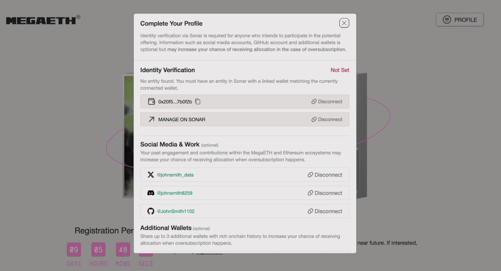
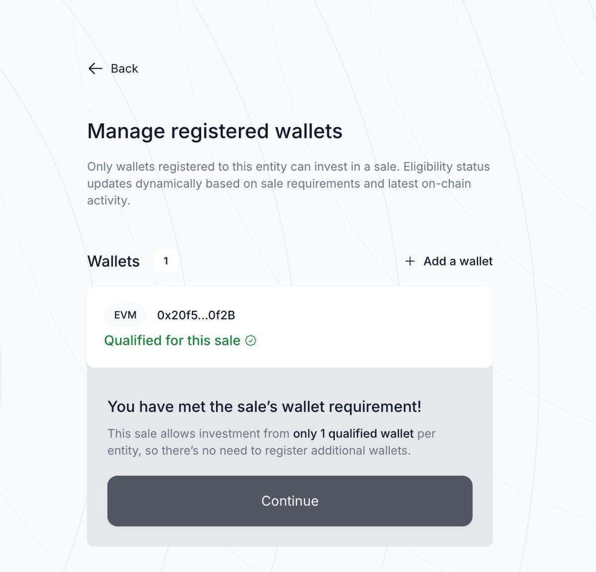
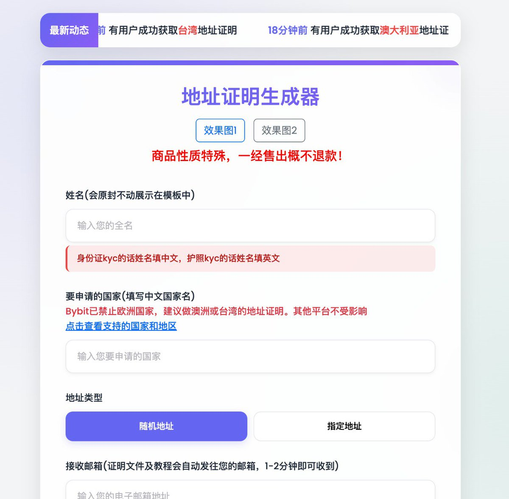

# MegaETH 打新上線：Echo Sonar KYC 完整教程（含地址證明方案）

> **來源**: [@johnsmith_data](https://x.com/johnsmith_data/status/1979464593492885951) | [原文連結](https://token.megaeth.com/)
>
> **日期**: Sat Oct 18 08:28:30 +0000 2025
>
> **標籤**: `新幣上線` `打新教程` `KYC驗證`

---

> **來源**: [@johnsmith_data (John Smith 史密斯)](https://twitter.com/johnsmith_data)
> **日期**: 2025-02-17
> **標籤**: `MegaETH` `IDO` `KYC` `Echo Sonar` `打新`

---

## 專案介紹

MegaETH (@megaeth) 是 EVM 兼容的 L2 區塊鏈專案，目標實現：
- 低於 10 毫秒級的區塊時間
- 10 萬 TPS 的交易吞吐量

**融資情況**：獲得 Vitalik Buterin、Dragonfly Capital 領投超過 5700 萬美元

**打新平台**：Echo Sonar

**打新官網**：https://megaeth.com/public-sale

---

## 帳號註冊流程

1. 在官網連結錢包、社群帳號創建帳號
2. 創建 Sonar 帳號
3. 創建完成後回到主頁，點擊「Manage on Sonar」
4. 依照指示進入 Sonar KYC 頁面

---

## Echo Sonar KYC 完整教程

### 第一階段：身分證件

- **可接受證件**：身分證或護照
- **注意事項**：
  - 使用身分證後續需用中文填寫
  - 使用護照後續需用英文填寫

### 第二階段：人臉辨識

- 使用電腦鏡頭進行人臉驗證
- 或使用 QR code 連結手機掃臉

### 第三階段：地址證明（卡關重點）

**所需文件**（擇一）：
- 個人水電帳單
- 銀行帳單
- 戶籍謄本

**卡關解決方案**：

如無法提供上述文件，可至以下服務購買地址證明：
- **成本**：2U（約 2 USDT）
- **服務連結**：https://t.co/2nyyOeWjfG
- **可獲得**：多份身份證明文件
- **地址選項**：可指定或隨機地址
- **額外用途**：可在其他平台 KYC 時重複使用

**上傳流程**：
1. 在服務平台申請地址證明文件
2. 至電子郵箱下載文件照片
3. 上傳至 Echo Sonar 的 KYC 頁面
4. 等待審核

---

## 參考來源

教程參考：@LuBtc888
