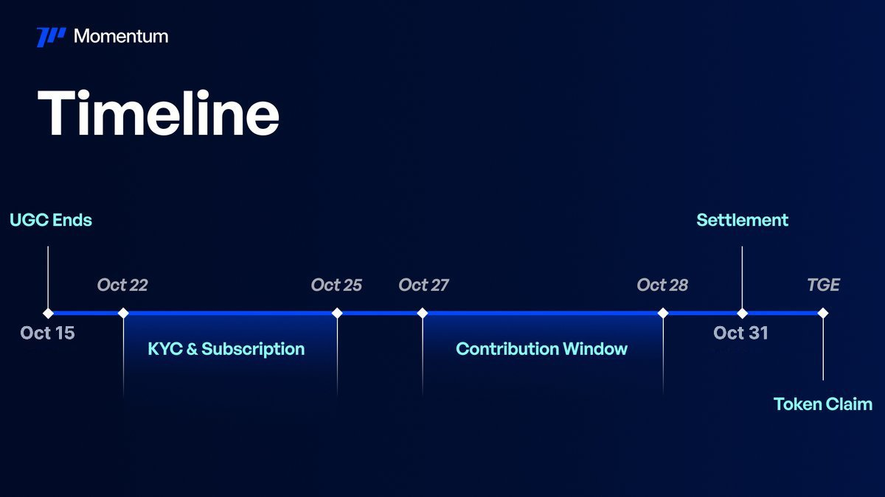

# BUIDLpad Momentum IDO 打新策略與 KYC 注意事項

> **來源**: [@LumaoDoggie](https://x.com/LumaoDoggie/status/1976632114633420921)
>
> **日期**: Fri Oct 10 12:53:14 +0000 2025
>
> **標籤**: `IDO 打新` `層級策略` `KYC 風險`

---

> **來源**: [@LumaoDoggie (撸毛小狗)](https://twitter.com/LumaoDoggie)
> **標籤**: `BUIDLpad` `MMT Finance` `IDO` `打新策略` `KYC`

---

## 核心策略

@MMTFinance + @buidlpad 打新最佳姿勢，講一下新人最佳策略和 KYC 多號注意事項。

## 一定要去 Tier 1

這次分兩個 tier：
- **Tier 1**：FDV $250M
- **Tier 2**：FDV $350M

### 1. Tier 1 利潤高一倍

因為不像上一期 $Falcon 穩定幣賽道，最後開盤價格是認購價的 10-15 倍以上。

這次 Momentum 是流動性池子，想象空間沒那麼大，TGE 估計 FDV 就 600M 左右。

那麼你 Tier 1 和 Tier 2 進去，最後利潤能差一倍。

### 2. 門檻不高

Tier 1 門檻就是 **$3,000 U 放 10 天**，算很低了。

放了十天後，會給你 $3,000 U 的打新額度。

## 不要上大資金

另外一種策略，就是上到 **Momentum Tier 5**，會有 $4,500 U 打新額度，而不是保底的 $3,000 額度。

但是拿到 Tier 5 我估算大概需要：

**20 萬 U 放 20 天做 LP**，每天利息 1-2% 左右。大可不必。我拿去 Curve 裡做穩定幣 LP 池子都有 16% 年化。

算一下，相當於你損了 1,000 U 的利息，多拿了 $1,500 的額度。

這多出來的額度最後的利潤我估計就是 **$100 左右**。

雖然到了 Tier 5，你除了多出來的這打新額度，也會拿到 Momentum 積分和空投。但是大概率回不了本。

**不建議不建議。**

## 買 KYC 號的注意事項

**非洲和菲律賓的 KYC 這次 100% 掛。**

上次 $FF 打新給過了是因為運氣好有大戶維權 + 官方沒提前說清楚。

所以這次官方提前加黑字體警告清楚了，你存了 $3,000 U 也不保證進 Tier 1，後期 KYC 過不了你都參加不了打新。

> "Users who have at least $3,000 in Momentum LP positions are NOT guaranteed with eligibility, they will still have to pass the anti-sybil test."

根據上次經驗，**阿根廷、歐洲的 KYC 比較好**。

另外，提前和 K 商說清楚，貨不對板退不退錢。

很多買的時候說是歐洲 KYC，打開一看其實是非洲黑叔叔的。

### 這次不建議買 KYC

因為項目給的定價太高，利潤低 + 絕對超募很多，然後變小毛。**Tier 2 單號利潤在 100 U 以下**。

要做 Tier 1 也可以，機會成本就是 3,000 U 鎖 12 天左右，比上次 FF 鎖三個月好很多。

## 新人進入路徑

### 10.13 日
通過 BUIDLpad 存 **3,100 U** 進 Momentum 做穩定幣池子。完善資料，綁定錢包。

第二天看看 Momentum 積分和排名出來沒。

卡在 10.15 第一季快照之前。

3,100 U 是為了留有餘地，比 $3,000 保底多一些。

### 10.22 日
去 BUIDLpad 做 KYC。

### 10.25 日 10:00 AM 之後
把這 3,100 U 提出去。

後面就等通知打錢了，沒啥好說的了。

## 嘴撸機會

有精力的可以嘴撸一下，也是根據上一期 $FF 經驗，**$150 U 保底很好拿**。你基本有個三五百個粉絲就行了。

不過這次利潤不會太大。這 $150 U 保底大概相當於 $300 U 利潤。
