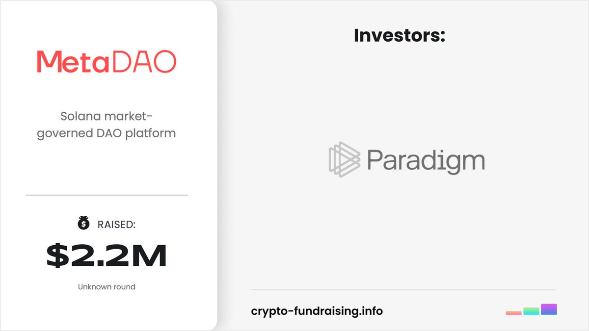
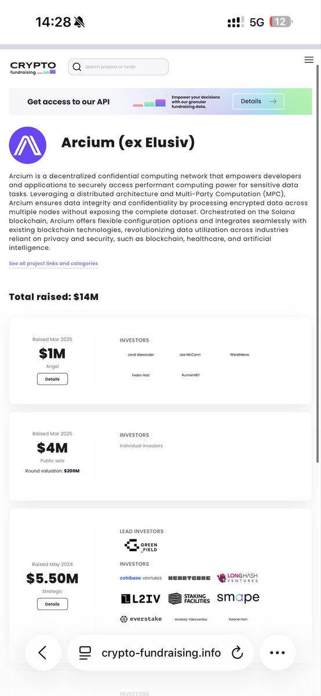

# MetaDAO 與 Umbra 新打新機會分析

> **來源**: [@0xleng1](https://x.com/0xleng1/status/1975087513875472782)
>
> **日期**: Mon Oct 06 06:35:33 +0000 2025
>
> **標籤**: `打新策略` `IDO評估` `風險管理`

---

> **來源**: [@0xleng1 (Leng)](https://twitter.com/0xleng1)
> **日期**: 2025-02-18
> **標籤**: `MetaDAO` `Umbra` `IDO` `Solana` `打新` `Arcium`

---

## MetaDAO 新打新機會

Paradigm 投資的 @MetaDAOProject 將在 **6-10 號**有一個新的打新機會，這是個大卡車項目，感覺就是穩定理財了。

## Umbra Privacy 項目分析

### 技術背景

@UmbraPrivacy 使用 @arcium 提供的技術支持，且 arcium 有轉推宣發。

### 代幣經濟學

**總供應量**: 2850 萬枚

**代幣分配**:
- **1000 萬** - 用於打新，價格 **0.075 USDC**
- **500 萬** - 作為流動性
  - 200 萬 + ICO 的 20% 資金直接加入池子
  - 300 萬作為 Meteora 的單邊流動性
- **1350 萬** - 分配給團隊

### 估值分析

**完全稀釋估值 (FDV)**: 213.75 萬 USDC

**開盤市值**:
- 不計入團隊部分: **112 萬 USDC**
- 不計入 Meteora 的 300 萬: 市值會更低
- 目前不確定團隊部分是否鎖倉

## 風險評估

初始市值不高，感覺可以玩玩，都是正兒八經的項目。算是風險比較小的項目，建議還是 DYOR（自己做研究）。

## 策略建議

單純就是打新大卡車超發然後分配，穩定理財項目。**最後一天看看情況再決定打多少**。
