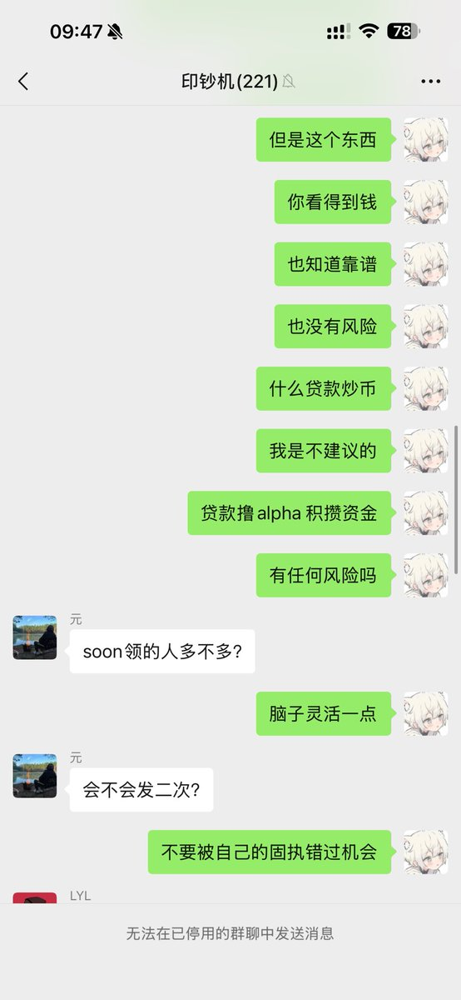
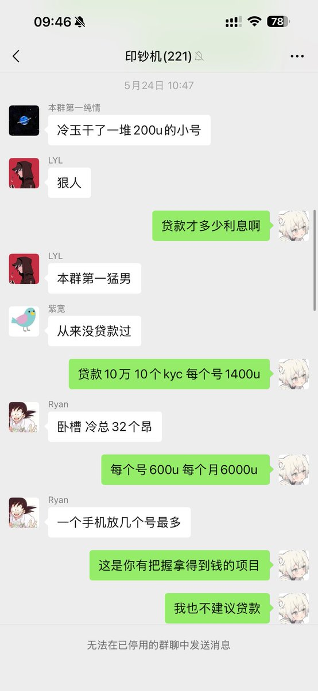
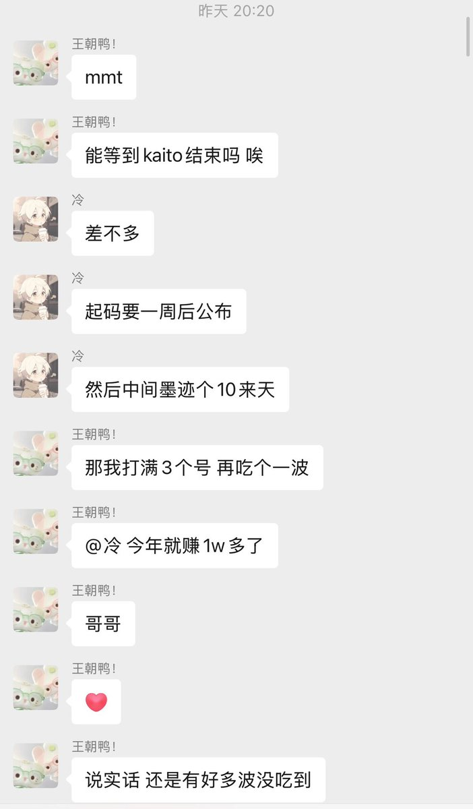
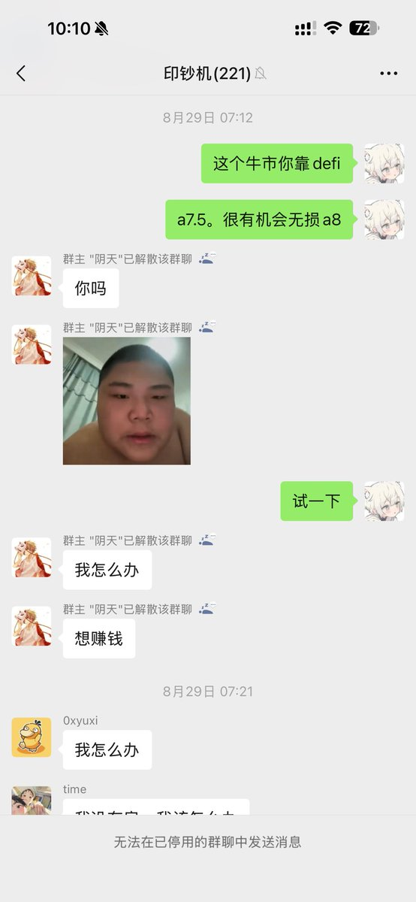

# 普通人牛市致富指南：從 Alpha 策略到 A7 階段的資金滾雪球方法

> **來源**: [@0xleng1](https://x.com/0xleng1/status/1972125481031160130) | [原文連結](https://x.com/0xleng1/status/1926197346011844724?s=46&t=IfeN_zvVH8-FJu5uLdOI6w)
>
> **日期**: Sun Sep 28 02:25:29 +0000 2025
>
> **標籤**: `資金累積` `打新策略` `DeFi 理財`

---

> **來源**: [@0xleng1 (Leng)](https://twitter.com/0xleng1)
> **日期**: 2024-10
> **標籤**: `alpha策略` `資金管理` `打新` `理財` `撸毛`

---

## 前言

今年其實是最適合普通人的牛市，這篇文章講解普通人怎麼打破自己的認知到 A7（百萬美金級別），以及 A7 以後最簡單的策略。

## 從 0 到 A6：Alpha 策略累積本金

### Alpha 是累積本金的基礎

普通人從 0 到 1 的基礎就是離不開 Alpha。Alpha 就是累積本金最簡單的方法，之前沒有一輪牛市可以提供這麼穩定的賺錢機會。

### 收益時間線

- **5 月**：處於行情較好的時候
- **7-8 月**：收益確實不穩定，沒建議人辭職，覺得適合加號。少歸少，但還是有收益
- **9 月份**：收益又開始暴漲

四個月的週期一個號應該有 2000u 收益。接下來 10 月 11 月還有很多大項目要 TGE，收益也不會低。

### 滾雪球策略

期間發了不少的打新理財撸毛貼：

- Pond
- 樹莓
- 兩個雪崩的註冊（沒有按頭打，雪崩這倆確實沒把握）

但凡之前五月份跟著做了 Alpha，後面跟著按頭打了樹莓，資金基礎又可以增加不少，也算是滾雪球。Pond 就不用說了，這個確實不是人人都有。

### 實際案例

把 Alpha 的利潤拿來做 OS 以及其他的一些盈虧比高的撸毛項目，還有一些確定性高的打新項目，就可以把 Alpha 提供的利潤慢慢放大。

五月份開始和我做 Alpha 的，從 1000u 到現在差不多 1 萬 u 利潤（沒算上 Pond）。從 Buidlpad、樹莓和其他各個地方薅一點，這還是錯過 Aster、Plasma 的前提下。

做到 11 月底應該可以簡單完成一個 A6。A6 其實沒有什麼值得一提的，但是這個方法它適用於所有普通人。

## 從 A6 到 A7：規模化複製

A6 到 A7 其實就更簡單了，把目前號的數量加大就可以了。畢竟已經累積了本金。

## A7 以後的策略

### 穩健打法

A7 以後其實每年撸一些確定性較高的項目，不要盲目跟風熱門項目，一年的收益還是比較可觀的。

但是重點還是在 DeFi 和打新上。大部份人讓他大資金去玩二級，一般人是不敢的，所以這個方法更適合普通人一點一點擴大資金。

### 存款項目踩中率

存款項目自身踩中率還是比較高的：

**成功項目**：
- Ethena
- Parcl
- Aster
- Plasma
- Thetanuts

還有一些別的項目太多了真記不住，還真沒有一個 rug 過我的錢，被盜或者跑路。我對這方面太謹慎了。

**收益較少的**：
- Sanctum
- Gomble

### 長期穩定理念

很早就在群裡和電報群推上和認識的朋友說過，賺到 A7 之後來理財慢慢放大資金就可以了。對於我來說沒有什麼比長期穩定賺錢來的更好。

對於我來說成也穩，敗也是穩。不敢放開玩，不過今年正兒八經打新的勝率應該在 90% 了。

## A7 打新與理財配置

### 打新項目規模化

A7 之後打新項目也是理財項目之一：

- **Buidlpad**：打完 Solayer 就一直在加號
- **Kaito**：打完樹莓也在加號

這些平台沒有辦法給大額度。如果說 A6 弄這些打新是 3-5 個號，A7 就得擴大到 10-30 個。KYC 是最簡單的，花錢就行。

只要打新平台的慣性還沒有被打破就可以一直玩，簡單來說就是還沒有賺錢效應就可以一直玩。確定性夠高的項目真的想不到怎麼輸。

### 撸毛配置建議

對於 A7 撸毛的配置：
- 建議 20-50 個號
- 有黑奴和工作室的話可以再放大一點

## 個人資金案例

今年投在幣圈的本金大概在 3 萬 u（因為輸不起），現在大概擴大到 30 萬 u 差不多：

- 十幾萬 u 放到了 Zerobse
- 十幾萬在 USDai
- 還有一部分流動資金放著打新、Alpha

## 總結

簡單來說就是跟著不卷的風口玩：

1. **0 到 A6**：Alpha 策略累積本金 → 滾雪球投入高確定性打新/撸毛
2. **A6 到 A7**：規模化（加號）複製成功策略
3. **A7 以後**：理財 + 打新 + 撸毛，注重長期穩定收益
