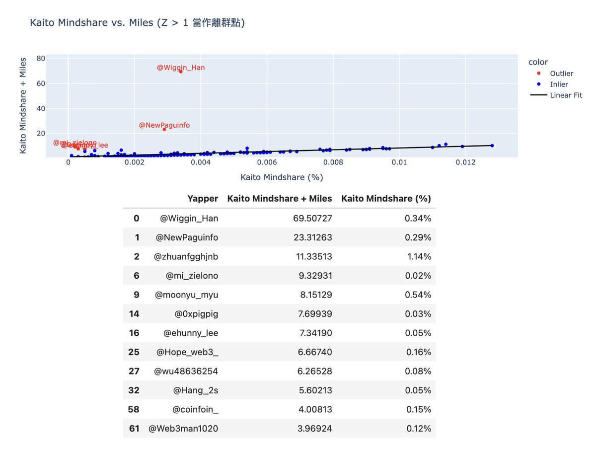

# 高質量 KOL 頻道指南：識別低調大鯨魚的投資者

> **來源**: [@jimcurrywang](https://x.com/jimcurrywang/status/1971868026858623242)
>
> **日期**: Sat Sep 27 09:22:27 +0000 2025
>
> **標籤**: `KOL評選` `空投農耕` `DeFi策略`

---

> **來源**: [RJ ♣️ (@jimcurrywang)](https://x.com/jimcurrywang)  
> **日期**: 2026-02-18  
> **標籤**: `KOL` `空投` `DeFi` `Kaito` `投資策略`

---

## 背景：如何識別真正有價值的 KOL

最近 @KaitoAI 跟 @falconfinance 合作的 #Yap2Fly 活動非常競爭，各路人馬都衝進來：有真金白銀砸下去的 KOL，也有互洗流量的矩陣號、聊天刷存在感的大軍，甚至還藏著一些被嚴重低估、其實投入不少資金的小號。

**問題來了 👉 怎麼分辨哪些帳號是真的有料？**

按照 @trader_alvin 的思路，使用 Kaito Mindshare vs Kaito Mindshare + Miles，用 sklearn 的 LinearRegression 做線性回歸，找出那些「低調但大倉位」的空投高手。

這群人有實力（倉位夠深）、有內容（會在 Kaito 發表觀點），卻不是那種只會喊單、嘴上擼的矩陣號。他們存在感或許不是最高，卻是真正值得長期跟蹤的頂級帳號。

圖中紅色點的帳號，就是這些大倉位卻低調的玩家。盯緊他們的動作，對未來其他項目的空投絕對有益處。

## 推薦 KOL 名單

### Top 1. @Wiggin_Han（里昂哥）

第一位是我自己很常 follow 的 KOL。

DeFi 圈應該沒人還沒看過里昂哥的文章吧，真的值得推薦。

他不只是個單純的 DeFi 玩家，而是深度參與鏈上策略、收益耕作的實戰型 KOL。從 Pendle 到 Huma，再到各種 LP、空投與中性收益策略，但更讓我佩服的是他能把收益耕作、鏈上策略講得既輕鬆又接地氣，每一項他都能拆解得很清楚，常常一條推文就能給人靈感。

更有意思的是，他不侷限在 DeFi，還會觸及一級市場投資、RWA、甚至 NFT 與 Web3 生態大規模應用的觀點。認真說，如果你想在鏈上找到更有效的打法，或是想理解不同賽道的連動，他的內容一定能帶來啟發。

### Top 2. @NewPaguinfo

鏈上 DeFi 玩家應該也都知道吧。

完完全全的實戰派，強調「I post what I actually invest」，不是紙上談兵，而是把自己的倉位、計算、策略攤在檯面。

想要跟到真正懂 DeFi 的玩家，我很推薦 @NewPaguinfo。

他不是那種只會喊單或複製貼上的帳號，而是標準的「高手型 Degen」：會把 Falcon、Pendle & Boros、Hyperithm 的 mHYPER（合成穩定幣）等協議的細節掰開揉碎，連 backing assets、basis trading、funding fee 都計算給你看。更特別的是，他的投資理念不是盲衝高風險，而是偏好「高 APY + 低風險」的組合，比如 delta-neutral、套利、對沖等，這才是長期能活下來的打法。

他還經常分享 perpDEX（GRVT、Rangers、Flipster）的最新動態，像資金費率機會、合成穩定幣玩法，甚至把數據和策略結合，教你怎麼在鏈上真正賺到利潤。

日更、高互動、多語言，讓他在亞洲 DeFi 社群中算是有代表性的一號人物。如果你想快速吸收 DeFi 最前線的資訊，他的貼文值得第一時間 follow。

### Top 3. @mi_zielono（ZielonoMi）

ZielonoMi 風格跟前面幾位不太一樣，他是比較明確的 airdrop 與一級市場專家。

在歐洲社群裡，如果要找懂 airdrop 狩獵和一級市場的玩家，那 ZielonoMi 肯定有一席之地。

從 2017 就進場，他的內容不是喊單，而是超實用的參與指南，包括 ICO、公售、點數農耕，甚至各種跨鏈橋和 DeFi 工具的整合玩法。

他的特色是「直接給方法」，像怎麼準備 KYC、怎麼搶 FCFS 名額，或是如何用 Pendle、Stargate 這類協議去放大點數收益。更重要的是，他經常把風險擺在明面上，提醒大家關於 hack、depeg、政策限制的坑，不會只講甜頭。

他的推文大多是 thread 形式，配上截圖、數據和 ref 連結，讀完就能立刻操作。從 USDai、Plasma 到 Falcon、BVM，他都會提前追蹤並拆解規則，幫助社群卡到位置。平時也會穿插 DeFi yield 策略，像是 Pendle LP、Balancer、Curve 等，讓投資人能把早期機會和鏈上收益結合起來。

總的來說，mi_zielono 是一位把早期紅利做成教科書的高手。如果你對空投農耕 + 初始公售機會有興趣，他的內容基本可以說是必追。

### Top 4. @0xpigpig

蠻低調的大佬，是「在場內默默搬走錢的人」。

內容沒有花俏的理論或複雜的投資學，而是偏向記錄自己在鏈上的實操，尤其是各種 L2 生態的 DeFi 策略。

從 Optimism 到 Arbitrum，他會分享怎麼用借貸、流動性挖礦、LSD 協議去堆高收益，也會實測一些新協議（像 Hallows Finance、Lybra Finance），給大家參考。

### Top 5. @ehunny_lee（Old Miner）

在韓國社群裡，@ehunny_lee 算是一位典型的 DeFi 實戰派玩家，也同時是投資人與教育者。他最常分享的是穩定幣與 DeFi 策略，像是 Falcon USDf 的套利、depeg 處理方法，甚至用 Pendle 來做短期 redemption，細節就是他的強項。

他把「收益 + 風險管理」結合在一起，讓人看得出不只是衝一波，而是真正懂得控盤。

除了 DeFi，他也積極參與空投與 leaderboard farming，特別是在 Yap2Fly 活動裡一路衝到前 15 名，還會估算 top200 的實際回報金額。這種把數據和策略結合的分享，對想 farming 的人超有參考價值。

他也會下場參加 launchpad，像 Buidlpad 的 @falconfinance $FF 或 BiomeAI，都用「褲子賣掉也要參加」的語氣形容，幽默又真實。

他的內容不是大篇理論，而是短文 + 圖片的操作記錄，有時會解釋概念（例如 market maker 的雙刃劍效應），有時則直接曬出收益圖表。更新頻率高、互動感強，很適合想要跟進 DeFi 穩定幣生態、空投耕作與早期投資機會的玩家去追蹤。
