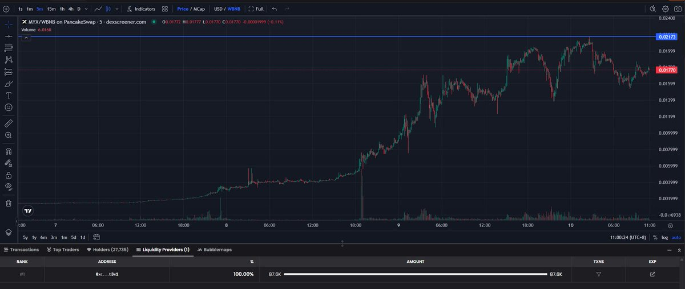

# $MYX 狗庄拉盤預測技巧 - 辨識莊家目標價位

> **來源**: [@scuptone](https://x.com/scuptone/status/1965613677975142491) | [原文連結](https://twitter.com/scuptone/status/1965613677975142491/photo/1)
>
> **日期**: Wed Sep 10 03:09:54 +0000 2025
>
> **標籤**: `狗庄操控` `代幣價格` `市場微觀`

---

> **來源**: [@scuptone (貓老師scupt)](https://x.com/scuptone)  
> **日期**: 2026-02-18  
> **標籤**: `MYX` `莊家分析` `加密貨幣` `價格預測` `鏈上分析`

---

簡單教一下大家如何知道 $MYX 狗莊會拉到多少的一個小技巧。

## 實戰效果

效果如下：的確價格就沒有超過項目方的預期，拉到了對應 BNB/MYX 0.02713。

## 查找方法

下面我教大家如何查找他想控制的價格位置。

（註：原推文包含一張教學圖片連結，展示具體的查找步驟）
