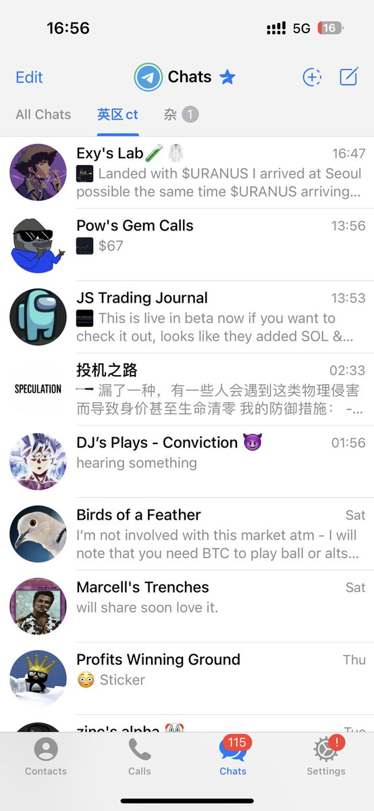

# 優化資訊流：追蹤頂級交易者提升交易認知

> **來源**: [@0xcrypto_max](https://x.com/0xcrypto_max/status/1962079301089787931)
>
> **日期**: Sun Aug 31 09:05:33 +0000 2025
>
> **標籤**: `資訊流管理` `交易心態` `社群學習`

---

> **來源**: [@0xcrypto_max (Max)](https://twitter.com/0xcrypto_max)
> **日期**: 2026-02-18
> **標籤**: `資訊流優化` `交易認知` `學習策略`

---

## 核心建議

建議在 Telegram 上單獨設置一個 folder，專門追蹤英文區 CT（Crypto Twitter）和中文區較為頂級的交易者。

## 篩選標準

這部分人員的標準：
- **必須條件**：實盤 A8 以上（千萬級別）
- **最佳條件**：實盤 A9（億級別）

## 學習方法

多看這些高手的發言，多學習，多模仿，久而久之，就能多少學到一點。

## 推特資訊流管理

在推特上掛一個 list，專門刷這些人，處理乾淨、增強自己的資訊流。

## 實際案例對比

以這次大盤下跌為例，形成鮮明對比：

**隨緣刷推遇到的內容**：
- 跌了就喊跌
- 宣稱牛市結束
- 技術形態進入熊市

**List 裡頂級交易者的觀點**：
- 看 9 月回踩
- 健康回調
- 迎接降息

幾個月後結果會證明誰是對的 👀

## 資源補充

- 推特的 list 還在補充中，已掛在主頁可以看到
- Telegram 的 folder 目前更需要補充
- 徵求更多厲害的英文區 CT 推薦
