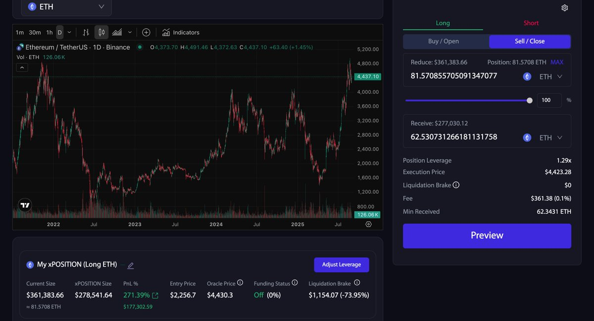
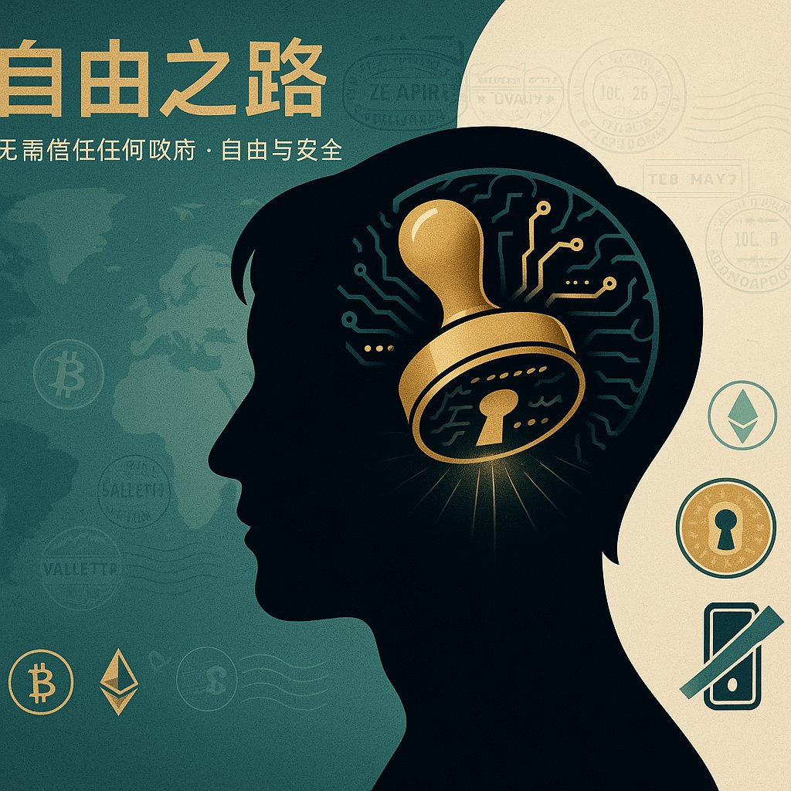
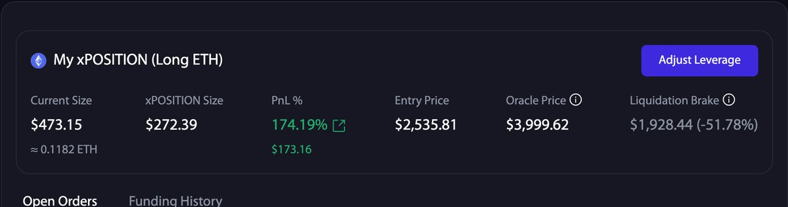
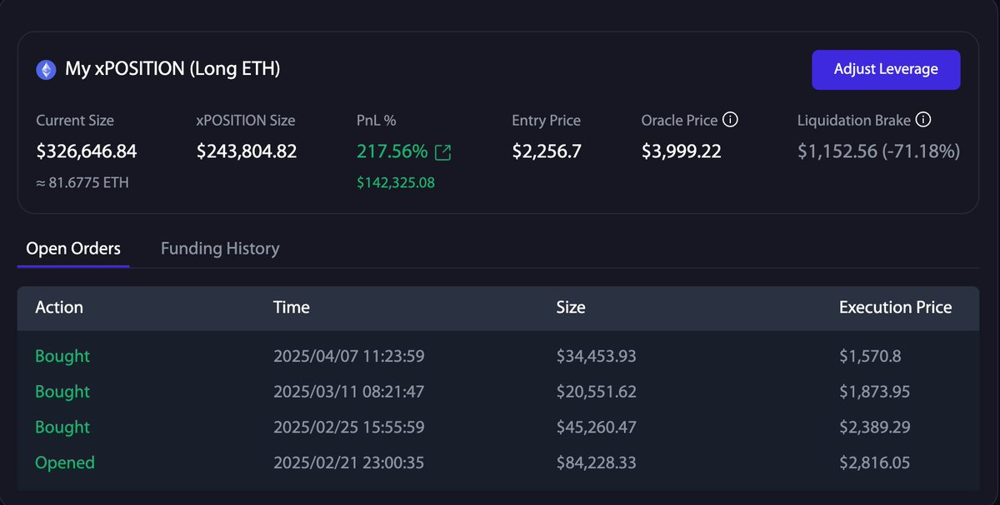
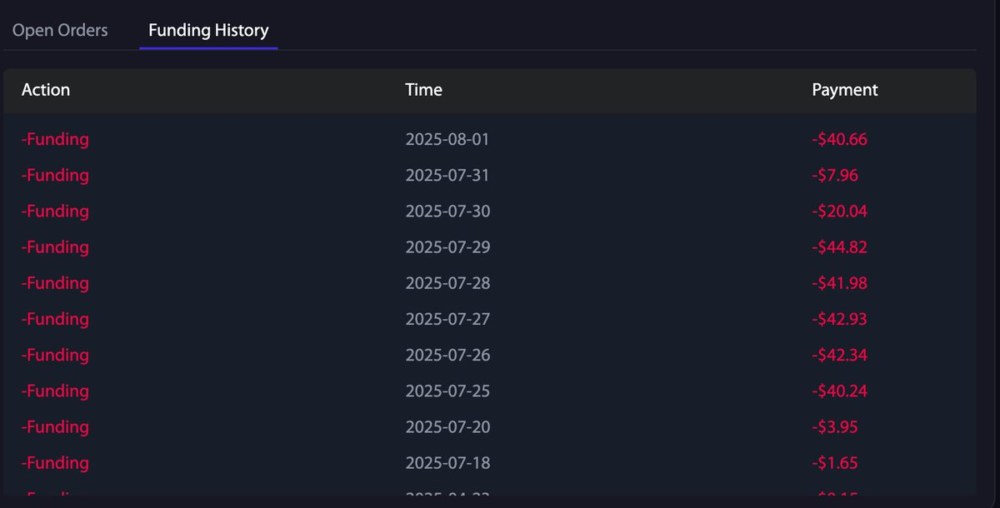

# DeFi 被動收入第二年：策略調整與套現計畫

> **來源**: [@darkforesttri](https://x.com/darkforesttri/status/1962052683130601700)
>
> **日期**: Sun Aug 31 07:19:47 +0000 2025
>
> **標籤**: `被動收入` `投資策略` `風險管理`

---

## 2025 年 7-8 月被動收入總結

兩個月被動收入明細：

| 項目 | 收益（美元） |
|------|-------------|
| Concentrator | $219.86 |
| Votium | $681.67 |
| LSD | $2,222.36 |
| SAAS | $3,618 |
| L2 鏈上 LP 挖礦 | $0 |
| **總計** | **$6,741** |

平均每月被動收入：**$3,370**

## 主動投資策略

### @protocol_fx 1.0 倉位

- **幣本位浮盈**：52%
- **獲利**：5.2 枚以太幣
- **槓桿率**：1.86X
- **平倉計畫**：ETH $8,000

這是一個非常悠久的倉位，伴隨了 @protocol_fx 的起步與成長。為後面的上漲儲備了一定的槓桿。

### @protocol_fx 2.0 倉位

**主力倉位**：
- **U 本位浮盈**：272%（217%）
- **幣本位浮盈**：25%（20%+）
- **獲利**：12.5 枚以太幣（10+ 枚）
- **槓桿率**：1.2X（1.33X）
- **平倉計畫**：ETH $5,000

**空投倉位**：
- **初始資金**：$100（3 倍槓桿）
- **浮盈**：174%
- **當前價值**：$270

## 市場判斷與套現計畫

### 市場階段

目前這個階段大概率處於牛市中期的調整期，等待降息落地。如果年內能有 2 次降息，相信牛市還是會持續下去的，但對於長牛我是沒有信心的。畢竟這些幣子在我手上已經超過十年了，今年一定會主動進行部分的套現，為可能到來的新一輪熊市做好儲備。

### 第一套現點位

- **BTC**：$150,000
- **ETH**：$6,000

這部分套現資金足夠我和我的家人無需工作過上一般家庭衣食無憂的保底生活了。

### 第二套現點位

- **ETH**：$8,000 左右

如果可以實現，全家都可以完全做到靠美國國債利息過上輕鬆惬意的生活了，孩子也沒必要卷了，他自己想幹點啥就幹點啥吧。

後面的套現點位等實現了第一步再說。

## 個人思考

這一切目前還只停留在美好的幻想中，有時候想想把現在的幣全賣了就很輕鬆可以實現第二階段想像中的美好生活了，但我仍然不希望從此離開區塊鏈的世界。

作為一個後半生可能在全球各地漂泊的中國人，沒有什麼資產可以像加密貨幣那樣，給予我足夠的自由與安全，也不需要相信任何政府。

如果思想鋼印可以把私鑰印在我的大腦那我一定毫不猶豫的去印上，從此擺脫私鑰保管之苦。

## 其他觀察

在假期中沒有機會調整槓桿率，現在的槓桿率只有 1.33X，實在是有點暴殄天物，浪費了這麼好的工具了。但，不貪婪才能活得更久。

有一點困惑的是，偶然看到 fund history 最近開始每天扣費了，難道 @protocol_fx 也要開始收資金費率了嗎？
