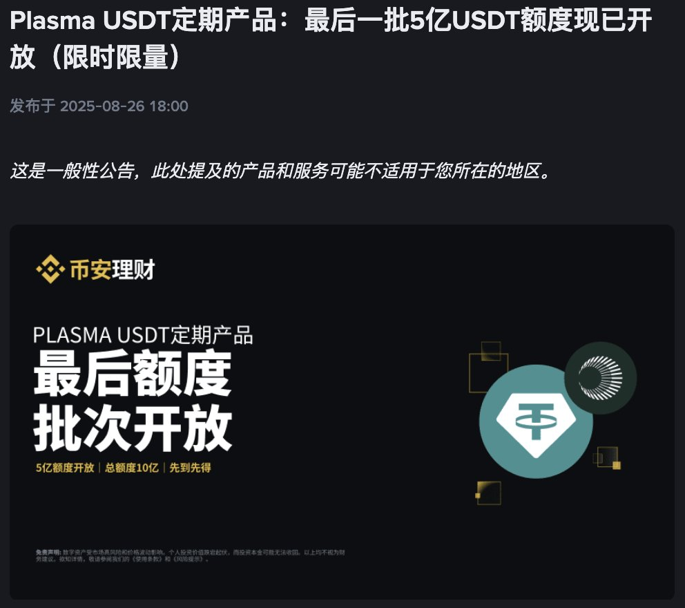
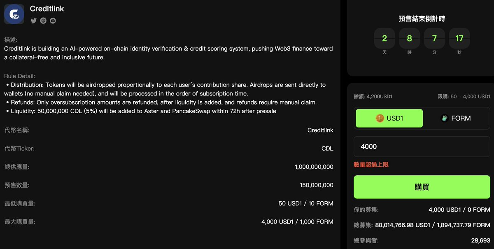

# DeFi 理財局彙總：多鏈穩定幣 LP 與固定收益機會

> **來源**: [@yuyue_chris](https://x.com/yuyue_chris/status/1961215673436340541)
>
> **日期**: 
>
> **標籤**: `DeFi 理財` `穩定幣收益` `打新投資`

---

> **來源**: [@yuyue_chris](https://x.com/yuyue_chris)
> **日期**: 2026-02-18
> **標籤**: `DeFi` `理財` `穩定幣` `LP` `固定收益`

---

最近理財局有點過於多了，以下是近期的理財局彙總。

## 主要理財機會

### 幣安理財

- **$XPL 兩個月固定理財**：估計今天最後一批 1 萬的額度要被搶完了
- **各種 booster 活動**：每期年化 20-30% 左右，但要注意贖回卡時間真的大坑
- **活期額度**：12% 年化，10 萬 USDC 的活期額度

### 打新機會

- **Four meme** @four_meme_ 的 USD1 打新：改版後第一期 0 積分門檻打新（已經卷到快 100M 的資金……不過還是想參與一下）
- **Buidlpad** @buidlpad 的 Lombard @Lombard_Finance USD1 打新：看討論度感覺有點無人問津？不少人嫌估值高，感覺有可能這次沒那麼卷
- **Kaito** 上的打新：個人 skip 了大部分過高估值項目

### 其他理財產品

- **Falcon** @falconfinance 的 USDf 存錢：基礎年化 13-15%
- **Sui 新 DeFi** @MMTFinance 的穩定幣 LP 理財 + 積分
- **USDAI** @USDai_Official 存錢
- **Perpdex** @Lighter_xyz 的 LLP 存錢

還有各種刷分…理財局越來越多。
