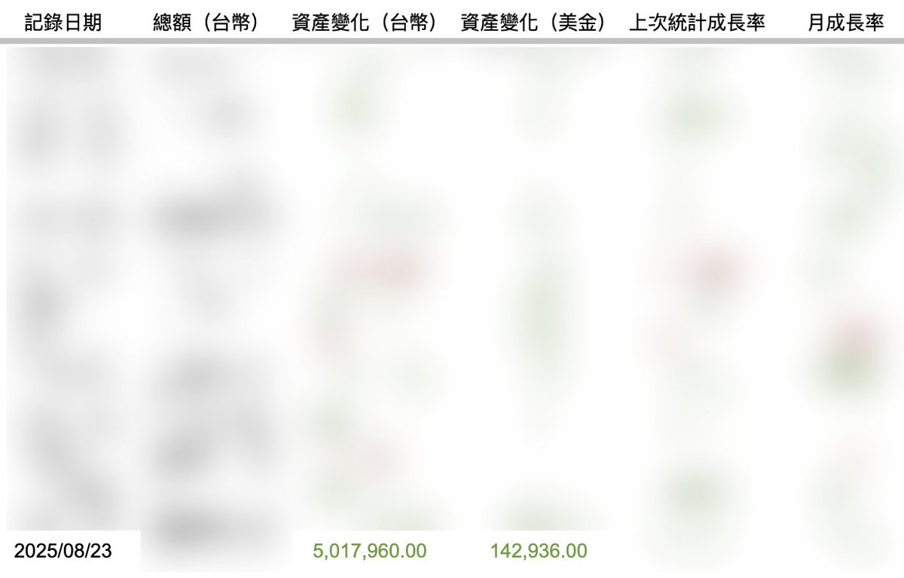
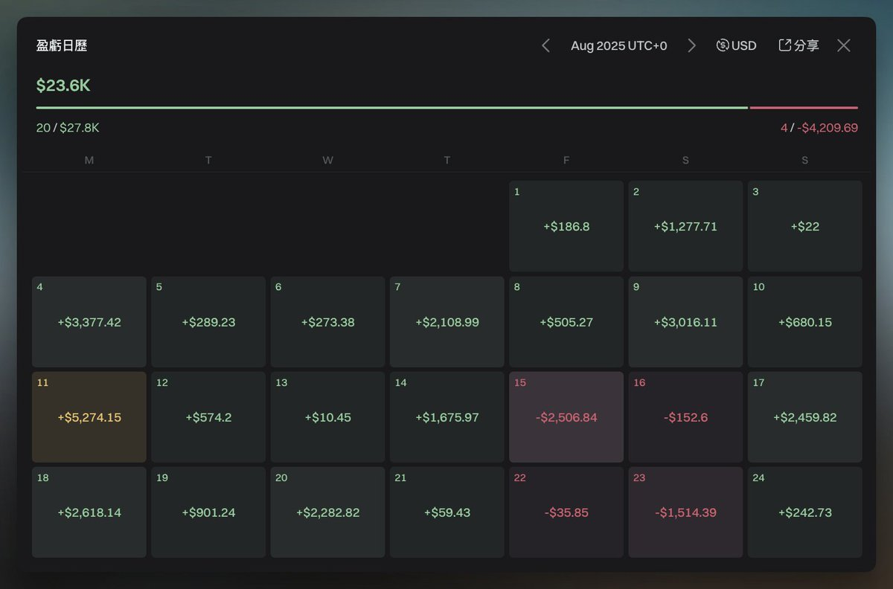
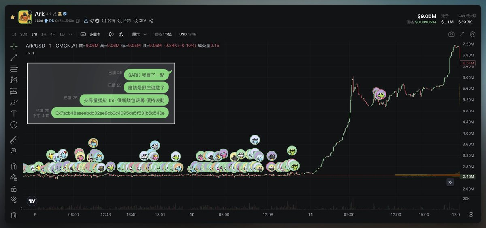
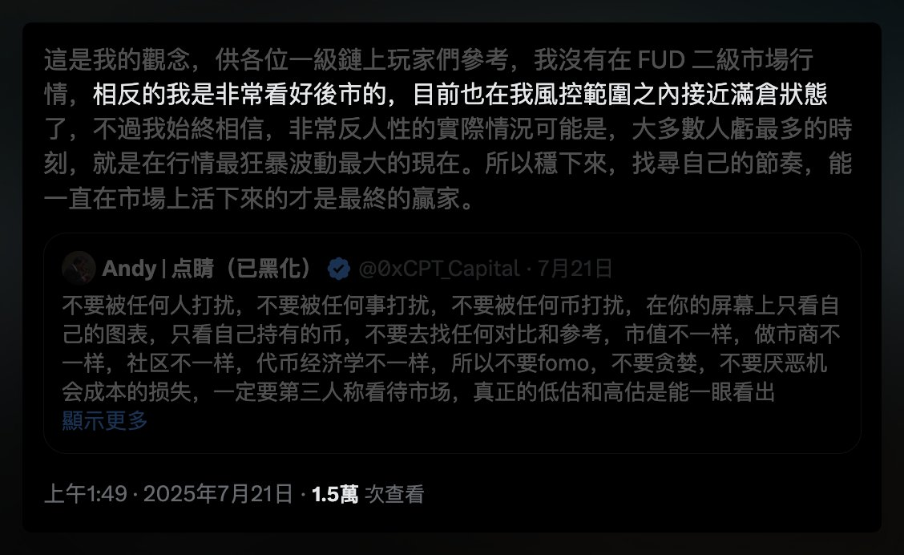

# 2025 年 7-8 月交易覆盤：Alpha 新幣、野庄盤、風控心得

> **來源**: [@CryptoCharming](https://x.com/CryptoCharming/status/1959623138997915741)
>
> **日期**: Sun Aug 24 14:25:39 +0000 2025
>
> **標籤**: `交易覆盤` `風控管理` `Alpha 新幣`

---

> **來源**: [@CryptoCharming (CryptoCharming 🐟)](https://twitter.com/CryptoCharming)  
> **日期**: 2025-07-23  
> **標籤**: `交易覆盤` `Alpha新幣` `BNBChain` `風控管理` `倉位管理`

---

## 交易回顧總覽

最近這一個月二級行情確實很好，各種東西都在漲，七月初到現在 $ETH 漲幅已經接近 100% 了，再加上 @worldlibertyfi 準備開始交易了,第一輪打的朋友高點收穫 30 多倍，所以推特上開始出現大量曬單、秀肌肉的文章，感覺很像沒有賺個 1m 就是爛咖一樣，所以應該有不少人產生價值觀的偏差、生理不適，那我這篇回顧或許可以讓很多其實已經足夠厲害的朋友不那麼焦慮 😂

回顧來看，07/22~08/23 我的總收益是 143k 刀，由於台美匯率助攻，單月收益剛好突破 500 萬新台幣，這已經是我開始玩鏈上的 9 個月裡，交易生涯第三出色的表現了，而主要我想說的是我在 @BNBCHAIN 應該算是還不錯的玩家了，我也只有賺這樣，也是順便幫大家袪魅一下，我實力差不多就這樣而已，千萬不要神化我、萬萬不要有什麼幻想，現在發現我很菜的可以取關我了 😂

所以賺自己認知內的錢、把握好屬於自己的機會就好，尤其是跟我一樣主攻一級的玩家，我還是建議不要看到二級滾倉之類 m 來 m 去的收益就上頭高槓桿進去瞎玩，永遠做好風控或許比較難暴富，但至少不會損失一發大的，也比較睡的好覺🙏（我是偏保守厭惡回撤的交易者類型）

而翻開細項來看我的收益組成，我有印象的主要是「BNBChain 上的 Alpha 新幣」、「BNB 野庄盤」、「$ETH 漲幅」、「事件交易」累積起來的，我極少單發賺大的，幾乎都是鎖定那些我守備範圍內能抓住的小機會積攢起來的收益，我認為市場上還是有很多我這個資產位階能夠玩的領域，下面稍微細講一下。

---

## 收益來源分析

### 1️⃣ Binance Alpha 新幣（收益大頭)

這是我收益的大頭，也是不多人關注但其實還是能掙錢的賽道，每個 Alpha 我都會事前做詳細的調研：

**事前研究方法**：
- 從拋壓大小、機構成本、公募成本來進行估值
- 具體可以看 @EleveResearch 的每日 Alpha 數據整理（大推薦）
- 對「項目方」地址做深入的蒐集（可以從初始流動性添加者、發盤 Dev、初始代幣持有者 MM 去做延伸）
- 參考官方流動性添加範圍來做估值的判斷

**開盤後分析**：
- 馬上針對交易者、持有者進行分析
- 有機會抓到明顯是老鼠倉、官方吸籌的訊號
- 其實不難發現 Alpha 新幣固定配合的造市商就是那幾個，Pattern 就是那幾種
- 多玩幾次多少能抓到他們的造市週期、節奏，接著就是去猜下一步動向了

**風控說明**：
- 當然還是會有意外，抓好止損
- 長期而言賺錢就好，不需要想著每個盤子都賺錢
- 我新幣勝率大概 7 成

### 2️⃣ BNB 野庄盤

印象比較深刻的是 $ARK，這個就是手法非常粗糙的野庄，全用剛打錢的新地址吸籌了 150 多個號，大號太明顯不敢買，全用小號果斷上車，輕鬆收米了。

**選幣方法**：
- 多多監控異動
- 找橫盤久然後近期成交量放大的標的
- 底部不時插針拉上引線的標的
- 再做後續分析

### 3️⃣ $ETH 漲幅

這個我在上一篇 7/21 文章時說過，已經在我風控範圍內上滿倉了，這個就不用多說了，這筆交易我莫名的滿有自信，沒有被 Fud 走，一直堅持自己的思考和推演，同事也幫了我很大的忙，加強我的信念和我的想法。是說上個月那篇文流量還不錯，希望有幫助道人。

### 4️⃣ 事件交易

這塊並非我的專長，只是偶爾看到我覺得不錯的機會就會切入去做：

- $OKB 那筆鏈上大額轉帳後果斷把第一波賣光的全部買回，就是一個滿不錯的交易
- 昨晚 $AAVE 7% $WLFI 被闢謠後馬上做的 Long $DOLO Short $AAVE 也是同理

---

## 踏空與反思

當然我還是有踏空的，踏空最多的應該是 @XLayerOfficial，我對他們「不會支持 memecoin」有比較強的想法，所以預想應該幾天生態就死了，沒想到現在還活的挺好，基本踏空整段行情，鏈上 meme 小打小鬧的獲利差不多 1 萬刀左右而已 😂 錯過了可以小資金大暴擊的機會，值得反省一下。

---

## 未來展望

接著 8~9 月還有 $WLFI 即將登場，當初打一萬刀的額度現在大大幫助到我下個月的 KPI 了哈哈，其他獲利手段應該大致不變，一樣多放心力在 Alpha 新幣的操作。

**關於實盤**：
- 具體買賣雖然我不會發文講，扒的地址也不可能公佈
- 不過可以直接看我實盤操作
- 我大多數交易會分成 3～5 個號分散（避免太亮眼被盯上）
- 所以主號也是會有交易的，可以作為一點小小的參考（別跟我單）

總之，新的一個月繼續加油！！！連續 9 個月的不間斷不休息高強度搞錢說實話有點累了，竟然有點期待行情轉折，有點期待可以照顧生活開始運動、躺著理財休息一下了... 😂

Btw 很少寫這種覆盤，哪裡寫不好或者喜歡哪邊可以評論一下，盡力鞭 🙏
