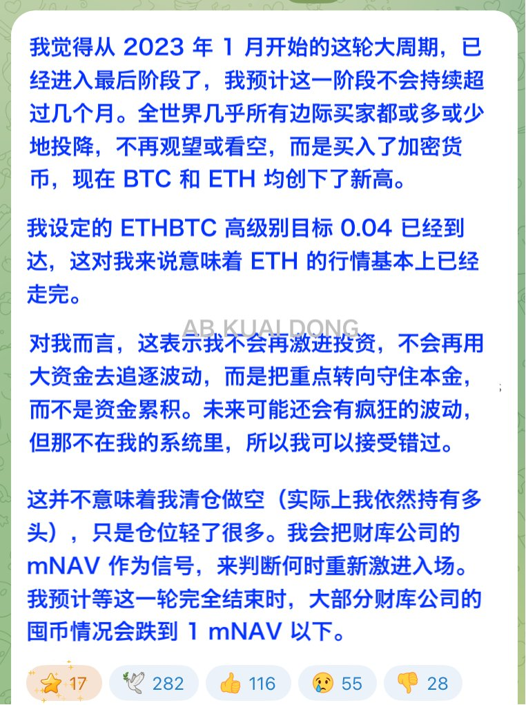
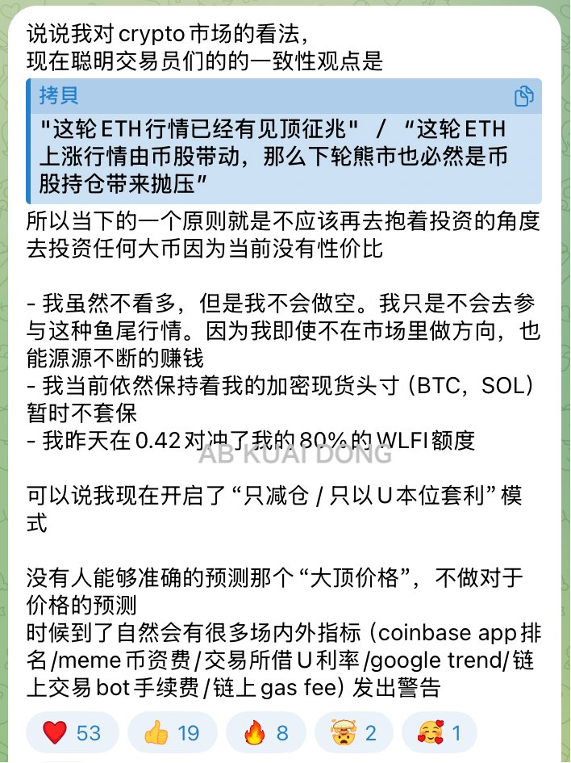

# 牛市頂點判斷與減倉策略

> **來源**: [@_FORAB](https://x.com/_FORAB/status/1959545312982560813) | [原文連結](https://twitter.com/_FORAB/status/1959545312982560813/photo/1)
>
> **日期**: Sun Aug 24 09:16:23 +0000 2025
>
> **標籤**: `牛市週期` `減倉管理` `風險控制`

---

> **來源**: [@_FORAB (AB Kuai.Dong)](https://twitter.com/_FORAB)
> **日期**: 2026-02-18
> **標籤**: `牛市判斷` `減倉策略` `市場週期` `頭部信號`

---

## 市場觀點：牛市接近頂點

傳奇交易員鴿子 Eugene，以及本波傳奇 00 後方程式新聞的老闆 Vida，均發表了認為這波行情已經到了牛尾的觀點。

## 主要論點

他們認為本輪行情，主要由各類財庫、微策略公司來驅動，外部圍觀的邊際買家們，也或多或少上車了 BTC、ETH 等加密貨幣。

## 應對策略

接下來開始逐漸減倉，以守住本金為主。
