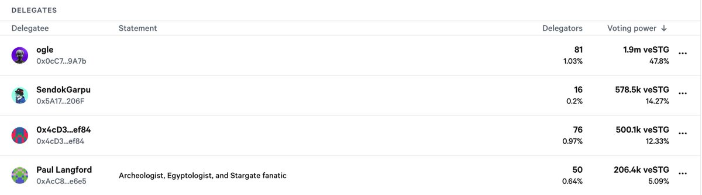

# STG 快照提案：大戶投票權分析與決策預測

> **來源**: [@cryptogator1121](https://x.com/cryptogator1121/status/1955210961079730395) | [原文連結](https://snapshot.box/#/s:stgdao.eth/delegates)
>
> **日期**: 
>
> **標籤**: `治理` `鯨魚持倉` `提案分析`

---

> **來源**: [@cryptogator1121 (CryptoGator 小鱷魚🐊)](https://x.com/cryptogator1121)
> **日期**: 2026-02-18
> **標籤**: `STG` `LayerZero` `DAO治理` `投票權分析` `veSTG`

---

## 籌碼大戶決策分析

最終決定權仍在 $veSTG 大戶手中。從快照數據可以得出結論：**這個提案只要前三名大戶都同意就會通過**。

## 前三大持有者分析

| 排名 | 持有者 | 投票權佔比 | 立場 |
|------|--------|-----------|------|
| 1 | @ogle | 48% | 兼任 @worldlibertyfi 顧問，目前沒對併購案表態 |
| 2 | @sendokgp | 14% | 活躍於 Discord，**已明確反對現行條件** |
| 3 | 0x4cD....ef84 | 12% | 未現身，未表態 |

## @sendokgp 的立場

@sendokgp 昨晚在 Discord 表明**反對現行的條件**，期望 @LayerZero_Core 提出：
- 更高的估值
- 或為 $veSTG holder 提供優惠方案

看起來現行的條件很難通過，但可以期待 @LayerZero_Core 端出更好的牛肉。

## 初步結論

既然前三大戶有人反對，**初步傾向不通過**。

---

**參考資料**: [Snapshot 提案連結](https://t.co/Fw5xHEwxsN)
