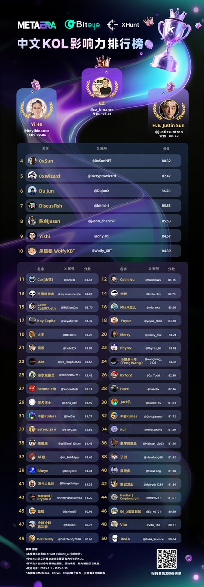

# 2025 年中文 KOL 影響力榜單

> **來源**: [@MetaEraCN](https://x.com/MetaEraCN/status/1943333537995985072)
>
> **日期**: 
>
> **標籤**: `KOL榜單` `行業聲音` `影響力評估`

---

> **來源**: [@MetaEraCN (ME News)](https://twitter.com/MetaEraCN)
> **日期**: 2025-07-XX
> **標籤**: `KOL` `影響力排名` `中文加密社群` `Twitter分析`

---

## 榜單發布

🏆 2025 中文 KOL 年中榜單正式發布！🏆

MetaEra × @BiteyeCN × @xhunt_ai 聯合出品

## 榜單內容

本次榜單包含以下類別：

- **中文 KOL 影響力榜**
- **宏觀領域戰力榜**
- **鏈上領域戰力榜**
- **一級市場領域戰力榜**
- **二級市場領域戰力榜**

## 評選方式

排名基於 XHunt 推特分析插件，結合 AI 演算法，綜合評估 KOL 的多項維度：

- 粉絲質量
- 互動活躍度
- 專業能力

確保結果客觀中立。

## 榮譽獎勵

影響力榜 Top 50 及各分榜 Top 15 KOL 將獲贈「年中榮譽·數字獎章」，記得私訊領取 📥

## 互動活動

🎁 來為你最愛的 KOL 打 call！參與人氣榜互動，有機會贏取 2 份「Biteye ✖️ Xhunt 定製版 Labubu」！

### 參與方式

1. 關注 @MetaEraCN、@BiteyeCN 和 @xhunt_ai
2. 點讚 & 轉發，並在評論區寫下你最 Pick 的上榜 KOL，送 ta 上人氣榜！

**活動截止時間**：7 月 17 日

---

致敬推動行業前行的每一位聲音！
